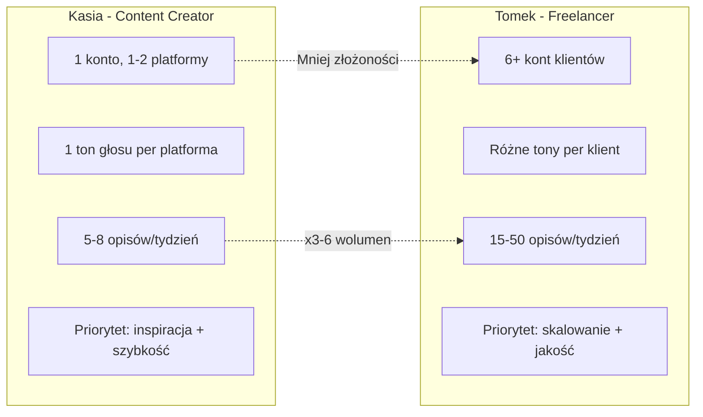

# 🎯 Job-To-Be-Done Analysis: CaptionForge

> **Wersja:** 1.0
> **Data:** Marzec 2026
> **Workflow:** `WF_Job_To_Be_Done`
> **Status:** Hipotezy na podstawie dokumentacji — brak danych z wywiadów z użytkownikami

---

## Summary

- **Hipoteza problemu:** Twórcy treści i freelancerzy social media tracą 15–30 minut na napisanie jednego opisu posta — CaptionForge kompresuje to do 10 sekund.
- **Target ICP:** Dwie persony — Kasia (content creator/influencer, 22–35, budżet 0–100 zł/mies.) + Tomek (freelancer SM, 25–40, budżet 50–200 zł/mies.).
- **Top Insight:** Job nie brzmi "napisz mi opis" — brzmi **"pozwól mi publikować regularnie bez wypalenia twórczego"**. Szybkość jest środkiem, nie celem. Celem jest konsystencja i jakość treści bez stresu.

---

## Job Snapshoty — Persona: Kasia / Twórczyni treści

### Snapshot K1: Codzienny post na Instagram

| Pole | Wartość |
|------|---------|
| **Context** | Wieczorem po pracy, planuje post na następny dzień. Ma gotowe zdjęcie, ale zero pomysłu na opis. Scrolluje konkurencję szukając inspiracji. |
| **Motivation** | Chce utrzymać regularność publikacji — algorytm nagradza konsystencję. Wie, że luka w postach = spadek zasięgu. |
| **Desired Outcome** | Gotowy opis z emotikonami i CTA w tonie casualowym, dopasowany do jej niszy fitness. Kopiuje, wkleja, publikuje — done. |
| **Current Solution** | Otwiera notatki w telefonie → szuka starych opisów → przerabia ręcznie → googla hasztagi → kopiuje z generatora hasztagów. |
| **Barriers** | Blokada twórcza po 5 postach w tygodniu. Recykling starych opisów daje poczucie wtórności. Googling hasztagów to strzał w ciemno. |
| **Trigger** | Kalendarz contentowy — "jutro post, a ja nie mam opisu". |
| **Wartość** | ~20 min oszczędności na post × 5 postów/tydzień = **~1.7h/tydzień**, **~7h/miesiąc**. |
| **Confidence** | 6 — hipoteza na bazie ogólnej wiedzy o content creatorach, bez bezpośrednich wywiadów. |

### Snapshot K2: TikTok z innym tonem niż Instagram

| Pole | Wartość |
|------|---------|
| **Context** | Kasia publikuje ten sam temat na Instagramie i TikToku, ale wie, że TikTok wymaga innego tonu — bardziej bezpośredniego, z hookiem w pierwszym zdaniu. |
| **Motivation** | Nie chce wyglądać jak "copy-paste creator". Wie, że cross-posting 1:1 niszczy engagement na obu platformach. |
| **Desired Outcome** | Dwa różne opisy tego samego tematu, zoptymalizowane pod specyfikę każdej platformy — bez konieczności wymyślania od zera. |
| **Current Solution** | Pisze opis na IG → ręcznie przerabia na TikToka → sprawdza, czy nie jest za długi → dodaje hasztagi TikTokowe. |
| **Barriers** | Nie rozumie dokładnie, czym się różni "dobry opis na TikToku" od "dobrego opisu na IG". Intuicyjnie czuje różnicę, ale nie potrafi jej wyartykułować. |
| **Trigger** | Publikacja tego samego contentu na dwóch platformach jednocześnie. |
| **Wartość** | ~15 min oszczędności × 3 razy/tydzień = **~3h/miesiąc** na samej adaptacji cross-platform. |
| **Confidence** | 5 — powszechny wzorzec, ale szczegóły mogą się różnić w zależności od niszy. |

### Snapshot K3: LinkedIn — wyjście z comfort zone

| Pole | Wartość |
|------|---------|
| **Context** | Kasia chce budować markę osobistą na LinkedIn, ale nie czuje się pewnie z profesjonalnym tonem. Na IG pisze "luźno", a LinkedIn wymaga innego rejestru. |
| **Motivation** | LinkedIn to kanał do klientów B2B i współprac brandowych — tam jest pieniądz. Ale bariera stylistyczna jest realna. |
| **Desired Outcome** | Profesjonalny, ale autentyczny opis — nie korporacyjny bełkot, ale wartościowy post budujący ekspertyzę. |
| **Current Solution** | Pisze draft → wysyła do znajomego na review → poprawia 2-3 razy → publikuje ze stresem → 3 lajki → rezygnuje po 2 tygodniach. |
| **Barriers** | Syndrom oszusta — "czy to brzmi wystarczająco profesjonalnie?". Brak feedbacku w czasie rzeczywistym. Długi czas od draftu do publikacji. |
| **Trigger** | Widziała post konkurencyjnego creatora z 500+ reakcji i myśli "ja też powinienam tam być". |
| **Wartość** | Trudna do zmierzenia — wartość pośrednia: nowi klienci z LinkedIn, współprace, personal branding. Potencjalnie setki złotych miesięcznie. |
| **Confidence** | 4 — silna hipoteza, ale LinkedIn to mniej typowy use case dla naszego ICP. Wymaga walidacji. |

### Snapshot K4: Kampania hasztagowa dla zasięgu

| Pole | Wartość |
|------|---------|
| **Context** | Kasia zauważa spadek zasięgu na IG. Czyta, że "hasztagi nadal działają, ale musisz dobrać mix dużych, średnich i niszowych". Nie wie, jak to zrobić. |
| **Motivation** | Chce przełamać plateau zasięgowe. Używa ciągle tych samych 15 hasztagów, podejrzewa że IG ją "shadowbanuje". |
| **Desired Outcome** | Zestaw hasztagów zoptymalizowany pod jej niszę + platformę z wyraźnym podziałem na zasięg. Rotacja hasztagów między postami. |
| **Current Solution** | Kopiuje hasztagi od większych twórców → wkleja te same do każdego posta → zero trackingu co działa. |
| **Barriers** | Brak wiedzy o strategii hasztagowej. Narzędzia do analizy hasztagów są drogie lub zbyt skomplikowane. |
| **Trigger** | Spadek zasięgu poniżej średniej → frustracja → googlowanie "jak poprawić zasięg na IG 2026". |
| **Wartość** | Potencjalnie +20-50% zasięgu = więcej followerów = więcej współprac. Wycena: 50–200 zł/miesiąc w utraconych możliwościach. |
| **Confidence** | 5 — hasztagi to element CaptionForge, ale ich realna wartość zależy od jakości danych. Mock tego nie dostarczy. |

### Snapshot K5: Batch content — przygotowanie postów na tydzień

| Pole | Wartość |
|------|---------|
| **Context** | Niedziela wieczorem. Kasia chce "zbatchować" opisy na cały tydzień — 5 postów IG + 3 TikTok. Siedzi z kalendarzem contentowym i pustymi polami. |
| **Motivation** | Batch creation oszczędza mentalną energię — pisze wszystko naraz zamiast codziennie od zera. Ale 8 opisów to 2-3 godziny pracy. |
| **Desired Outcome** | 8 gotowych opisów różnej tematyki, w odpowiednich tonach i na różne platformy — w mniej niż 30 minut. |
| **Current Solution** | Otwiera Google Docs → tworzy tabelkę: dzień, platforma, temat, opis → pisze ręcznie każdy → hasztagi osobno. |
| **Barriers** | Wypalenie twórcze pod koniec sesji — opisy 6, 7, 8 są znacznie gorsze niż 1, 2, 3. Repetytywność procesu zabija motywację. |
| **Trigger** | Niedzielny wieczór — rytuał planowania contentu na tydzień. |
| **Wartość** | ~2.5h oszczędności w niedzielnym batchu × 4 tygodnie = **~10h/miesiąc**. To najbardziej wartościowy use case. |
| **Confidence** | 7 — batch creation to dobrze udokumentowany wzorzec wśród content creatorów. Wysoka pewność. |

---

## Job Snapshoty — Persona: Tomek / Social Media Freelancer

### Snapshot T1: Przełączanie między klientami

| Pole | Wartość |
|------|---------|
| **Context** | Poniedziałek rano. Tomek zarządza 6 kontami klientów. Każdy ma inną niszę, inny ton głosu, inną platformę. Musi napisać posty dla trzech z nich przed lunchem. |
| **Motivation** | Czas = pieniądz. Im szybciej napisze opisy, tym więcej klientów może obsłużyć. Skalowanie bez zatrudniania ludzi. |
| **Desired Outcome** | Przełączenie "kontekstu klienta" jednym kliknięciem — ton, nisza, platforma automatycznie się zmieniają. Output gotowy do wysłania klientowi na akceptację. |
| **Current Solution** | Notion z kartami per klient → otwiera kartę → czyta brief → pisze opis → kopiuje → wysyła na Slacku → czeka na akceptację → poprawia → publikuje. |
| **Barriers** | Context switching jest kosztowny mentalnie. Pomylenie tonów między klientami to realny problem. Brak standaryzacji procesu. |
| **Trigger** | Poranny planning — "które konta potrzebują contentu na ten tydzień?". |
| **Wartość** | ~15 min/opis × 15 opisów/tydzień = **~3.75h/tydzień**, **~15h/miesiąc**. Przy stawce 100 zł/h = **1500 zł/miesiąc** w zaoszczędzonym czasie. |
| **Confidence** | 7 — freelancerzy to power users. Ich JTBD jest dobrze zdefiniowany i mierzalny. |

### Snapshot T2: Raportowanie i prezentacja dla klienta

| Pole | Wartość |
|------|---------|
| **Context** | Koniec miesiąca. Klient pyta: "co opublikowaliśmy w tym miesiącu i jakie były wyniki?". Tomek musi zebrać wszystkie opisy i przedstawić raport. |
| **Motivation** | Profesjonalne raportowanie buduje zaufanie klienta i justyfikuje stawkę. Chaotyczny freelancer = ryzyko utraty klienta. |
| **Desired Outcome** | Historia wygenerowanych opisów per klient, z datami i platformami — export do PDF/CSV jednym kliknięciem. |
| **Current Solution** | Scrolluje DM-y na Slacku → kopiuje opisy do Excela → ręcznie dodaje daty → formatuje → eksportuje PDF. |
| **Barriers** | Rozproszone dane — opisy w Notion, DM-ach, Google Docs, kopiach w telefonie. Brak jednego źródła prawdy. |
| **Trigger** | Email od klienta: "Jaki content planujemy na następny miesiąc?". |
| **Wartość** | ~2h/raport × 6 klientów = **~12h/miesiąc** na samo raportowanie. |
| **Confidence** | 5 — historia i eksport to feature Fazy 2, nie MVP. Ale potrzeba jest realna. |

### Snapshot T3: Onboarding nowego klienta

| Pole | Wartość |
|------|---------|
| **Context** | Tomek pozyskał nowego klienta — mała kawiarnia. Musi szybko wejść w niszę gastronomiczną, poznać ton marki i zacząć generować content od następnego tygodnia. |
| **Motivation** | Szybki start = profesjonalizm. Klient nie chce czekać 2 tygodni na "research fazy". |
| **Desired Outcome** | W 30 minut: 3-5 przykładowych opisów w tonie marki klienta, hasztagi niszowe, gotowy do akceptacji "pakiet startowy". |
| **Current Solution** | Analizuje IG konkurencji klienta → notuje ton i styl → pisze 3 drafty → poprawia po feedbacku klienta → finalizuje po 2-3 dniach. |
| **Barriers** | Trudność w "wgryzeniu się" w niszę, której nie zna. Czasochłonny research. Ryzyko nietrafienia w ton marki. |
| **Trigger** | Podpisanie umowy z nowym klientem. |
| **Wartość** | Skrócenie onboardingu z 2-3 dni do 30 minut = **~4-6h oszczędności na nowym kliencie**. |
| **Confidence** | 6 — hipoteza mocna, ale wymaga walidacji z freelancerami. |

### Snapshot T4: Skalowanie portfolio klientów

| Pole | Wartość |
|------|---------|
| **Context** | Tomek chciałby obsługiwać 10 klientów zamiast 6, ale fizycznie nie jest w stanie pisać 50+ opisów tygodniowo ręcznie. |
| **Motivation** | Więcej klientów = wyższy przychód bez zatrudniania asystenta. Automatyzacja pisania opisów to klucz do skalowania. |
| **Desired Outcome** | System, który pozwala wygenerować 50 opisów w <2 godziny, z poprawnym tonem i niszą per klient. + Jakość na tyle dobra, że klienci akceptują 80% bez edycji. |
| **Current Solution** | Pisze ręcznie + ChatGPT z customowymi promptami per klient → kopiuje → poprawia → wysyła. ~50% wymaga edycji. |
| **Barriers** | ChatGPT nie pamięta kontekstu klienta między sesjami. Brak pre-fillowania niszy/tonu. Ręczne zarządzanie promptami w Notion. |
| **Trigger** | Odmówienie potencjalnemu klientowi z powodu braku capacity. |
| **Wartość** | +4 klientów × 2000 zł/mies. = **+8000 zł/miesiąc potencjalnego przychodu** umożliwionego przez automatyzację. |
| **Confidence** | 7 — skalowanie jest jasnym, mierzalnym JTBD. Ale wymaga solidnego AI, nie mocka. |

### Snapshot T5: A/B testowanie opisów

| Pole | Wartość |
|------|---------|
| **Context** | Klient Tomka chce wiedzieć, czy "luźny ton" czy "profesjonalny ton" lepiej konwertuje na IG. Tomek musi przygotować warianty tego samego posta w dwóch tonach. |
| **Motivation** | Data-driven approach buduje przewagę nad "robieniem na wyczucie". Klienci cenią freelancerów, którzy testują i optymalizują. |
| **Desired Outcome** | 2-3 warianty tego samego tematu w różnych tonach, gotowe do porównania wyników po publikacji. |
| **Current Solution** | Pisze wariant A → przepisuje w innym tonie → porównuje "na oko" → wybiera "lepszy" subiektywnie. |
| **Barriers** | Ręczne pisanie wariantów to x2 pracy. Brak systematycznego podejścia — zwykle odpuszcza po 1-2 próbach. |
| **Trigger** | Spadek engagement rate u klienta → potrzeba diagnozy. |
| **Wartość** | ~30 min oszczędności na test × 4 testy/miesiąc = **~2h/miesiąc**. Plus: wyższa jakość decyzji = lepsze wyniki = retencja klienta. |
| **Confidence** | 5 — fajny use case, ale prawdopodobnie wykonywany rzadko. Nice-to-have, nie must-have. |

---

## Syntetyczna Analiza

### Top 3 Jobs

| # | Job | ICP | Częstotliwość |
|---|-----|-----|---------------|
| 1 | **Wygeneruj angażujący opis do posta w <30 sekund** | Obie persony | Dzienna / kilka razy w tygodniu |
| 2 | **Zaadaptuj content do specyfiki platformy bez ręcznej przeróbki** | Obie persony | Przy każdej cross-platformowej publikacji |
| 3 | **Wygeneruj batch opisów na cały tydzień bez wypalenia twórczego** | Kasia silniej, Tomek też | Co tydzień, sesja batchowa |

### Top 3 Desired Outcomes

| # | Outcome | Metryka sukcesu |
|---|---------|-----------------|
| 1 | **Opis gotowy do użycia bez edycji lub z minimalnym retuszem** | <20% opisów wymaga edycji |
| 2 | **Hasztagi zoptymalizowane pod niszę z podziałem na zasięg** | Mix dużych + niszowych tagów w każdym zestawie |
| 3 | **Konsystencja publikacji bez wzrostu czasu pracy** | Utrzymanie 5+ postów/tydzień przy <30 min/sesję |

### Primary Pain Drivers

| # | Pain Driver | Nasilenie | Dotyka |
|---|-------------|-----------|--------|
| 1 | **Blokada twórcza / wypalenie** — wymyślanie opisów od zera przy 5+ postach/tydzień | 🔴 Wysoki | Obie persony |
| 2 | **Context switching** — zmiana tonu, niszy i platformy między postami/klientami wymaga mentalnego restartu | 🔴 Wysoki | Tomek silniej |
| 3 | **Hasztagowy strzał w ciemno** — brak danych o skuteczności; kopiowanie od innych; zero strategii | 🟡 Średni | Kasia silniej |

### Variability — jak job się różni między segmentami

**Kluczowa różnica:** Kasia potrzebuje **inspiracji i szybkości** w jednej niszy. Tomek potrzebuje **skalowania i standaryzacji** w wielu niszach. MVP musi obsługiwać obie potrzeby — ale Kasia jest łatwiejsza do zadowolenia jako pierwsza.

---

## Opportunity Mapping — jak to przekuć w MVP

### Core Job-to-be-Done — wybór #1

> **"Kiedy siadam do tworzenia treści na social media, chcę wygenerować angażujący opis dopasowany do mojej platformy i tonu, żeby mieć gotowy post w <30 sekund zamiast 15-30 minut."**

Ten job łączy:
- 🔥 **Wysoką palączość** — dzieje się 5-50× w tygodniu w zależności od segmentu
- ✅ **Łatwość rozwiązania** — formularz z 5 polami + AI/mock = szybki output
- 💰 **Willingness-to-pay** — Kasia: 49 zł/mies., Tomek: 100-200 zł/mies.

### Minimum Success Criteria — co musi robić MVP

| # | Kryterium | Miernik |
|---|-----------|---------|
| 1 | **Opis brzmi naturalnie i jest dopasowany do wybranej platformy** | >70% użytkowników ocenia output jako "użyteczny bez dużej edycji" |
| 2 | **Time-to-value <2 minuty** od wejścia na stronę do skopiowania opisu | Mediana czasu: landing → clipboard < 120s |
| 3 | **Hasztagi nie są losowe — widać logikę niszy i kategoryzację zasięgu** | Użytkownik rozpoznaje relevantne hasztagi, nie googla "czy to dobre tagi" |

### Quick Experiments — 3 testy do walidacji

| # | Eksperyment | Cel | Czas realizacji |
|---|-------------|-----|-----------------|
| 1 | **Landing page + pre-signup** — strona CaptionForge z formularzem zapisu "Chcę dostęp do Pro" | Zmierzyć intent-to-pay: ile osób poda email? Target: >5% conversion rate | Już częściowo istnieje |
| 2 | **Concierge test** — 10 content creatorów dostaje "darmowy pakiet 5 opisów" generowany ręcznie przez Ciebie z AI. Po 3 dniach: survey jakości + WTP | Zwalidować Desired Outcome #1: czy opisy są naprawdę użyteczne? | Wymaga outreach |
| 3 | **Mock vs AI A/B** — połowa userów dostaje mock, połowa AI. Track: copy rate, return rate, NPS | Zmierzyć, czy AI robi istotną różnicę w percepcji wartości vs szablon | Wymaga integracji OpenAI |

---

## Risks [RISKS]

### 🔴 False Positives — deklaratywna vs realna potrzeba

- **Ryzyko:** Użytkownicy powiedzą "super narzędzie!" przy pierwszym użyciu, ale nie wrócą — bo opis mocka powtarza się, lub AI nie jest wystarczająco dobry.
- **Sygnał ostrzegawczy:** Return rate <10% po 7 dniach.
- **Mitygacja:** Mierz retencję od Dnia 1. Nie celebruj signups — celebruj 3. użycie tego samego użytkownika.

### 🔴 Edge-case Fragmentation — różnorodność jobów

- **Ryzyko:** "Opis na IG fitness" i "opis na LinkedIn B2B" to tak naprawdę zupełnie różne joby. Jeden generator nie może obsłużyć obu dobrze.
- **Sygnał ostrzegawczy:** Jakość outputu drastycznie spada w niektórych kombinacjach platforma × ton × nisza.
- **Mitygacja:** Zacząć od 1-2 platform + 2 tonów. Nie obiecywać "5 platform" jeśli output na LinkedIn jest słaby.

### 🟡 Mock Kills Trust — iluzja wartości

- **Ryzyko:** User Journey Map jawnie stwierdza: **"Iluzoryczny Aha Moment — mock szablony powtarzają się po kilku użyciach"**. To nie ryzyko — to fakt.
- **Sygnał ostrzegawczy:** Spadek engagement rate po 3-4 użyciach.
- **Mitygacja:** Integracja z OpenAI to **nie feature** — to **warunek konieczny** do walidacji Core Job.

### 🟡 High Manual Work — support i prompt engineering

- **Ryzyko:** Jeśli AI generuje generyczne opisy, Tomek — power user — potrzebuje customowego prompt engineeringu per klient. To wymaga ręcznej konfiguracji i supportu od Solo-Deva.
- **Sygnał ostrzegawczy:** Frequent feature requests typu "chcę własny system prompt" od freelancerów.
- **Mitygacja:** Template system z predefiniowanymi tonami. NIE pozwól na custom prompts w MVP — to otwiera puszkę Pandory.

### 🟢 Timing Risk — ChatGPT jako konkurent proxy

- **Ryzyko:** Tomek już używa ChatGPT z własnymi promptami. CaptionForge musi dać **coś ponad** ChatGPT — bo samo "generowanie opisów" to commodity.
- **Sygnał ostrzegawczy:** User mówi "ale to samo robię w ChatGPT za darmo".
- **Mitygacja:** Przewaga = **specjalizacja** — hasztagi z oceną zasięgu, platformowa optymalizacja, batch generation, zapamiętywanie kontekstu klienta. ChatGPT tego nie robi out-of-the-box.

---

## MVP Scope — konkretnie dla Solo-Deva

### Essential — musisz to mieć

| # | Element | Realizuje |
|---|---------|-----------|
| 1 | **Core flow: Formularz → AI generation → 3 warianty + hasztagi → Kopiuj** | Core Job #1 |
| 2 | **Integracja OpenAI** — prawdziwe AI zamiast mocka | Warunek konieczny walidacji |
| 3 | **Szybki onboarding: zero rejestracji na start, 3 darmowe generacje** | Time-to-value <2 min |

### Analytics — musisz to mierzyć

| Metryka | Jak mierzyć |
|---------|-------------|
| **Time-to-first-value** | Czas od: page load → pierwsza kopia opisu |
| **% users reaching Desired Outcome** | Ile % userów klika "Kopiuj" na przynajmniej 1 opisie |
| **Copy rate per variant** | Który wariant jest najczęściej kopiowany — sygnał jakości |
| **Return rate D1/D7** | Ile % wraca po 1 i 7 dniach bez email prompta |

### Do Not Build Yet — nie ruszaj tego w MVP

- ❌ System kont i dashboard historii — podnieś to dopiero po potwierdzeniu retencji
- ❌ Eksport CSV/PDF — fancy feature bez walidacji core jobu
- ❌ Integracja z Buffer/Later — rozproszenie uwagi
- ❌ Custom prompts / enterprise features — puszetka Pandory
- ❌ Wielojęzyczność ponad PL/EN — skupienie na 2 językach

---

## Metrics to Track

| Typ | Metryka | Target |
|-----|---------|--------|
| **Activation** | % users kopiujących przynajmniej 1 opis w pierwszej sesji | >50% |
| **Quality** | % opisów kopiowanych bez edycji — proxy NPS | >70% |
| **Engagement** | Repeat usage: ile sesji generowania na usera/tydzień | >2 sesje/tydzień active users |
| **Monetization** | % konwersji Free → Paid po trafieniu na limit | >5% |
| **Efficiency** | Mediana czasu: landing → first copy | <120 sekund |

---

## Interview Script — 7 pytań do walidacji

> Poniższy skrypt do użycia z 5-10 content creatorami / freelancerami SM.

1. **"Opowiedz mi o ostatnim razie, kiedy pisałaś opis do posta na social media."** — Context
2. **"Co wtedy dokładnie robiłaś krok po kroku? Jakie narzędzia otwierałaś?"** — Current Solution
3. **"Co było najgorsze w tym procesie? Co Cię najbardziej frustruje?"** — Pain
4. **"Skąd wiesz, że opis jest dobry? Po czym poznajesz, że to działa?"** — Desired Outcome
5. **"Ile czasu zajmuje Ci napisanie opisu? A ile hasztagów?"** — Value
6. **"Gdyby istniało narzędzie, które generuje opis w 10 sekund — ile zapłaciłabyś miesięcznie?"** — Willingness-to-Pay
7. **"Próbowałaś ChatGPT, Jaspera, Copy.ai do opisów? Dlaczego to nie wystarczyło?"** — Alternatives / Switching Barriers

---

## Checklista zbierania danych

- [x] 10 wypełnionych Job Snapshotów — 5 per persona, na bazie hipotez
- [x] Co najmniej 2 metryki wartości — czas i pieniądze
- [x] Zidentyfikowany Core Job-to-be-Done
- [x] 3 propozycje szybkich eksperymentów
- [ ] 🔲 **Brakuje:** Wywiady z realnymi użytkownikami — hipotezy wymagają walidacji
- [ ] 🔲 **Brakuje:** Dane telemetryczne z obecnego MVP

---

## Next Steps

1. **Sugerowany kolejny workflow:** `WF_MVP_Scoping` — zdefiniuj minimalny produkt realizujący Core Job z integracją OpenAI.
2. **Szybki eksperyment:** Wyślij link do obecnego landing page 20 content creatorom — zmierz, ilu klika "Generuj", ilu kopiuje opis, ilu wraca.
3. **Krytyczne do adresacji:** Integracja OpenAI musi nastąpić PRZED walidacją JTBD — mock nie pozwala potwierdzić, czy Core Job jest realnie zrealizowany.

---

## Interaktywne pytanie

**Czy masz dostęp do 5-10 content creatorów lub freelancerów SM, z którymi możesz przeprowadzić 15-minutowe wywiady?** Dane z hipotez mają Confidence 4-7/10. Jeden dobry wywiad podniesie to do 8-9/10 i może odkryć joby, których nie widzimy w dokumentacji. Jeśli nie — sugeruję `WF_MVP_Scoping` z obecnymi hipotezami i szybki concierge test zamiast wywiadów.
