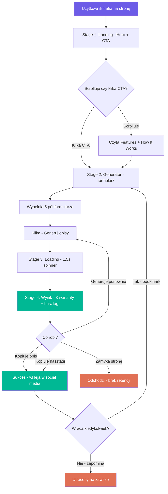
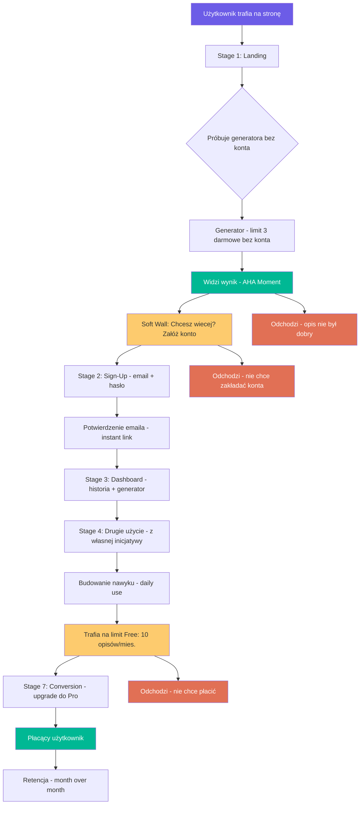
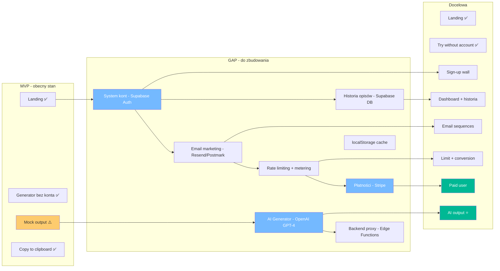
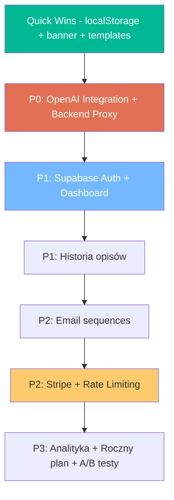

# 🎯 User Journey Map: CaptionForge

> **Wersja:** 1.0
> **Data:** Marzec 2026
> **Status:** Analiza dwuwariantowa – MVP (obecny) + Docelowa (z kontami i AI)

---

## Success Metric – Co jest sukcesem użytkownika?

_Użytkownik będzie uważać, że CaptionForge warte jest 49 zł/miesiąc, jeśli:_

→ **Wygeneruje opis do posta w <30 sekund, skopiuje go i opublikuje w social media – bez żadnej edycji lub z minimalnym retuszem.**

### Metryki sukcesu – nie feature'y:

| Metryka | Target |
|---------|--------|
| Czas od wejścia na stronę do skopiowania pierwszego opisu | < 2 minuty |
| Procent użytkowników, którzy kopiują przynajmniej 1 opis | > 50% |
| Procent użytkowników, którzy wracają w ciągu 7 dni | > 30% |
| Procent użytkowników oceniających output jako useful | > 70% |

**🚩 Red Flag:** Jeśli użytkownik musi edytować >50% wygenerowanego opisu, generator nie dostarcza wartości – to gloryfikowany autocomplete, nie narzędzie.

---

## CZĘŚĆ I: User Journey MVP – stan obecny

> **Kontekst:** Brak kont użytkowników, brak backendu, mock generator oparty na szablonach, zero personalizacji między sesjami.

### Diagram Journey MVP

---

### Stage 1: Landing – 0-30 sekund

**What they see:**
- Headline: _"Opisy, które angażują. Hasztagi, które docierają."_
- Value prop: _"CaptionForge generuje spersonalizowane opisy i hasztagi do Twoich postów w 10 sekund."_
- Social proof: 10K+ Twórców, 500K+ Opisów, 5 Platform

**✅ Co działa dobrze:**
- Headline jest konkretny – mówi CO robi produkt, nie ogólnikami
- CTA "Generuj za darmo" jest agresywny i jasny
- Mockup karty z przykładowym opisem natychmiast pokazuje output
- Floating badges "Ton głosu dopasowany" i "+47% zasięgów" budują ciekawość

**Friction Points:**
- [ ] Issue: Social proof "10K+ Twórców" jest mocno wątpliwy dla MVP bez backendu – nowi użytkownicy mogą to wyczuć jako blef
  - Solution: Zamienić na "Przetestowany na X kryteriach jakości" lub usunąć do momentu zebrania realnych danych
- [ ] Issue: Badge "🚀 Nowe: Obsługa TikTok i LinkedIn" nie dodaje wartości – nowy user nie wie co było wcześniej
  - Solution: Zamienić na pain-point CTA: "Tworzenie opisów zajmuje Ci godziny? Skróć do 10 sekund"

**Aha Moment:** User myśli: _"Hm, mogę wygenerować opis bez zakładania konta? Spróbuję."_

**CTA:** "Generuj za darmo →" oraz "Jak to działa?"

**⏱️ Czas przejścia:** 10-30 sekund

---

### Stage 2: Generator – Input – 30 sekund do 2 minut

**Flow:**
1. Smooth scroll do sekcji generatora
2. Widzi formularz z 5 polami: Platforma, Ton, Nisza, Język, Temat posta
3. Wypełnia formularz
4. Klika "Generuj opisy"

**Input type:** Formularz z dropdownami + text inputs

**Required fields:**
- [x] Platforma: dropdown, 5 opcji z emoji – intuicyjne
- [x] Ton głosu: dropdown, 5 opcji z emoji – intuicyjne
- [x] Nisza/Branża: text input, placeholder "np. fitness, technologia, moda, kulinaria..."
- [x] Język: dropdown, 2 opcje
- [x] Temat posta: textarea, max 200 znaków, z counter'em

**✅ Co działa dobrze:**
- Nie wymaga konta – zero friction do pierwszego użycia
- Domyślne wartości w dropdownach – user nie musi nic zmieniać, żeby kliknąć Generuj
- Character counter w textarea daje feedback w real-time
- Placeholder w textarea podaje konkretny przykład tematu

**Friction Points:**
- [ ] Issue: 5 pól to dużo na pierwszy raz – user może się wahać, co wybrać w polu "Nisza"
  - Solution: Dodać "przykładowe szablony" pod formularzem – np. "Fitness post na Instagram" jako 1-click template
- [ ] Issue: Pole "Nisza" jest opcjonalne wizualnie, ale wpływa na jakość hasztagów – user może zostawić puste
  - Solution: Dodać `required` lub micro-copy: "Im bardziej precyzyjna nisza, tym lepsze hasztagi"
- [ ] Issue: Brak walidacji real-time – jeśli user kliknie Generuj bez tematu, dostanie błąd dopiero po submit
  - Solution: Walidacja inline z podświetleniem pola

**Aha Moment:** System akceptuje dane i pokazuje loading state → przejście do Stage 3.

**⏱️ Czas przejścia:** 30s–2 min, zależy od wahania przy wypełnianiu

---

### Stage 3: Processing – 1.5 sekundy

**UX:** Spinner z tekstem "Generuję Twoje opisy..." + subtekst "Analizuję niszę i dobieramy hasztagi"

**✅ Co działa dobrze:**
- Czas oczekiwania 1.5s to sweet spot – wystarczająco długi, żeby zbudować anticipation, ale krótki, żeby nie frustrować
- Tekst loading state jest konkretny – mówi CO się dzieje, nie tylko "Loading..."
- Subtekst "Analizuję niszę i dobieramy hasztagi" buduje percepcję wartości

**Friction Points:**
- [ ] Issue: Brak progress bar – spinner jest mniej informacyjny niż % postępu
  - Solution: Dodać tekstowe etapy: "Analizuję temat... → Dobieram ton... → Generuję warianty..."

**Error Handling:** Jeśli temat jest pusty, pojawia się alert – powinien być inline error przy textarea, nie window.alert.

**⏱️ Czas przejścia:** 1.5s – OK

---

### Stage 4: First Output – AHA MOMENT ⭐

**Output format:** 3 karty z opisami + chipy hasztagów z oceną zasięgu

**Visual Design:**
- User widzi: 3 gotowe opisy dopasowane do wybranej platformy, tonu i tematu
- User może: Kopiować pojedynczy opis, kopiować wszystkie hasztagi, generować ponownie

**Export Options:**
- [x] Kopiuj do schowka – per opis
- [x] Kopiuj wszystkie hasztagi – jednym kliknięciem
- [ ] ❌ Brak: Download as TXT/PDF
- [ ] ❌ Brak: Email do siebie
- [ ] ❌ Brak: Share link

**✅ Co działa dobrze:**
- 3 warianty dają wybór – user nie czuje się uwięziony w jednym wyniku
- Hasztagi z oceną zasięgu to dodatkowa wartość, której user się nie spodziewał
- Przycisk "Generuj ponownie" zachęca do iteracji
- Toast "Skopiowano!" daje potwierdzenie akcji

**Friction Points:**
- [ ] Issue: Opisy oparte na szablonach – po 3-4 użyciach user zauważy powtarzalność
  - Solution: **Krytyczne** – integracja z AI (OpenAI) musi być priorytetem Fazy 2
- [ ] Issue: Brak persistencji – odświeżenie strony = wyniki znikają
  - Solution: localStorage jako tymczasowe rozwiązanie (bez backendu)
- [ ] Issue: Output nie pokazuje metryki wartości – np. "Zaoszczędziłeś ~15 minut pisania"
  - Solution: Dodać banner pod wynikami: "✅ 3 opisy w 10 sekund – normalnie zajęłoby Ci ~15 minut"
- [ ] Issue: Po skopiowaniu opisu nie ma dalszego CTA – user "odpływa"
  - Solution: Dodać soft-CTA: "Chcesz generować opisy codziennie? Zapisz się na powiadomienia" lub "Dodaj do zakładek"

**Aha Moment:** User myśli: _"O, ten opis jest naprawdę dobry – mogę go użyć prawie bez zmian!"_

Ale tutaj jest kluczowy problem:

> 🚩 **THE BOTTLENECK MVP:** Aha Moment jest **iluzoryczny** przy mock generatorze. User dostaje dobry opis raz, ale przy 3-4 użyciu zauważa powtarzalność szablonów. To zabija retencję.

**⏱️ TOTAL TIME FROM LANDING TO AHA:** ~1.5–3 minuty ✅ – poniżej targetu 5 minut

---

### Summary MVP Journey

| Metryka | Obecny stan MVP | Target |
|---------|----------------|--------|
| Landing → Generator scroll | ~90% – CTA jasny | >80% ✅ |
| Generator → First Output | ~60% – 5 pól to friction | >70% |
| First Output → Copy | ~40% – zależy od jakości mocka | >50% |
| Copy → Return w 7 dni | ~10% – brak retencji mechanizmów | >30% |
| Time to Aha | ~2 min | <5 min ✅ |

### 🚩 Czerwone Flagi MVP

1. **Brak retencji** – zero mechanizmów powrotu (brak kont, emaili, notyfikacji)
2. **Iluzoryczny Aha Moment** – mock szablony powtarzają się po kilku użyciach
3. **Social proof jest sztuczny** – "10K+ Twórców" bez dowodów podważa zaufanie
4. **Zero persistencji** – odświeżenie = utrata wyników
5. **Brak ścieżki do płatności** – pricing section istnieje, ale CTA prowadzi do generatora, a nie do checkout'u

---

## CZĘŚĆ II: User Journey Docelowa – z kontami, AI i płatnościami

> **Kontekst:** Supabase Auth + OpenAI GPT-4 + Stripe + email marketing. Pełna 7-etapowa ścieżka.

### Diagram Journey Docelowej

---

### Stage 1: Landing – 0-30 sekund

**What they see:**
- Headline: _"Opisy, które angażują. Hasztagi, które docierają."_ (bez zmian)
- Value prop: Taki sam, ale z realnym social proof po zebraniu danych

**Friction Points:**
- [ ] Issue: Social proof musi być prawdziwy
  - Solution: Po zebraniu 100+ userów, zmienić na "Dołącz do X twórców" z dynamicznym counter'em

**Aha Moment:** _"Mogę spróbować bez rejestracji? OK, próbuję."_

**CTA:** "Wypróbuj za darmo – bez konta" (podkreślenie zero-barrier)

**Kluczowa zmiana vs MVP:** Dodać micro-CTA pod Hero: "Wygeneruj 3 opisy za darmo – bez rejestracji"

---

### Stage 2: Sign-Up – 1-3 minuty

**Trigger:** User wygenerował 3 opisy bez konta i trafia na soft wall:

> "Spodobało Ci się? Załóż darmowe konto i generuj 10 opisów miesięcznie za darmo."

**Flow:**
1. Email + Hasło (2 pola – nic więcej)
2. Opcja: "Kontynuuj z Google" (OAuth)
3. Instant email z linkiem potwierdzającym (nie kodem PIN)
4. Po kliknięciu linku → automatyczne logowanie → Dashboard

**Friction Points:**
- [ ] Issue: User może nie chcieć zakładać konta po 3 darmowych generacjach
  - Solution: Soft wall, nie hard wall – pokaż wyniki, ale ukryj hasztagi lub ogranicz do 1 wariantu
- [ ] Issue: Potwierdzenie email'a dodaje krok
  - Solution: Pozwól na ograniczone korzystanie bez potwierdzenia (np. 24h grace period)

**Aha Moment:** User widzi dashboard z historią swoich 3 poprzednich generacji → _"O, moje opisy się zachowały!"_

**Follow-up Email – 5 min po rejestracji:**
- Subject: "Twój pierwszy opis czeka – wygeneruj następny"
- Body: 1 link do generatora, tip: "Pro tip: spróbuj innego tonu głosu dla tego samego tematu"

---

### Stage 3: First Data Input – z kontekstem konta – 1-2 minuty

**Input type:** Ten sam formularz generatora, ale z ulepszeniami:

**Required fields:**
- [x] Platforma – zapamiętana z ostatniego użycia
- [x] Ton głosu – zapamiętany z ostatniego użycia
- [x] Nisza – zapamiętana (user definiuje raz, edytuje gdy chce)
- [x] Język – zapamiętany
- [x] Temat posta – zawsze nowy

**Kluczowa zmiana vs MVP:** 4 z 5 pól zapamiętane → user wypełnia tylko 1 pole (temat) przy kolejnych użyciach. **Friction spada dramatycznie.**

**Friction Points:**
- [ ] Issue: Zapamiętane pola mogą zdezorientować – "czemu tu już jest Instagram?"
  - Solution: Micro-copy: "Twoje ostatnie ustawienia – zmień w dowolnym momencie"

**Aha Moment:** _"Nie muszę za każdym razem ustawiać platformy i tonu – system pamięta!"_

---

### Stage 4: Processing – 2-5 sekund

**UX:** Progress bar z etapami tekstowymi:
1. "Analizuję Twój temat..."
2. "Generuję 3 warianty w tonie [ton]..."
3. "Dobieram hasztagi dla [nisza]..."

**Kluczowa zmiana vs MVP:** Prawdziwe AI (GPT-4) generuje unikalne opisy. Czas przetwarzania może wzrosnąć do 3-5s.

**Error Handling:**
- Timeout >10s → "Przepraszamy, serwer jest przeciążony. Spróbuj ponownie."
- API error → "Nie udało się wygenerować. Próbujemy ponownie..." (auto-retry 1x)
- Rate limit → "Wykorzystałeś limit na minutę. Spróbuj za 30 sekund."

---

### Stage 5: First Output – AHA MOMENT ⭐ – MOST CRITICAL

**Output format:** 3 karty z unikalnymi, AI-generowanymi opisami + inteligentne hasztagi

**Visual Design:**
- User widzi: 3 **naprawdę unikalne** warianty, po raz pierwszy w życiu ideowy match do ich tematu
- User widzi: Hasztagi z oceną zasięgu (real data lub estimated)
- User widzi: "⏱️ Zaoszczędziłeś ~15 minut" – banner wartości

**Export Options:**
- [x] Kopiuj do schowka – per opis
- [x] Kopiuj wszystkie hasztagi
- [x] Zapisz w historii (automatycznie po generacji)
- [ ] Eksport CSV (Pro)
- [ ] Udostępnij link do opisu (future)

**Friction Points:**
- [ ] Issue: AI może generować generyczne opisy, jeśli prompt jest źle zbudowany
  - Solution: Iteracyjne testowanie promptów z real users; A/B testing wariantów promptu
- [ ] Issue: User może nie wiedzieć, który wariant jest najlepszy
  - Solution: Dodać "AI rekomendacja: Wariant 2 ma najwyższy predicted engagement"
- [ ] Issue: Brak edycji in-line – user musi skopiować, wkleić gdzieś i edytować
  - Solution: Dodać lightweight text editor pod każdym wariantem – "Edytuj przed skopiowaniem"

**Aha Moment:** _"Wow, ten opis brzmi jakby pisał go człowiek znający moją branżę. Mogę go użyć natychmiast!"_

**⏱️ TOTAL TIME FROM LANDING TO AHA:** ~2-3 minuty (z AI), 1.5-2 min (returning user z zapamiętanymi polami)

---

### Stage 6: Second Action – 1-3 dni później

**Trigger system:**
1. **Email 24h po sign-up:** "Jaki post planujesz dziś? → [Link do generatora]"
2. **Email 72h po sign-up:** "3 trendy w hashtagach [nisza] tego tygodnia → [Link]"
3. **In-app widget:** "Ostatnio generowałeś o [temat]. Spróbuj z innym tonem?"
4. **Browser notification:** (opcjonalnie, za zgodą)

**Message template:**
- Subject: "Twój content czeka – wygeneruj następny opis w 10 sekund"
- Body: 1 prominent CTA, 1 tip, link do generatora z pre-filled ostatnimi ustawieniami

**Goal:** User wraca i generuje opis **bez email reminderu** – z nawyku.

**Success – Return Rate measurement:**
- DAU/MAU ratio > 0.15 (15% aktywnych dziennie)
- Day 1 retention > 40%
- Day 7 retention > 30%

**Friction Points:**
- [ ] Issue: User zapomina o narzędziu – nie ma powodu do powrotu
  - Solution: Content hook – "Tygodniowy trend hasztagów w Twojej niszy" (email weekly)
- [ ] Issue: Generowanie opisów nie jest codzienną potrzebą dla casual users
  - Solution: Targetować power users – content managers, freelancerzy zarządzający wieloma kontami
- [ ] Issue: Brak integracji z workflow user'a
  - Solution: Future – integracja z Buffer/Later, Notion, Google Sheets

**Aha Moment:** User generuje opis **z własnej inicjatywy**, bez email prompta.

---

### Stage 7: Conversion to Paid – 7-30 dni

**Trigger:** User trafia na limit Free:

> "Wykorzystałeś 10 z 10 darmowych opisów w tym miesiącu. Przejdź na Pro, aby generować bez limitów."

**Soft limit approach:**
- Po 8/10 opisów: "Zostały Ci 2 darmowe opisy w tym miesiącu"
- Po 10/10: Blokada generatora z jasnym CTA do upgrade

**Message – Email + In-App:**
- Subject: "Twój limit się kończy – przejdź na Pro za 49 zł/mies."
- In-app banner: "🔒 Limit osiągnięty. Upgrade do Pro → Nielimitowane opisy, wszystkie platformy, historia 500 opisów"

**Pricing:**
| Feature | Free | Pro – 49 zł/mies. |
|---------|------|--------------------|
| Opisy | 10/mies. | ♾️ Bez limitu |
| Platformy | 3 | 5 |
| Tony głosu | 3 | 5 |
| Hasztagi | Podstawowe | Z oceną zasięgu |
| Historia | ❌ | ✅ 500 ostatnich |
| Eksport CSV | ❌ | ✅ |
| Trial | – | 7 dni gratis |

**CTA Button:** "Wypróbuj Pro – 7 dni gratis"

**Friction Points:**
- [ ] Issue: 49 zł/mies. może być dużo dla casual user'a – porównaj z ChatGPT Plus za ~100 zł/mies.
  - Solution: Dodać roczny plan z rabatem: 390 zł/rok = 32.50 zł/mies. (33% taniej)
- [ ] Issue: User może generować opisy w ChatGPT bezpośrednio – po co płacić za wrapper?
  - Solution: Value prop Pro: "Zapamiętane ustawienia + historia + hasztagi z oceną zasięgu + 1-click copy. ChatGPT tego nie ma."
- [ ] Issue: 7-dniowy trial może nie wystarczyć na zbudowanie nawyku
  - Solution: 14-dniowy trial lub "Pierwszy miesiąc 19 zł" jako intro pricing
- [ ] Issue: Proces płatności musi być bezbolesny
  - Solution: Stripe Checkout – 1 strona, karta lub BLIK, zero formularzy korporacyjnych

**Aha Moment:** _"Jeśli nie zapłacę, stracę dostęp do narzędzia, na którym oszczędzam 3h tygodniowo. 49 zł to mniej niż moja godzina pracy."_

---

## CZĘŚĆ III: Gap Analysis – MVP vs Docelowa

### Co brakuje w MVP, aby dojść do docelowej journey

### Tabela gap'ów z priorytetami

| Gap | Obecny stan | Docelowy stan | Priorytet | Uzasadnienie |
|-----|-------------|---------------|-----------|-------------|
| Generator AI | Mock szablony | OpenAI GPT-4 | 🔴 P0 – krytyczny | Bez AI, Aha Moment jest iluzoryczny |
| Backend proxy | Brak | Edge Function / Serverless | 🔴 P0 – krytyczny | Klucz API nie może być na froncie |
| localStorage cache | Brak | Wyniki zapisywane lokalnie | 🟡 P1 – szybki win | Zapobiega utracie wyników po refresh |
| System kont | Brak | Supabase Auth | 🟡 P1 – ważny | Retencja wymaga kont |
| Historia opisów | Brak | Supabase Database | 🟡 P1 – ważny | Core value prop dla retencji |
| Email sequences | Brak | Resend/Postmark | 🟠 P2 – retention | Napędza return rate |
| Płatności | Brak | Stripe Checkout | 🟠 P2 – monetyzacja | Bez tego nie ma revenue |
| Rate limiting | Brak | Metering per user | 🟠 P2 – monetyzacja | Wymusza konwersję Free → Pro |
| Roczny plan | Brak | 390 zł/rok | 🟢 P3 – optymalizacja | Obniża churn, podnosi LTV |
| Analityka | Brak | GA4 / Mixpanel | 🟢 P3 – tracking | Nie możesz poprawić tego, czego nie mierzysz |

---

## CZĘŚĆ IV: THE Bottleneck + Quick Wins

### 🎯 THE Bottleneck – jeden punkt, który zabija konwersję

> **Mock generator** – opisy oparte na szablonach powtarzają się po 3-4 użyciach. To sprawia, że Aha Moment jest jednorazowy. User wraca, widzi podobny output i myśli: "To nie jest AI, to automat". **Retencja spada do zera.**

**Rozwiązanie:** Integracja z OpenAI GPT-4 to **jedyny ruch**, który umożliwia resztę journey'u. Bez prawdziwego AI:
- Nie ma sensu budować kont (po co wracać?)
- Nie ma sensu budować płatności (za co płacić?)
- Nie ma sensu budować emaili (po co przypominać o narzędziu, które nie działa?)

### Quick Wins – zmiany, które poprawią konwersję natychmiast

**1. localStorage dla wyników** – zapisz ostatnie 3 generacje w localStorage. User wraca, widzi wyniki. Zero backendu wymagane.

**2. Banner wartości pod outputem** – "⏱️ Zaoszczędziłeś ~15 minut" po każdej generacji. Buduje percepcję wartości.

**3. 1-click templates** – 3 gotowe szablony pod formularzem: "Fitness post na Instagram", "Tech tip na LinkedIn", "Foodie na TikTok". User klika → pola się wypełniają → klika Generuj. Czas do Aha spada z 2 min do 30 sekund.

**4. Usunięcie fałszywego social proof** – "10K+ Twórców" zamienić na "Sprawdź sam w 10 sekund" lub usunąć do momentu zebrania realnych danych.

**5. CTA po kopiowaniu** – po skopiowaniu opisu pokazać: "📌 Dodaj do zakładek, żeby mieć generator zawsze pod ręką" z instrukcją Ctrl+D.

---

## Metryki do śledzenia

### Daily Metrics
- [ ] Landing → Generator scroll: ___% (target: >80%)
- [ ] Generator → First Output completion: ___% (target: >70%)
- [ ] Time from landing to first output: ___ min (target: <3)
- [ ] Copy rate: ___% użytkowników kopiuje przynajmniej 1 opis (target: >50%)

### Weekly Metrics
- [ ] Day 1 Return Rate: ___% (target: >40%)
- [ ] Day 7 Return Rate: ___% (target: >30%)
- [ ] Generacje per user per tydzień: ___ (target: >3)

### Monthly Metrics (po wdrożeniu kont i płatności)
- [ ] Sign-up conversion: ___% (target: >10% z landing)
- [ ] Trial-to-Paid Conversion: ___% (target: >5%)
- [ ] Churn Rate: ___% (target: <5%)
- [ ] MRR: ___ zł (target: rosnący m/m)

---

## Biggest Friction Point (The ONE thing killing conversions)

→ **Mock generator z powtarzalnymi szablonami zabija retencję. Bez prawdziwego AI cały funnel jest jednorazowy.**

---

## Rekomendowana kolejność budowy (Roadmap zgodny z Journey)

**Sekwencja jest kluczowa:** Nie buduj kont, zanim AI nie generuje wartości. Nie buduj płatności, zanim konta nie mają retencji. Nie buduj analityki, zanim nie ma co mierzyć.
