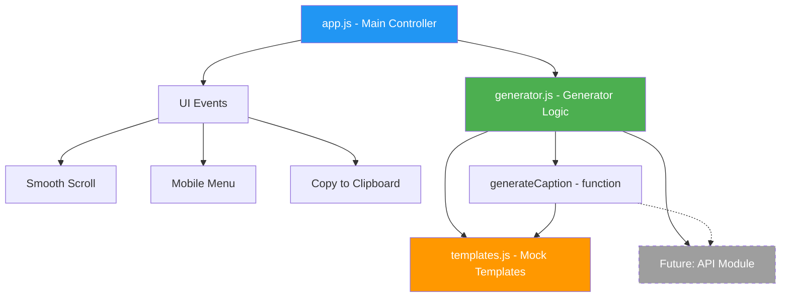

# CaptionForge – Plan Techniczny (Historyczny)

> ⚠️ **Uwaga:** Ten dokument opisuje **oryginalny plan wersji Vanilla HTML/CSS/JS** (faza MVP, marzec 2026). Aplikacja została następnie zmigrowana na **Next.js 14 App Router + TypeScript strict + Tailwind CSS**. Kod historycznej wersji zachowany jest w [`vanilla web/`](../../vanilla%20web), aktualna implementacja znajduje się w [`code/`](../../code).
>
> **Sekcje poniżej zachowują wartość referencyjną:**
> - **Design system** (kolory, typografia, breakpointy) — nadal aktualny, zaimplementowany jako CSS vars w [`code/src/app/globals.css`](../../code/src/app/globals.css) i mapowany w [`code/tailwind.config.ts`](../../code/tailwind.config.ts)
> - **Struktura sekcji strony** (navbar → hero → features → generator → FAQ → footer) — zachowana 1:1 w [`code/src/app/page.tsx`](../../code/src/app/page.tsx)
> - **Strategy Pattern** — zastąpiony Route Handlerem `/api/generate` z fallbackiem na mock
>
> Zaktualizowaną dokumentację techniczną znajdziesz w [`../tech/technical-documentation.md`](../tech/technical-documentation.md).

---

## 📋 Opis Projektu (wersja oryginalna, Vanilla)

**CaptionForge** to narzędzie webowe do generowania opisów i hasztagów pod posty w mediach społecznościowych. Łączy landing page (prezentacja produktu) z działającym prototypem generatora (mock z architekturą pod przyszłe API).

**Stack (historyczny):** Czysty HTML5 + CSS3 + Vanilla JavaScript (zero frameworków)
**Stack (aktualny):** Next.js 14 App Router + React 18 + TypeScript strict + Tailwind CSS v3 + Zod
**Lokalizacja kodu:** [`code/`](../../code) (Next.js) · [`vanilla web/`](../../vanilla%20web) (historyczne)

---

## 🏗️ Architektura Plików

```
plans/captionforge/
├── index.html          # Główna strona - landing + generator
├── css/
│   └── styles.css      # Wszystkie style, responsywność
├── js/
│   ├── app.js          # Główna logika aplikacji, routing między sekcjami
│   ├── generator.js    # Logika generatora - mock + interfejs pod API
│   └── templates.js    # Szablony mockowych opisów i hasztagów
├── assets/
│   └── (ikony SVG inline w HTML)
└── README.md           # Dokumentacja projektu
```

---

## 🎨 Struktura Strony HTML

### Sekcje Landing Page:

1. **Navbar** – Logo + nawigacja + CTA button
2. **Hero** – Nagłówek, podtytuł, CTA, wizualizacja produktu
3. **Features** – 3-4 kluczowe funkcje z ikonami
4. **How It Works** – 3 kroki z numeracją
5. **Generator (Try It)** – Działający prototyp generatora
6. **FAQ** – Najczęstsze pytania
7. **Footer** – Linki, copyright

### Sekcja Generatora (kluczowa):

Formularz z polami:
- **Platforma** – dropdown: Instagram, TikTok, LinkedIn, X/Twitter, Facebook
- **Nisza/Branża** – text input: np. fitness, technologia, moda
- **Ton głosu** – dropdown: profesjonalny, casualowy, humorystyczny, inspirujący, edukacyjny
- **Temat posta** – textarea: krótki opis o czym jest post
- **Język** – dropdown: polski, angielski

Wynik:
- 3 warianty opisu (z możliwością kopiowania)
- Zestaw 10-15 hasztagów z oceną popularności (mock)
- Przycisk „Kopiuj do schowka" przy każdym wariancie

---

## 🔧 Architektura JavaScript



### Kluczowy wzorzec - Strategy Pattern dla generatora:

```javascript
// generator.js - architektura pod przyszłe API
const GeneratorStrategy = {
    mock: async function(params) { /* ... */ },
    // openai: async function(params) { /* ... */ },  // do podpięcia później
};

let activeStrategy = 'mock';

async function generateCaption(params) {
    return GeneratorStrategy[activeStrategy](params);
}
```

To pozwala na łatwe przełączenie z mocka na prawdziwe API przez:
1. Dodanie nowej strategii (np. `openai`)
2. Zmianę `activeStrategy` na `openai`
3. Bez zmian w reszcie kodu

---

## 🎨 Design System

- **Kolory:**
  - Primary: `#6C5CE7` (fiolet - kreatywność)
  - Secondary: `#00B894` (zielony - sukces)
  - Dark: `#2D3436`
  - Light: `#F8F9FA`
  - Accent: `#FD79A8` (różowy - CTA)

- **Typografia:** System fonts (bez zewnętrznych fontów dla szybkości)
  - Nagłówki: `-apple-system, BlinkMacSystemFont, Segoe UI, sans-serif`
  - Body: ten sam stack

- **Responsywność:** Mobile-first, breakpointy: 768px, 1024px, 1200px

---

## 📦 Mock Templates - Strategia

Plik `templates.js` zawiera:
- **Szablony opisów** pogrupowane wg: platforma × ton × język
- **Baza hasztagów** pogrupowana wg nisz
- **Logika losowania** – wybiera szablon, podmienia zmienne (temat, nisza), dodaje losowe warianty

Przykład struktury:
```javascript
const captionTemplates = {
    instagram: {
        professional: {
            pl: [
                "🎯 {topic} - to temat, który zmienia zasady gry w branży {niche}...",
                "Czy wiesz, że {topic}? Oto 3 rzeczy, które musisz wiedzieć..."
            ],
            en: [...]
        },
        casual: { ... },
        humorous: { ... }
    },
    // ...
};
```

---

## ⚡ Interaktywność

1. **Smooth scroll** – kliknięcie w nawigację płynnie przewija do sekcji
2. **Loading state** – po kliknięciu Generuj, 1.5s animacja ładowania (symulacja API call)
3. **Copy to clipboard** – przycisk kopiujący opis/hasztagi z potwierdzeniem
4. **Mobile hamburger menu** – responsywna nawigacja
5. **Animacje wejścia** – sekcje pojawiają się przy scrollowaniu (Intersection Observer)

---

## 🚀 Kolejność Implementacji

1. Struktura HTML z wszystkimi sekcjami
2. CSS - layout, kolory, typografia, responsywność
3. JS - `app.js` (nawigacja, scroll, menu mobilne)
4. JS - `templates.js` (baza szablonów mockowych)
5. JS - `generator.js` (logika generowania + UI generatora)
6. Animacje i polish (loading states, copy, Intersection Observer)
7. Testowanie w przeglądarce
8. README.md

---

## 🔄 Mapowanie: Plan Vanilla → Implementacja Next.js

Tabela pokazuje, jak elementy oryginalnego planu zostały zrealizowane w aktualnej wersji Next.js.

| Element planu (Vanilla) | Realizacja w Next.js |
|-------------------------|----------------------|
| `index.html` — monolit | [`src/app/page.tsx`](../../code/src/app/page.tsx) + sekcje jako osobne komponenty w [`src/components/features/`](../../code/src/components/features) |
| `css/styles.css` — ~2000 linii | Tailwind CSS + design tokens w [`src/app/globals.css`](../../code/src/app/globals.css) + [`tailwind.config.ts`](../../code/tailwind.config.ts) |
| `js/app.js` — nawigacja, scroll, FAQ | Logika rozproszona do Client Components: [`Navbar`](../../code/src/components/features/navbar.tsx), [`FAQ`](../../code/src/components/features/faq.tsx), native CSS `scroll-behavior: smooth` |
| `js/generator.js` — Strategy Pattern | **Serwerowy Route Handler** [`src/app/api/generate/route.ts`](../../code/src/app/api/generate/route.ts) + client fetch w [`GeneratorSection`](../../code/src/components/features/generator/generator-section.tsx). Klucz API w ENV zamiast hardkodu. |
| `js/templates.js` — baza mocków | [`src/lib/mock-templates.ts`](../../code/src/lib/mock-templates.ts) (fallback serwerowy) |
| `js/features.js` — ThemeManager, HistoryManager, ExportManager, ProgressBar | Rozbite na hooks i komponenty: [`useTheme`](../../code/src/hooks/useTheme.ts), [`useHistory`](../../code/src/hooks/useHistory.ts), [`HistoryStorage`](../../code/src/lib/history-storage.ts), [`exportTxt`](../../code/src/lib/export-txt.ts), [`ProgressBar`](../../code/src/components/ui/progress-bar.tsx) |
| Design system (kolory, breakpointy) | Bez zmian — CSS Custom Properties w `globals.css` + Tailwind theme |
| `prompt()` / `alert()` dla błędów | `Toast` + state machine w `GeneratorSection` |
| Klucz Gemini w JS (`CONFIG`) | **Eliminacja problemu** — klucz w `.env.local` / `process.env.GEMINI_API_KEY`, klient wywołuje proxy |
| Brak walidacji wejścia | `Zod.safeParse` po stronie Route Handlera, 400 z detalami przy błędzie |
| Brak rate-limit | Soft rate-limit 30 req/h per IP (in-memory) — TODO: Upstash/KV |

> Pełna specyfikacja migracji: [`plans/szkielet-nextjs-captionforge.md`](../plans/PLAN_szkielet-nextjs-captionforge.md).
