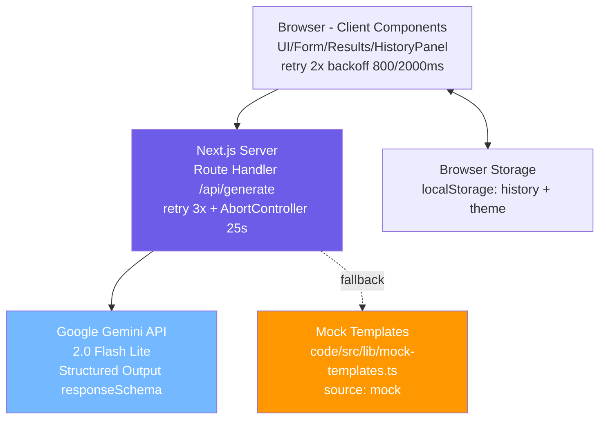

# System Overview — CaptionForge

Wysokopoziomowy opis architektury aplikacji CaptionForge w wersji 2.0 (Next.js 14, kwiecień 2026). Dokument służy jako szybkie wprowadzenie dla nowych developerów i agentów AI; szczegółowy opis modułów znajduje się w [`docs/tech/technical-documentation.md`](../tech/technical-documentation.md).

## 1. Cel systemu

CaptionForge to webowy generator opisów i hasztagów do mediów społecznościowych (Instagram, TikTok, LinkedIn, X/Twitter, Facebook), napędzany Google Gemini 2.0 Flash Lite. Realizuje **Core Job-to-be-Done** zdefiniowany w [`docs/business/Job_To_Be_Done.md`](../business/Job_To_Be_Done.md): _„Wygeneruj angażujący opis dopasowany do platformy i tonu w <30 sekund zamiast 15–30 minut"_. Target ICP: content creatorzy (persona Kasia) i freelancerzy SM (persona Tomek).

## 2. Stos technologiczny

| Warstwa | Technologia | Wersja | Uzasadnienie |
|---------|-------------|--------|--------------|
| Framework | Next.js App Router | 14.2 | Server Components + Route Handlers — patrz [`adr_001`](adr_001_nextjs-app-router.md) |
| UI | React | 18.3 | Concurrent rendering, Server/Client split |
| Język | TypeScript strict | 5.x | Bezpieczeństwo typów + `noUncheckedIndexedAccess` |
| Style | Tailwind CSS | 3.4 | Utility-first + CSS vars na design tokens |
| Walidacja | Zod | 3 | Wspólna schema client + server |
| AI Backend | Google Gemini 2.0 Flash Lite | — | Patrz [`adr_002`](adr_002_gemini-api.md) |
| Persystencja | localStorage | — | Historia generacji + motyw bez backendu (50 wpisów FIFO) |
| Eksport | Blob API | — | Pobieranie TXT po stronie klienta |

Pełna tabela stack + komendy w [`docs/tech/technical-documentation.md`](../tech/technical-documentation.md) sekcja 5.

## 3. Architektura komponentów

- **Browser (Client Components)** — formularz generatora, wyniki (banner „Tryb awaryjny" gdy `source === "mock"`), panel historii, dark mode toggle. Klient ma własną pętlę retry (2× przy błędach sieciowych/5xx, backoff 800/2000 ms + jitter). Komponenty w [`code/src/components/`](../../code/src/components).
- **Next.js Server (Route Handler)** — serwerowy proxy do Gemini API; ukrywa klucz API, waliduje payload przez Zod, soft rate-limit 30 req/h per IP. Polityka resilience: retry 3× (backoff 500/1500/4000 ms + jitter) dla `[429, 500, 502, 503, 504]` i błędów sieciowych, `AbortController` 25 s, walidacja odpowiedzi przez Zod (`GenerateResultPayloadSchema`), fallback na mock przy każdym naruszeniu kontraktu (m.in. `MAX_TOKENS`, brak kandydatów, niepoprawny JSON, walidacja Zod fail). Logging JSON z `requestId`. Plik: [`code/src/app/api/generate/route.ts`](../../code/src/app/api/generate/route.ts).
- **Google Gemini API** — zewnętrzny LLM generujący opisy + hasztagi; wywoływany z `responseSchema` (Structured Output) wymuszającym kontrakt `{captions:[3], hashtags:[10..15]}`, `temperature: 0.7`, `maxOutputTokens: 4096`. Klucz z `process.env.GEMINI_API_KEY`.
- **Mock Templates** — fallback szablony (platforma × ton × język × nisza) używane przy braku klucza, HTTP 429 po retry, `MAX_TOKENS`, błędzie walidacji Zod, błędzie parsowania JSON. Plik: [`code/src/lib/mock-templates.ts`](../../code/src/lib/mock-templates.ts). Wynik oznaczony `source: "mock"` → UI pokazuje banner.
- **Browser Storage** — `localStorage` dla historii (`captionforge-history`, max 50 FIFO) i motywu (`captionforge-theme`, anti-FOUC).

Szczegółowy diagram sekwencji + state machine generatora w [`docs/tech/technical-documentation.md`](../tech/technical-documentation.md) sekcje 2.4–2.5.

## 4. Integracje zewnętrzne

| Integracja | Typ | Komunikacja | Plik kontaktu | Bezpieczeństwo |
|------------|-----|-------------|---------------|----------------|
| Google Gemini 2.0 Flash Lite | LLM | HTTPS POST `/v1beta/models/.../generateContent` | [`code/src/app/api/generate/route.ts`](../../code/src/app/api/generate/route.ts) | Klucz API server-only (`GEMINI_API_KEY` w `.env.local`); proxy ukrywa klucz przed klientem; rate limit 30 req/h per IP — patrz [`adr_002`](adr_002_gemini-api.md) |

