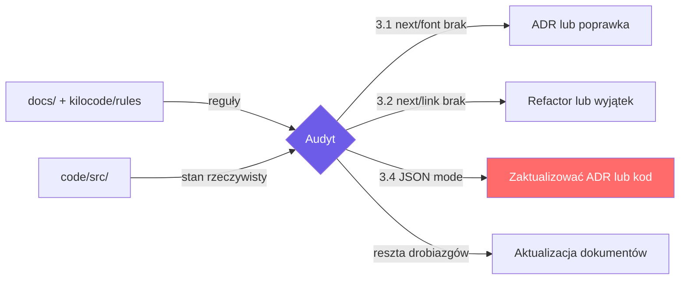

# PLAN — Audyt zgodności kodu z dokumentacją

> **Data:** 2026-05-10  
> **Zakres:** Porównanie kodu w [`code/src/`](../../code/src) z dokumentacją w [`docs/`](../../docs) oraz regułami w [`kilocode/rules/`](../../kilocode/rules).  
> **Metoda:** Statyczne czytanie kluczowych plików (layout, route handler, komponenty, hooks, libs, configi) + reguły kodowania + ADR-y + dokumentacja techniczna.

---

## 1. Ogólna ocena

**Werdykt:** Kod jest w **wysokim stopniu zgodny z dokumentacją** (struktura katalogów, podział SC/CC, stack, Zod, rate limit, fallback na mock, dark mode anti-FOUC, historia w localStorage z FIFO 50 — wszystko zgadza się z opisem w [`docs/tech/technical-documentation.md`](../tech/technical-documentation.md) i [`docs/architecture/system_overview.md`](../architecture/system_overview.md)).

Wykryto jednak **kilka rozbieżności** — głównie naruszenia globalnych reguł z [`kilocode/rules/dev-coding-rules.md`](../../kilocode/rules/dev-coding-rules.md) (sekcja 6 „Wydajność") oraz drobną niespójność między ADR-002 a rzeczywistą implementacją wywołania Gemini.

---

## 2. Co jest zgodne ✅

| Obszar | Dokument referencyjny | Stan kodu |
|---|---|---|
| Stack: Next.js 14.2 + React 18.3 + TS strict + Tailwind 3.4 + Zod 3 | [`docs/tech/...`](../tech/technical-documentation.md) §5, [`adr_001`](../architecture/adr_001_nextjs-app-router.md) | [`code/package.json`](../../code/package.json) — wersje pasują |
| `tsconfig`: `strict: true`, `noUncheckedIndexedAccess: true` | [`docs/tech/...`](../tech/technical-documentation.md) §2.1 | [`code/tsconfig.json`](../../code/tsconfig.json:7-8) ✓ |
| `tailwind.config.ts`: `darkMode: ["class", '[data-theme="dark"]']` | [`docs/tech/...`](../tech/technical-documentation.md) §2.1 | [`code/tailwind.config.ts`](../../code/tailwind.config.ts:10) ✓ |
| Struktura katalogów `src/` (app, components/ui, components/features, hooks, lib, types, constants, services) | [`dev-coding-rules.md`](../../kilocode/rules/dev-coding-rules.md) §2.1, [`docs/tech/...`](../tech/technical-documentation.md) §2.1 | Pasuje 1:1 |
| Anti-FOUC inline script przed hydratacją | [`docs/tech/...`](../tech/technical-documentation.md) §2.1 | [`code/src/app/layout.tsx`](../../code/src/app/layout.tsx:30-53) ✓ |
| Route Handler: Zod schema + rate limit 30 req/h + fallback mock | [`docs/tech/...`](../tech/technical-documentation.md) §2.4, [`adr_002`](../architecture/adr_002_gemini-api.md) | [`code/src/app/api/generate/route.ts`](../../code/src/app/api/generate/route.ts:18-100) ✓ |
| Klucz API server-only (`process.env["GEMINI_API_KEY"]`) | [`adr_002`](../architecture/adr_002_gemini-api.md), [`docs/tech/...`](../tech/technical-documentation.md) §4 | [`route.ts`](../../code/src/app/api/generate/route.ts:69) ✓ |
| 5 platform × 5 tonów × 2 języki w schemacie i constants | [`docs/tech/...`](../tech/technical-documentation.md) §2.1 | [`route.ts`](../../code/src/app/api/generate/route.ts:19-22), [`platforms.ts`](../../code/src/constants/platforms.ts), [`tones.ts`](../../code/src/constants/tones.ts) ✓ |
| Historia: `captionforge-history`, max 50 FIFO | [`docs/tech/...`](../tech/technical-documentation.md) §3 | [`history-storage.ts`](../../code/src/lib/history-storage.ts:8-9,49) ✓ |
| Strategy Pattern: prompt + parsing wyizolowane od route | [`adr_002`](../architecture/adr_002_gemini-api.md) — „Neutralne" | [`gemini-prompt.ts`](../../code/src/lib/gemini-prompt.ts) zawiera `buildGeminiPrompt` + `parseGeminiResponse` ✓ |
| Podział SC/CC zgodny z tabelą w dokumentacji | [`docs/tech/...`](../tech/technical-documentation.md) §2.3 | Spójne z opisem (FAQ jako CC z accordion state itd.) |

---

## 3. Rozbieżności ❌ / ⚠️

### 3.1. ❌ Brak `next/font` w root layout (naruszenie reguły obowiązkowej)

- **Dokument:** [`dev-coding-rules.md`](../../kilocode/rules/dev-coding-rules.md:166) §6 — *„Fonty: `next/font` z subset `latin-ext` — nigdy Google Fonts przez `<link>`"*
- **Stan w kodzie:** [`code/src/app/layout.tsx`](../../code/src/app/layout.tsx:1-24) nie importuje żadnego fontu z `next/font`. [`tailwind.config.ts`](../../code/tailwind.config.ts:38-46) używa systemowego stosu `-apple-system, BlinkMacSystemFont, "Segoe UI"...` — czyli decyzja zapadła „system fonts only", ale **nie jest to udokumentowane** ani w `tech-doc`, ani w żadnym ADR.
- **Skutek:** Niejasność czy to celowe vs naruszenie reguły.

### 3.2. ❌ Surowe `<a href>` dla nawigacji wewnętrznej zamiast `next/link`

- **Dokument:** [`dev-coding-rules.md`](../../kilocode/rules/dev-coding-rules.md:165) §6 — *„Linki: ZAWSZE `next/link` — nigdy surowy `<a>` dla routingu wewnętrznego"*
- **Stan w kodzie:**
  - [`code/src/components/features/hero.tsx`](../../code/src/components/features/hero.tsx:48,51) — `<a href="#generator">`, `<a href="#how-it-works">`
  - [`code/src/components/features/footer.tsx`](../../code/src/components/features/footer.tsx:36) — `<a href="#" ...>`
  - [`code/src/components/features/navbar.tsx`](../../code/src/components/features/navbar.tsx) — prawdopodobnie podobnie (do zweryfikowania)
- **Niuans:** dla anchorów (`#hash`) wewnątrz tej samej strony `next/link` formalnie nie jest wymagany, ale reguła w dokumentacji jest sztywna („ZAWSZE"). Albo trzeba zaktualizować regułę o wyjątek dla anchorów, albo użyć `Link`.

### 3.3. ⚠️ Brak `next/image` — żaden komponent nie używa obrazów rastrowych

- **Dokument:** [`dev-coding-rules.md`](../../kilocode/rules/dev-coding-rules.md:164) §6
- **Stan w kodzie:** wyszukiwanie `` w [`hero.tsx`](../../code/src/components/features/hero.tsx:48,51), [`footer.tsx`](../../code/src/components/features/footer.tsx:36), [`navbar.tsx`](../../code/src/components/features/navbar.tsx) na `<Link>` z `next/link` **albo** dopisać w [`dev-coding-rules.md`](../../kilocode/rules/dev-coding-rules.md:165) wyjątek: „dla in-page anchorów dozwolony surowy `<a>`".
- [ ] **3.1** Dodać sekcję w [`docs/tech/technical-documentation.md`](../tech/technical-documentation.md) lub mini-ADR `adr_003_typografia-system-fonts.md` uzasadniający rezygnację z `next/font`.
- [ ] **3.5** W [`dev-coding-rules.md`](../../kilocode/rules/dev-coding-rules.md:150) zmienić przykład `@/lib/utils` → `@/lib/cn` (lub rozszerzyć `cn.ts` o inne utilsy i przemianować).
- [ ] **3.6** Dopisać w `tech-doc` §2 notkę: „Brak `error.tsx` / `loading.tsx` — fetching odbywa się w CC (`GeneratorSection`) z własnym state machine".
- [ ] **3.7** Albo usunąć `services/.gitkeep`, albo dodać `services/` do drzewa w `tech-doc` §2.1 z opisem „zarezerwowane na przyszłą warstwę serwisów (np. analytics)".
- [ ] **3.8** (opcjonalnie) Wyprowadzić `Platform` / `Tone` / `Language` przez `z.infer<typeof GenerateRequestSchema>` — jedno źródło prawdy.

---

## 6. Diagram przepływu kontroli zgodności

