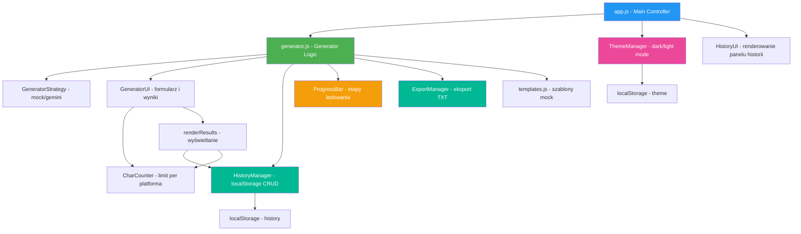

# 🚀 CaptionForge – Plan Nowych Funkcji

> **Cel:** Uzupełnić luki w obecnej implementacji i poprawić UX generatora
> **Zakres:** Historia generacji + Eksport + Licznik znaków z limitem platformy + Progress bar + Dark mode
> **Pliki do modyfikacji:** `index.html`, `css/styles.css`, `js/app.js`, `js/generator.js`

---

## 📊 Przegląd zmian

```mermaid
graph TD
    A[CaptionForge - Nowe Funkcje] --> B[1. Historia Generacji]
    A --> C[2. Eksport do TXT]
    A --> D[3. Licznik znaków z limitem]
    A --> E[4. Progress bar z etapami]
    A --> F[5. Dark Mode]

    B --> B1[localStorage - max 50 wpisów]
    B --> B2[Panel historii pod generatorem]
    B --> B3[Przycisk - Użyj ponownie]
    B --> B4[Przycisk - Usuń / Wyczyść]

    C --> C1[Eksport opisów + hasztagów]
    C --> C2[Format TXT - czytelny]
    C --> C3[Przycisk w panelu wyników]

    D --> D1[Dynamiczny limit per platforma]
    D --> D2[Kolorowa wizualizacja - zielony/żółty/czerwony]
    D --> D3[Tooltip z limitem platformy]

    E --> E1[3 etapy tekstowe]
    E --> E2[Pasek postępu z animacją]
    E --> E3[Podmiana tekstu co 1-2s]

    F --> F1[Toggle w navbar]
    F --> F2[CSS custom properties - łatwe przełączanie]
    F --> F3[localStorage - zapamiętanie preferencji]
    F --> F4[Respekt prefers-color-scheme]

    style A fill:#6C5CE7,color:white
    style B fill:#00B894,color:white
    style C fill:#00B894,color:white
    style D fill:#F59E0B,color:white
    style E fill:#F59E0B,color:white
    style F fill:#EC4899,color:white
```



---

## 1. 📜 Historia Generacji (localStorage)

### Opis
Sekcja Features na landing page obiecuje *"Eksport i historia generacji"* – ale ta funkcja nie istnieje. Implementujemy ją w oparciu o `localStorage`.

### Architektura danych

```javascript
// Struktura pojedynczego wpisu w historii
{
    id: crypto.randomUUID(),        // unikalny identyfikator
    timestamp: Date.now(),           // unix timestamp
    params: {
        platform: 'instagram',
        tone: 'inspirational',
        niche: 'fitness',
        language: 'pl',
        topic: 'Poranny trening...'
    },
    captions: [
        { id: 1, text: '...', variant: 'Wariant 1' },
        { id: 2, text: '...', variant: 'Wariant 2' },
        { id: 3, text: '...', variant: 'Wariant 3' }
    ],
    hashtags: [
        { tag: '#fitness', reach: 'large' },
        // ...
    ]
}
```

### Limity
- **Max 50 wpisów** w localStorage (FIFO – najstarsze usuwane automatycznie)
- Szacowany rozmiar per wpis: ~2-3 KB → ~150 KB max (bezpieczne dla localStorage)

### UI – Panel historii
- Umieszczony **pod generatorem** jako nowa sekcja
- Domyślnie zwinięty (accordion) z nagłówkiem: *"📜 Historia generacji (X wpisów)"*
- Każdy wpis pokazuje:
  - Datę/godzinę (sformatowaną: "23 mar, 18:45")
  - Badge platformy (emoji + nazwa)
  - Fragment tematu (pierwsze 50 znaków)
  - Przyciski: **Użyj ponownie** | **Podgląd** | **Usuń**
- Przycisk **Wyczyść historię** na dole panelu

### Interakcje
- **Użyj ponownie** → wypełnia formularz generatora danymi z wpisu historii
- **Podgląd** → rozwija wpis i pokazuje opisy + hasztagi (bez ponownego generowania)
- **Usuń** → kasuje wpis z localStorage po potwierdzeniu
- **Automatyczny zapis** → po każdym udanym generowaniu, wynik trafia do historii

### Plik do modyfikacji
| Plik | Zmiana |
|------|--------|
| `js/generator.js` | Dodaj moduł `HistoryManager` z metodami: `save()`, `getAll()`, `remove()`, `clear()` |
| `js/generator.js` | W `renderResults()` wywołaj `HistoryManager.save(params, result)` |
| `index.html` | Dodaj sekcję `#history` pod generatorem |
| `css/styles.css` | Style dla panelu historii |
| `js/app.js` | Inicjalizacja i renderowanie historii przy `DOMContentLoaded` |

---

## 2. 📤 Eksport do TXT

### Opis
Przycisk eksportu pojawi się w panelu wyników (obok "Generuj ponownie") oraz przy każdym wpisie historii.

### Format pliku TXT

```
CaptionForge – Wygenerowane opisy
Data: 23.03.2026, 18:45
Platforma: Instagram | Ton: Inspirujący | Nisza: fitness

═══════════════════════════════════════

WARIANT 1:
✨ Każdy dzień to nowa szansa na stworzenie czegoś wyjątkowego...

─────────────────────────────────────

WARIANT 2:
Twój poranny trening to inwestycja w siebie...

─────────────────────────────────────

WARIANT 3:
Nie czekaj na idealny moment – zacznij teraz...

═══════════════════════════════════════

HASZTAGI:
🔥 #fitness #motivation #lifestyle
📈 #fitnessmotivation #healthylifestyle
🎯 #treningPL #fitnessPL
```

### Implementacja
- Użyj `Blob` + `URL.createObjectURL()` + symulowany `<a>` click
- Nazwa pliku: `captionforge-{platforma}-{data}.txt`
- Kodowanie: UTF-8

### Plik do modyfikacji
| Plik | Zmiana |
|------|--------|
| `js/generator.js` | Dodaj funkcję `exportToTxt(result, params)` |
| `index.html` | Dodaj przycisk eksportu w `#resultsContent` |
| `css/styles.css` | Styl przycisku eksportu |

---

## 3. 📏 Licznik znaków z limitem platformy

### Opis
Obecnie jest prosty licznik `0/200` dla pola "Temat posta". Dodajemy **dynamiczny licznik** dla wygenerowanych opisów, pokazujący limit platformy.

### Limity per platforma

```javascript
const platformCharLimits = {
    instagram: { max: 2200, warning: 2000 },
    tiktok:    { max: 300,  warning: 250 },
    linkedin:  { max: 3000, warning: 2500 },
    twitter:   { max: 280,  warning: 250 },
    facebook:  { max: 63206, warning: 5000 }
};
```

### Wizualizacja
- Pod każdym wygenerowanym opisem: `148 / 2200 znaków`
- Kolorystyka:
  - **Zielony** (`#00B894`) – poniżej 80% limitu
  - **Żółty** (`#F59E0B`) – 80-95% limitu
  - **Czerwony** (`#E17055`) – powyżej 95% limitu
- Przy wyborze platformy w formularzu – krótki tooltip: *"Instagram: max 2200 znaków"*

### Plik do modyfikacji
| Plik | Zmiana |
|------|--------|
| `js/generator.js` | Dodaj `platformCharLimits`, aktualizuj `renderResults()` o licznik |
| `css/styles.css` | Style dla licznika (kolory, pozycja) |

---

## 4. ⏳ Progress Bar z etapami

### Opis
Zamiast prostego spinnera, pokażemy **animowany progress bar z opisami etapów**.

### Etapy

```javascript
const loadingStages = [
    { text: 'Analizuję Twój temat...', icon: '🔍', duration: 1500 },
    { text: 'Generuję 3 warianty opisów...', icon: '✍️', duration: 2000 },
    { text: 'Dobieram hasztagi dla Twojej niszy...', icon: '🏷️', duration: 1500 }
];
```

### UI
- Pasek postępu (CSS animation) wypełniający się od 0% do ~90%
- Tekst etapu zmienia się co ~1.5-2s
- Na końcu – szybkie wypełnienie do 100% + ikona ✅
- Pasek jest **animacją estetyczną** – nie odzwierciedla realnego postępu API (bo nie mamy chunked response)

### Plik do modyfikacji
| Plik | Zmiana |
|------|--------|
| `index.html` | Zamień `#resultsLoading` na rozbudowany progress bar |
| `js/generator.js` | Dodaj `ProgressBar` moduł z metodami `start()`, `nextStage()`, `complete()` |
| `css/styles.css` | Style progress bar, animacje etapów |

---

## 5. 🌙 Dark Mode

### Opis
Toggle dark/light mode z zapamiętywaniem preferencji w localStorage i respektowaniem `prefers-color-scheme`.

### Architektura CSS

Obecne kolory w `styles.css` korzystają z CSS custom properties (`:root`). Dodajemy wariant `[data-theme=dark]`:

```css
:root {
    --bg-primary: #FFFFFF;
    --bg-secondary: #F8F9FA;
    --text-primary: #2D3436;
    --text-secondary: #718096;
    --card-bg: #FFFFFF;
    --border-color: #E2E8F0;
    /* ... reszta */
}

[data-theme='dark'] {
    --bg-primary: #1A1A2E;
    --bg-secondary: #16213E;
    --text-primary: #E2E8F0;
    --text-secondary: #A0AEC0;
    --card-bg: #1E293B;
    --border-color: #334155;
    /* ... reszta */
}
```

### Toggle UI
- Przycisk 🌙/☀️ w navbarze (obok CTA)
- Płynna tranzycja: `transition: background-color 0.3s, color 0.3s`

### Logika przełączania (priorytet)
1. Sprawdź `localStorage.getItem('theme')`
2. Jeśli brak → sprawdź `window.matchMedia('(prefers-color-scheme: dark)')`
3. Domyślnie: light

### Plik do modyfikacji
| Plik | Zmiana |
|------|--------|
| `css/styles.css` | Dodaj blok `[data-theme=dark]` z dark palette, dodaj `transition` na `body` |
| `index.html` | Dodaj toggle button w navbar |
| `js/app.js` | Dodaj `ThemeManager` z metodami `init()`, `toggle()`, `persist()` |

---

## 🗂️ Kolejność implementacji

```mermaid
graph LR
    A[1. Dark Mode CSS vars] --> B[2. Dark Mode toggle + JS]
    B --> C[3. Progress bar z etapami]
    C --> D[4. Licznik znaków z limitem]
    D --> E[5. Historia generacji - localStorage]
    E --> F[6. Eksport do TXT]
    F --> G[7. Testowanie + QA]

    style A fill:#EC4899,color:white
    style B fill:#EC4899,color:white
    style C fill:#F59E0B,color:white
    style D fill:#F59E0B,color:white
    style E fill:#00B894,color:white
    style F fill:#00B894,color:white
    style G fill:#6C5CE7,color:white
```



### Uzasadnienie kolejności
1. **Dark Mode najpierw** – bo wymaga refaktoru CSS custom properties, co wpływa na wszystkie kolejne komponenty. Lepiej zrobić to raz na początku.
2. **Progress bar** – prosta zmiana w jednym miejscu (loading state), nie wpływa na inne funkcje.
3. **Licznik znaków** – dodatkowy element w `renderResults()`, mały zakres.
4. **Historia + Eksport** – najbardziej złożona funkcja, wymaga nowego modułu JS i sekcji HTML. Robimy na końcu, gdy reszta jest stabilna.

---

## 🔴 Ryzyka

| Ryzyko | Prawdopodobieństwo | Mitygacja |
|--------|---------------------|-----------|
| localStorage pełny u power usera | Niskie | Limit 50 wpisów + automatyczne FIFO |
| Dark mode psuje kontrast na poszczególnych elementach | Średnie | Testowanie manualne każdej sekcji |
| Progress bar nie synchronizuje się z czasem API | Niskie | Bar jest czysto estetyczny – animacja CSS niezależna od API |
| Eksport TXT – problemy z kodowaniem | Niskie | Wymuszenie UTF-8 BOM w Blob |
| Refaktor CSS properties łamie istniejące style | Średnie | Krok po kroku – testuj po każdej zmianie zmiennej |

---

## 📐 Diagram architektury modułów JS


