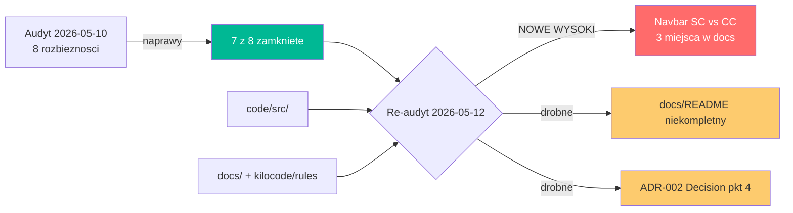

# PLAN — Re-audyt zgodności kodu z dokumentacją (2026-05-12)

> **Data:** 2026-05-12
> **Poprzedni audyt:** [`PLAN_audyt-zgodnosci-kod-vs-dokumentacja.md`](PLAN_audyt-zgodnosci-kod-vs-dokumentacja.md) (2026-05-10)
> **Zakres:** Weryfikacja, czy rozbieżności z poprzedniego audytu zostały zamknięte oraz wykrycie nowych niespójności między kodem [`code/src/`](../../code/src) a dokumentacją w [`docs/`](../../docs) i regułami w [`kilocode/rules/`](../../kilocode/rules).
> **Metoda:** Statyczne czytanie kluczowych plików (layout, route handler, komponenty CC/SC, hooks, types, configi) + porównanie z ADR-ami, dokumentacją techniczną, regułami kodowania i rejestrami zaimplementowanych funkcjonalności.

---

## 1. Werdykt ogólny

Kod jest w **bardzo wysokim stopniu zgodny z dokumentacją (>95%)**. Z 8 rozbieżności wykrytych 2026-05-10 — **7 zamkniętych**, 1 zamknięta przez aktualizację reguły (anchor links). Wykryto natomiast **1 nową istotną rozbieżność** (klasyfikacja `Navbar` jako Server/Client Component w trzech miejscach dokumentacji) oraz 2 drobne braki dokumentacyjne (niekompletny indeks w [`docs/README.md`](../README.md), niedoprecyzowanie pkt 4 sekcji „Decision" w [`adr_002`](../architecture/adr_002_gemini-api.md)).

---

## 2. Co zostało naprawione od poprzedniego audytu ✅

| Pkt z 2026-05-10 | Stan na 2026-05-12 | Dowód w kodzie/dokumentacji |
|---|---|---|
| 3.1 — brak `next/font` nieudokumentowany | ✅ Powstał ADR | [`adr_003_system-fonts.md`](../architecture/adr_003_system-fonts.md); reguła [`dev-coding-rules.md`](../../kilocode/rules/dev-coding-rules.md:166) ma wyjątek MVP; tech-doc §2.1 ma „Notkę typograficzną" |
| 3.2 — `<a href="#">` zamiast `next/link` | ✅ Reguła rozszerzona o wyjątek | [`dev-coding-rules.md`](../../kilocode/rules/dev-coding-rules.md:165) — *„wyjątek: in-page anchor linki używają surowego `<a>`"* |
| 3.4 — ADR-002 deklaruje JSON mode, kod nie używa | ✅ Kod doprowadzony do ADR | [`route.ts`](../../code/src/app/api/generate/route.ts:119) — `responseMimeType: "application/json"` + `responseSchema: GENERATE_RESPONSE_SCHEMA` |
| 3.5 — `lib/utils` w przykładzie reguł | ✅ Poprawione | [`dev-coding-rules.md`](../../kilocode/rules/dev-coding-rules.md:150) — `import { cn } from '@/lib/cn';` |
| 3.6 — brak `error.tsx`/`loading.tsx` | ✅ Udokumentowane | „Notka architektoniczna" w [`technical-documentation.md`](../tech/technical-documentation.md:78) |
| 3.7 — `services/.gitkeep` poza drzewem | ✅ Dodane do drzewa | [`technical-documentation.md`](../tech/technical-documentation.md:74) — „Zarezerwowane (puste) — przyszła warstwa serwisów" |
| 3.8 — duplikacja typów vs Zod | ✅ Wyprowadzone przez `z.infer` | [`generator.ts`](../../code/src/types/generator.ts:68-72) — `Platform`, `Tone`, `Language`, `GenerateRequest`, `HashtagReach` |
| ADR-002 parametry Gemini (temperature/maxTokens) | ✅ Sekcja „Rozszerzenie — Polityka Resilience" | [`adr_002_gemini-api.md`](../architecture/adr_002_gemini-api.md:45-83) — opisuje aktualne `temperature: 0.7`, `maxOutputTokens: 4096`, retry 3×, AbortController 25 s, Zod walidacja |

---

## 3. Nowe / nadal otwarte rozbieżności ❌

### 3.1. 🔴 [WYSOKI] Navbar to Client Component, dokumentacja klasyfikuje go jako Server

- **Stan w kodzie:** [`code/src/components/features/navbar.tsx:1`](../../code/src/components/features/navbar.tsx:1) zaczyna się od `"use client"`. Komponent używa:
  - [`useState`](../../code/src/components/features/navbar.tsx:8) — `isScrolled`, `mobileOpen`
  - [`useEffect`](../../code/src/components/features/navbar.tsx:11) — scroll listener z cleanupem
  - `onClick` z handlerem `scrollTo` ([linie 24-34](../../code/src/components/features/navbar.tsx:24))

  To **pełnoprawny Client Component**, nie SC z leaf CC.

- **Dokumentacja błędna w 3 miejscach:**
  1. [`technical-documentation.md`](../tech/technical-documentation.md:143) §2.3 (tabela SC/CC) — *„Server (opakowuje `ThemeToggle` CC)"*
  2. [`technical-documentation.md`](../tech/technical-documentation.md:232) §2.6 (tabela sekcji) — *„Server + leaf CC (`ThemeToggle`)"*
  3. [`implemented_features.md`](../architecture/implemented_features.md:11) — *„Wszystkie sekcje jako Server Components z wyjątkiem FAQ (Client — accordion state) i Navbar (opakowuje leaf CC ThemeToggle)"*

- **Skutek:** Wprowadza w błąd nt. granicy SC/CC. Istotne, bo cytujemy podział SC/CC jako sztandarowy dowód zgodności z [`dev-coding-rules.md`](../../kilocode/rules/dev-coding-rules.md) §3 — błędna klasyfikacja podważa wiarygodność tabeli.

### 3.2. 🟡 [NISKI] Niekompletny indeks dokumentów w `docs/README.md`

- [`docs/README.md`](../README.md:13-33) **nie wymienia** w tabelach:
  - **Architektura:** [`architecture/system_overview.md`](../architecture/system_overview.md), [`adr_001_nextjs-app-router.md`](../architecture/adr_001_nextjs-app-router.md), [`adr_002_gemini-api.md`](../architecture/adr_002_gemini-api.md), [`adr_003_system-fonts.md`](../architecture/adr_003_system-fonts.md), [`implemented_features.md`](../architecture/implemented_features.md), [`implemented_plans.md`](../architecture/implemented_plans.md)
  - **Plany:** [`PLAN_generator-niezawodnosc-p0.md`](PLAN_generator-niezawodnosc-p0.md), [`PLAN_audyt-zgodnosci-kod-vs-dokumentacja.md`](PLAN_audyt-zgodnosci-kod-vs-dokumentacja.md), [`PLAN_sdd-architecture-adr.md`](PLAN_sdd-architecture-adr.md), [`PLAN_sdd-dokumentacja-rol.md`](PLAN_sdd-dokumentacja-rol.md), [`PLAN_sdd-rejestry-projektu.md`](PLAN_sdd-rejestry-projektu.md), [`PLAN_sdd-workflow-implement.md`](PLAN_sdd-workflow-implement.md)
- **Skutek:** Nawigacja po dokumentacji jest niepełna; nowy developer/agent może nie znaleźć ADR-ów, rejestrów ani połowy planów.

### 3.3. 🟡 [NISKI] ADR-002 — pkt 4 sekcji „Decision" mylący po wdrożeniu Structured Output

- [`adr_002_gemini-api.md`](../architecture/adr_002_gemini-api.md:24) — *„Native JSON mode … (choć implementacja nadal ma fallback z `parseGeminiResponse` dla starszych modeli)"*
- W kontekście aktualnego kodu (`responseSchema` + Zod walidacja w [`parseGeminiResponse`](../../code/src/lib/gemini-prompt.ts:155-163) + fallback do mocka) zdanie jest mylące — fallback nie jest „dla starszych modeli", tylko dla **naruszeń kontraktu Zod / błędów Gemini**. Sekcja „Rozszerzenie — Polityka Resilience" wyjaśnia to poprawnie, ale „Decision" warto zsynchronizować dla spójności wewnętrznej dokumentu.

---

## 4. Punkty świadome / nieistotne 🟢

- **Brak `next/image`** — żaden komponent nie używa obrazów rastrowych (emoji + CSS gradients only). Świadoma decyzja MVP, wzmiankowana pośrednio w dokumentacji architekturalnej.
- **`HashtagReachSchema` waliduje `reach` jako `z.string()` w `GenerateResultPayloadSchema`** — celowe rozluźnienie schemy payloadu, twarda walidacja `reach` jako enum odbywa się w [`parseGeminiResponse`](../../code/src/lib/gemini-prompt.ts:170-185) z fallbackiem do `"medium"`. Spójne z polityką resilience.

---

## 5. Diagram stanu

---

## 6. Plan działania (todo dla naprawy)

Lista naprawcza — **do wykonania w trybie `code` po akceptacji**:

- [ ] **3.1.a** Poprawić klasyfikację `Navbar` w [`docs/tech/technical-documentation.md`](../tech/technical-documentation.md:143) §2.3 — zmienić *„Server (opakowuje `ThemeToggle` CC)"* na *„Client (scroll listener, mobile menu state, scrollTo onClick) — zawiera leaf CC `ThemeToggle`"*.
- [ ] **3.1.b** Poprawić klasyfikację `Navbar` w [`docs/tech/technical-documentation.md`](../tech/technical-documentation.md:232) §2.6 — zmienić *„Server + leaf CC (`ThemeToggle`)"* na *„Client (zawiera `ThemeToggle`)"*.
- [ ] **3.1.c** Poprawić opis Landing Page w [`docs/architecture/implemented_features.md`](../architecture/implemented_features.md:11) — zaktualizować zdanie *„Wszystkie sekcje jako Server Components z wyjątkiem FAQ (Client — accordion state) i Navbar (opakowuje leaf CC ThemeToggle)"* na: *„Wszystkie sekcje jako Server Components z wyjątkiem FAQ (Client — accordion state) i Navbar (Client — scroll listener + mobile menu, zawiera leaf CC `ThemeToggle`)"*.
- [ ] **3.2.a** Uzupełnić [`docs/README.md`](../README.md) sekcję „Dokumentacja projektu" o brakujące wpisy: `architecture/system_overview.md`, `architecture/adr_001_nextjs-app-router.md`, `architecture/adr_002_gemini-api.md`, `architecture/adr_003_system-fonts.md`, `architecture/implemented_features.md`, `architecture/implemented_plans.md`.
- [ ] **3.2.b** Uzupełnić [`docs/README.md`](../README.md) sekcję „Plany implementacyjne" o: `PLAN_generator-niezawodnosc-p0`, `PLAN_audyt-zgodnosci-kod-vs-dokumentacja`, `PLAN_reaudyt-zgodnosci-2026-05-12`, `PLAN_sdd-architecture-adr`, `PLAN_sdd-dokumentacja-rol`, `PLAN_sdd-rejestry-projektu`, `PLAN_sdd-workflow-implement`.
- [ ] **3.3** Doprecyzować pkt 4 sekcji „Decision" w [`docs/architecture/adr_002_gemini-api.md`](../architecture/adr_002_gemini-api.md:24) — zamienić *„fallback z `parseGeminiResponse` dla starszych modeli"* na *„fallback z `parseGeminiResponse` + walidacja Zod do mock-templates dla naruszeń kontraktu / awarii Gemini (szczegóły w sekcji Rozszerzenie poniżej)"*.
- [ ] **WALIDACJA** Po wprowadzeniu poprawek uruchomić `cd code && npm run lint && npm run build` — zmiany dotyczą wyłącznie plików `.md`, więc build powinien być no-op, ale walidacja końcowa jest wymagana zgodnie z [`dev-coding-rules.md`](../../kilocode/rules/dev-coding-rules.md) §11.

---

## 7. Powiązane dokumenty

- Poprzedni audyt: [`PLAN_audyt-zgodnosci-kod-vs-dokumentacja.md`](PLAN_audyt-zgodnosci-kod-vs-dokumentacja.md)
- Reguły kodowania: [`dev-coding-rules.md`](../../kilocode/rules/dev-coding-rules.md)
- Architektura: [`system_overview.md`](../architecture/system_overview.md), [`adr_001`](../architecture/adr_001_nextjs-app-router.md), [`adr_002`](../architecture/adr_002_gemini-api.md), [`adr_003`](../architecture/adr_003_system-fonts.md)
- Tech-doc: [`technical-documentation.md`](../tech/technical-documentation.md)
- Rejestry: [`implemented_features.md`](../architecture/implemented_features.md), [`implemented_plans.md`](../architecture/implemented_plans.md)
