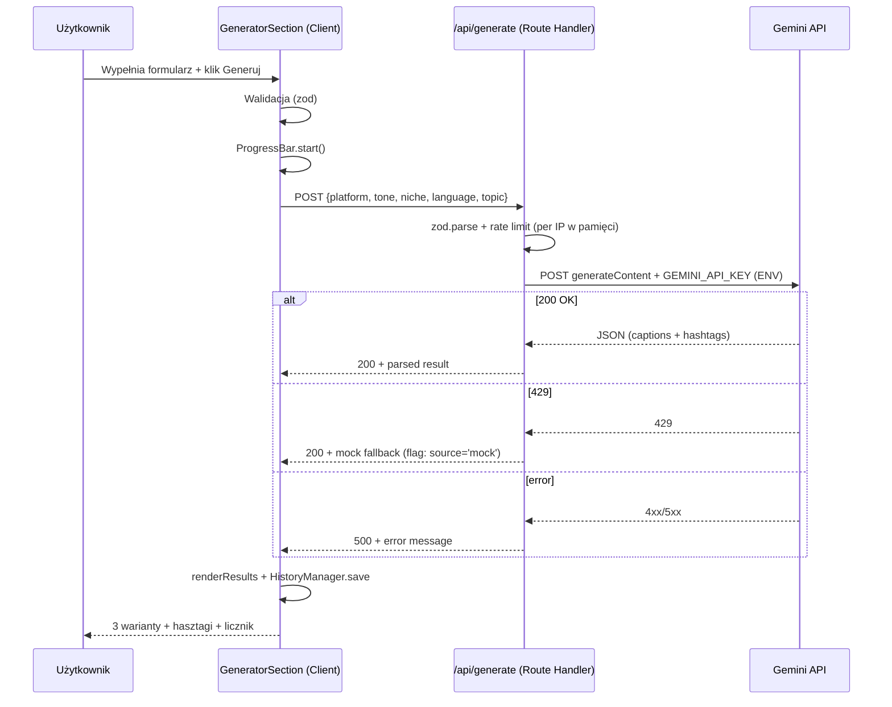

# 🏗️ Szkielet Next.js CaptionForge – Master Plan

> **Data:** 2026-04-21
> **Lokalizacja docelowa:** `/szkielet/`
> **Cel:** Zbudować w folderze `/szkielet/` nowy projekt Next.js 14 App Router + React 18 + TypeScript strict + Tailwind v3, będący pełnym portem obecnego MVP CaptionForge (landing + generator z AI + dark mode + historia + eksport), zgodnym z obligatoryjnymi regułami z [`kilocode/rules/dev-coding-rules.md`](../kilocode/rules/dev-coding-rules.md:1).
> **Kluczowa różnica vs obecny MVP:** klucz Gemini API przenosimy na backend (Route Handler `/api/generate`) i eliminujemy krytyczną lukę bezpieczeństwa z [`plans/captionforge-audit-i-roadmap.md`](captionforge-audit-i-roadmap.md:34).

---

## 🎯 Definicja Ukończenia (Master)

Szkielet jest gotowy, gdy:

- [ ] `/szkielet/` zawiera działający projekt Next.js 14 App Router z TS strict i Tailwind v3
- [ ] `npm run dev` uruchamia aplikację bez błędów; `npm run build && npm run lint && tsc --noEmit` przechodzi
- [ ] Strona `/` renderuje landing page (Navbar, Hero, Features, How It Works, Generator, FAQ, CTA, Footer) z design systemem CaptionForge (fiolet `#6C5CE7` / zielony `#00B894`)
- [ ] Dark/light mode działa z persystencją w `localStorage` i brak FOUC
- [ ] Generator wysyła request do `/api/generate`, który po stronie serwera woła Gemini 2.5 Flash z kluczem z ENV; fallback mock przy 429
- [ ] Historia generacji (localStorage, max 50 wpisów) z podglądem, przywracaniem i usuwaniem
- [ ] Eksport pojedynczego wyniku do TXT (UTF-8 BOM) przez Blob API
- [ ] Licznik znaków per platforma z progami safe/warning/danger
- [ ] Responsywność mobile-first (breakpointy Tailwind `md:`, `lg:`, `xl:`)

---

## 🧭 Docelowa architektura projektu

```
szkielet/
├── .env.local.example        # GEMINI_API_KEY=...
├── .eslintrc.json
├── .gitignore
├── next.config.mjs
├── package.json
├── postcss.config.mjs
├── tailwind.config.ts
├── tsconfig.json             # strict, noUncheckedIndexedAccess
├── public/
│   └── favicon.svg
└── src/
    ├── app/
    │   ├── layout.tsx         # Root layout + ThemeProvider + anti-FOUC script
    │   ├── page.tsx           # Server Component — składa sekcje landing
    │   ├── globals.css        # @tailwind base/components/utilities + CSS vars
    │   └── api/
    │       └── generate/
    │           └── route.ts   # POST — proxy do Gemini API
    ├── components/
    │   ├── ui/
    │   │   ├── button.tsx
    │   │   ├── select.tsx
    │   │   ├── textarea.tsx
    │   │   ├── input.tsx
    │   │   ├── toast.tsx
    │   │   ├── progress-bar.tsx
    │   │   ├── theme-toggle.tsx
    │   │   └── index.ts
    │   └── features/
    │       ├── navbar.tsx
    │       ├── hero.tsx
    │       ├── features-grid.tsx
    │       ├── how-it-works.tsx
    │       ├── generator/
    │       │   ├── generator-section.tsx   # 'use client'
    │       │   ├── generator-form.tsx
    │       │   ├── generator-results.tsx
    │       │   ├── caption-card.tsx
    │       │   ├── hashtag-chips.tsx
    │       │   └── char-counter.tsx
    │       ├── history/
    │       │   ├── history-panel.tsx       # 'use client'
    │       │   └── history-entry.tsx
    │       ├── faq.tsx
    │       ├── cta-bottom.tsx
    │       └── footer.tsx
    ├── hooks/
    │   ├── useTheme.ts
    │   ├── useHistory.ts
    │   └── useGenerator.ts
    ├── lib/
    │   ├── cn.ts                       # clsx + tailwind-merge
    │   ├── gemini-prompt.ts            # buildGeminiPrompt, parseGeminiResponse
    │   ├── platform-limits.ts          # platformCharLimits
    │   ├── history-storage.ts          # CRUD localStorage
    │   ├── export-txt.ts               # Blob + UTF-8 BOM
    │   └── mock-templates.ts           # port templates.js (fallback)
    ├── services/
    │   └── generate-client.ts          # fetch('/api/generate')
    ├── types/
    │   ├── generator.ts                # Platform, Tone, Language, CaptionResult
    │   └── history.ts
    └── constants/
        ├── platforms.ts
        ├── tones.ts
        └── design-tokens.ts            # kolory + echo tokenów z Tailwind
```

### Przepływ request/response



---

## 🗂️ Podział na atomowe plany (kolejność realizacji)

Zgodnie z [`dev-plan-workflow.md`](../kilocode/rules/dev-plan-workflow.md:1), każdy plan atomowy = ≤3 pliki lub jasno ograniczona funkcjonalność, wykonalny w jednej sesji AI. Master plan poniżej rozbija pracę na **8 atomowych planów** do realizacji sekwencyjnie.

| # | Plan atomowy | Zakres | Zależy od |
|---|--------------|--------|-----------|
| 1 | Bootstrap Next.js | Konfiguracje, struktura katalogów, root layout, placeholder page | — |
| 2 | Design System + Theme | Tailwind tokeny, globals.css, ThemeProvider, anti-FOUC, theme-toggle | 1 |
| 3 | Landing page UI | Navbar, Hero, Features, HowItWorks, FAQ, CTA, Footer jako komponenty | 2 |
| 4 | Generator UI (stub) | Formularz + panel wyników + stany (placeholder/loading/results) — bez API | 2 |
| 5 | Route Handler `/api/generate` | Proxy do Gemini z ENV, zod walidacja, fallback 429 na mock | 1 |
| 6 | Integracja generatora | Połączenie UI z `/api/generate`, ProgressBar, CharCounter, toast errorów | 4, 5 |
| 7 | Historia generacji | HistoryManager + HistoryUI panel + restore do formularza + usuwanie | 6 |
| 8 | Eksport TXT | ExportManager (Blob + BOM) + przycisk w results + w historii | 6, 7 |

---

## ⚙️ Sekcja 1: Bootstrap Next.js ✅ Test Manualny

**Pliki (5):**
- `szkielet/package.json`
- `szkielet/tsconfig.json` (strict + noUncheckedIndexedAccess)
- `szkielet/next.config.mjs`
- `szkielet/tailwind.config.ts` + `szkielet/postcss.config.mjs`
- `szkielet/src/app/{layout.tsx,page.tsx,globals.css}` + `.eslintrc.json` + `.gitignore` + `.env.local.example`

**Zakres:**
- Zainicjować `package.json` z dependencies: `next@14`, `react@18`, `react-dom@18`, `typescript@5`, `tailwindcss@3`, `clsx`, `tailwind-merge`, `zod`. Dev: `@types/*`, `eslint`, `eslint-config-next`, `postcss`, `autoprefixer`.
- Skonfigurować TS strict.
- Utworzyć katalogi: `src/{app,components/ui,components/features,hooks,lib,services,types,constants}` (z pustymi `index.ts` gdzie ma sens).
- `layout.tsx` z `<html lang="pl">` + `globals.css`; `page.tsx` = placeholder „CaptionForge szkielet".
- `.env.local.example` z `GEMINI_API_KEY=` + wpis w `.gitignore` dla `.env.local`.

**Test manualny:**
- `cd szkielet && npm install && npm run dev` — otwiera `http://localhost:3000` z placeholderem
- `npm run build` przechodzi; `npx tsc --noEmit` bez błędów

---

## ⚙️ Sekcja 2: Design System + Theme ✅ Test Manualny

**Pliki (4):**
- `szkielet/tailwind.config.ts` (rozszerzenie)
- `szkielet/src/app/globals.css` (CSS vars + @layer base)
- `szkielet/src/components/ui/theme-toggle.tsx` + `src/hooks/useTheme.ts`
- `szkielet/src/app/layout.tsx` (dodanie anti-FOUC inline script + `suppressHydrationWarning`)

**Zakres:**
- W `tailwind.config.ts` rozszerzyć `theme.extend.colors` o tokeny: `primary` (#6C5CE7), `secondary` (#00B894), `accent` (#FD79A8), `surface`, `text-primary`, `text-secondary`, `border` — powiązane z CSS vars (`bg: 'rgb(var(--bg) / <alpha-value>)'`).
- W `globals.css` zdefiniować `:root` i `[data-theme='dark']` z paletą z [`plan.md`](../docs/plan.md:107) i [`features.js`](../js/features.js:1).
- Anti-FOUC inline script w `<head>` (`dangerouslySetInnerHTML`) czytający `localStorage['captionforge-theme']` i ustawiający `data-theme` PRZED hydracją.
- `useTheme` – hook zarządzający stanem + listener `matchMedia('(prefers-color-scheme: dark)')`.
- `<ThemeToggle />` – ikony 🌙/☀️ w prawym górnym rogu (później montowany w Navbar).

**Test manualny:**
- Toggle przełącza motyw natychmiastowo
- Reload strony zachowuje wybrany motyw
- Brak mignięcia białego tła przy wejściu w dark mode
- Usunięcie wpisu z localStorage → motyw zgodny z `prefers-color-scheme`

---

## ⚙️ Sekcja 3: Landing Page UI ✅ Test Manualny

**Pliki (7+):**
- `src/components/features/{navbar,hero,features-grid,how-it-works,faq,cta-bottom,footer}.tsx`
- `src/app/page.tsx` – composition sekcji
- (opcjonalnie) `src/components/ui/{button.tsx,accordion.tsx}`

**Zakres:**
- Port UI z obecnego [`index.html`](../index.html:1) jako React Server Components (FAQ = Client dla accordion).
- Navbar zawiera `<ThemeToggle />` + hamburger menu mobilne (Client).
- Hero: headline z gradientem, CTA scrollujący do `#generator`, mockup karty z przykładem, floating badges, statystyki.
- Features: grid 6 kart z inline SVG ikonami.
- How It Works: 3 kroki z connector lines.
- FAQ: accordion Client — jedno pytanie otwarte naraz.
- Footer: linki (placeholder `#`), copyright.
- Wszystko na Tailwind utility classes, responsywne mobile-first.

**Test manualny:**
- Wszystkie sekcje renderują się poprawnie w light/dark
- Mobile (<768px): hamburger menu działa, layout nie łamie się
- Smooth scroll przy kliknięciu w link navigacyjny
- FAQ: klik otwiera/zamyka panele ekskluzywnie

---

## ⚙️ Sekcja 4: Generator UI (stub) ✅ Test Manualny

**Pliki (≤3):**
- `src/components/features/generator/generator-section.tsx` (Client)
- `src/components/features/generator/generator-form.tsx` + `generator-results.tsx`
- `src/constants/{platforms.ts,tones.ts}` + `src/types/generator.ts`

**Zakres:**
- Formularz React Hook Form (opcjonalnie) lub controlled components z useState.
- 5 pól: Platform (select), Tone (select), Niche (input), Language (select), Topic (textarea z character counter).
- Walidacja inline przez zod.
- Panel wyników w 3 stanach: `idle` (placeholder), `loading` (ProgressBar z 3 etapami), `success` (3 karty + hasztagi), `error` (komunikat + retry).
- Na razie submit tylko ustawia stan `loading` przez mock timeout 1.5s → idle z komunikatem "TODO: API".

**Test manualny:**
- Wypełnienie formularza + submit → loading → idle
- Walidacja: pusty temat blokuje submit z komunikatem
- Character counter w textarea zmienia kolor przy >180/200 znakach

---

## ⚙️ Sekcja 5: Route Handler `/api/generate` ✅ Test Manualny

**Pliki (3):**
- `src/app/api/generate/route.ts`
- `src/lib/gemini-prompt.ts` (`buildGeminiPrompt`, `parseGeminiResponse`)
- `src/lib/mock-templates.ts` (port uproszczony z [`js/templates.js`](../js/templates.js:1) — minimum dla fallback)

**Zakres:**
- `POST /api/generate`:
  - `zod` schema dla body (platform, tone, niche, language, topic).
  - Odczyt `process.env.GEMINI_API_KEY`; jeśli brak → 500 z komunikatem „brak konfiguracji".
  - Budowa promptu + fetch do Gemini 2.5 Flash.
  - Przy HTTP 429 → zwróć 200 z mock fallback + flag `source: 'mock'`.
  - Przy parse error → 200 z mock + flag.
  - Przy innym błędzie → 500 z JSON `{error: string}`.
  - `export const runtime = 'nodejs'` (lub `edge` – wybrać node dla prostoty logów).
- Limit per IP in-memory (Map) — soft rate limiting, 30 req/h.

**Test manualny:**
- `curl -X POST localhost:3000/api/generate -d '{"platform":"instagram","tone":"casual","niche":"fitness","language":"pl","topic":"poranny trening"}' -H 'Content-Type: application/json'` — zwraca JSON z 3 captions + hashtags
- Brak `GEMINI_API_KEY` → 500 z jasnym komunikatem
- Niepoprawny body → 400 z błędami zod

---

## ⚙️ Sekcja 6: Integracja generatora ✅ Test Manualny

**Pliki (3):**
- `src/services/generate-client.ts` (`fetch('/api/generate')` + typy)
- `src/hooks/useGenerator.ts` (stan: idle/loading/success/error, handler submit)
- `src/components/ui/progress-bar.tsx` + `src/components/features/generator/char-counter.tsx` + `src/lib/platform-limits.ts`

**Zakres:**
- `useGenerator` woła `generate-client` → zapisuje wynik w stanie.
- `ProgressBar` – 3 etapy tekstowe z animacją CSS (Tailwind `animate-pulse` lub keyframes w globals.css).
- `CharCounter` – wyświetla `N / max` z kolorami wg progów z `platform-limits`.
- Toast errorów (lekki komponent `ui/toast.tsx` — `aria-live="polite"`).

**Test manualny:**
- Submit → ProgressBar 3 etapy → 3 karty z Gemini lub mock
- Licznik znaków na każdej karcie: zielony / żółty / czerwony
- Symulacja błędu sieci (offline) → toast z komunikatem

---

## ⚙️ Sekcja 7: Historia generacji ✅ Test Manualny

**Pliki (3):**
- `src/lib/history-storage.ts` (CRUD localStorage, klucz `captionforge-history`, max 50)
- `src/hooks/useHistory.ts`
- `src/components/features/history/{history-panel.tsx,history-entry.tsx}`

**Zakres:**
- Typy: `HistoryEntry { id, timestamp, params, captions, hashtags, source }`.
- `useHistory.add()` wywoływany w `useGenerator` po sukcesie.
- `HistoryPanel` – collapsible poniżej generatora; lista wpisów z datą, badgem platformy, fragmentem tematu.
- Per wpis: „Użyj ponownie" (restore do formularza przez callback / context), „Podgląd" (expand), „Usuń".
- „Wyczyść historię" na dole z confirm.

**Test manualny:**
- Po wygenerowaniu wpis pojawia się w historii
- „Użyj ponownie" wypełnia formularz poprzednimi wartościami
- Usunięcie pojedynczego wpisu i „Wyczyść historię" działają
- Reload strony zachowuje historię

---

## ⚙️ Sekcja 8: Eksport TXT ✅ Test Manualny

**Pliki (2):**
- `src/lib/export-txt.ts` (`buildTxt(params, result)` + `download(filename, content)`)
- Rozszerzenie `generator-results.tsx` + `history-entry.tsx` o przycisk eksportu

**Zakres:**
- Format TXT zgodny z [`captionforge-new-features.md §2`](captionforge-new-features.md:118): nagłówek, 3 warianty oddzielone liniami, hasztagi.
- UTF-8 BOM na początku (`\uFEFF`).
- Nazwa pliku: `captionforge-{platform}-{YYYY-MM-DD}.txt`.

**Test manualny:**
- Klik „Eksport TXT" pobiera plik
- Otwarcie w Notatniku/Excelu → polskie znaki poprawne
- Eksport z wpisu historii również działa

---

## 🧪 Weryfikacja Końcowa (master)

```bash
cd szkielet
npm install
npm run lint
npx tsc --noEmit
npm run build
npm run dev   # smoke test: dark mode + generator + historia + eksport
```

---

## 🔴 [RISKS]

| Ryzyko | Prawdopodobieństwo | Mitygacja |
|--------|---------------------|-----------|
| `GEMINI_API_KEY` zapomniany w `.env.local` na produkcji | Wysokie | `.env.local.example` + docs w README szkieletu + explicit 500 z jasnym komunikatem |
| Hydration mismatch przy theme (dark mode) | Średnie | Anti-FOUC inline script + `suppressHydrationWarning` na `<html>` |
| Rate limit Gemini 429 w dev | Średnie | Fallback mock + toast informujący o źródle |
| `use client` wszędzie → ciężki bundle | Niskie | Ściśle trzymać Server Components dla statycznych sekcji, Client tylko dla Generator/History/FAQ/Theme |
| Port templates.js 1:1 wydłuży plan | Średnie | W Sekcji 5 zrobić MINIMALNY mock (po 1 szablonie per ton × platforma) — rozbudowa później |
| Różnice design tokenów CSS vars vs Tailwind colors | Średnie | Jeden source of truth: CSS vars → Tailwind mapuje przez `rgb(var(--x) / <alpha-value>)` |

---

## 🤝 Decyzje architektoniczne

| Decyzja | Uzasadnienie |
|---------|-------------|
| Route Handler zamiast Server Action dla Gemini | Jawny kontrakt REST, łatwy mock/test z `curl`; Server Action wymaga formularza i komplikuje fallback |
| `runtime = 'nodejs'` | Łatwiejsze debugowanie i logi; Edge można włączyć później bez zmian w logice |
| localStorage (nie IndexedDB) dla historii | Spójność z obecnym MVP, wystarczające dla 50 wpisów × ~3 KB |
| Zod w API i formularzu | Jeden schemat `GenerateRequestSchema` re-używany client + server |
| Tailwind + CSS vars (nie tylko Tailwind) | Dark mode przez `data-theme` bez config dwóch palet; spójne z planem `plan.md` |
| Brak react-hook-form w MVP szkieletu | Zero dodatkowej zależności; formularz krótki, useState wystarczy |

---

## 🔗 Powiązane dokumenty

- [`dev-coding-rules.md`](../kilocode/rules/dev-coding-rules.md:1) — obligatoryjne reguły kodowania
- [`dev-plan-workflow.md`](../kilocode/rules/dev-plan-workflow.md:1) — wzorzec atomowych planów
- [`captionforge-audit-i-roadmap.md`](captionforge-audit-i-roadmap.md:1) — audit MVP + roadmap
- [`gemini-api-integration.md`](gemini-api-integration.md:1) — integracja Gemini (referencja promptu)
- [`captionforge-new-features.md`](captionforge-new-features.md:1) — specyfikacja Historii / Eksportu / ProgressBar
- [`docs/plan.md`](../docs/plan.md:1) — design system i breakpointy
- [`docs/technical-documentation.md`](../docs/technical-documentation.md:1) — architektura obecnego MVP
