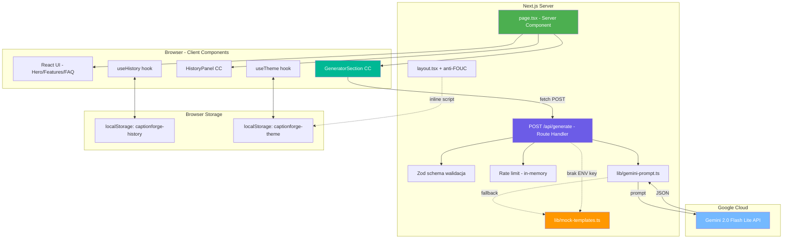
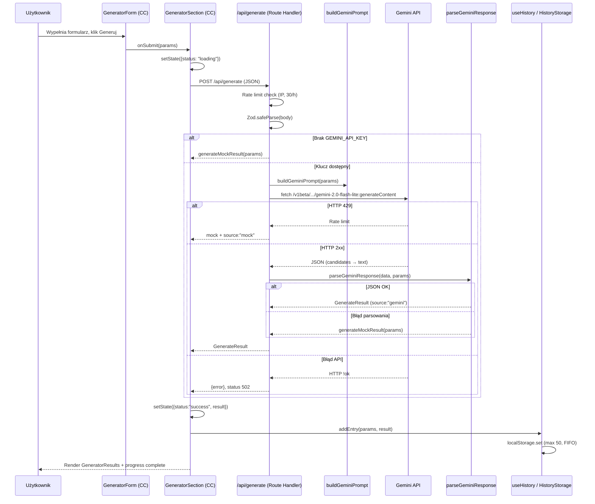
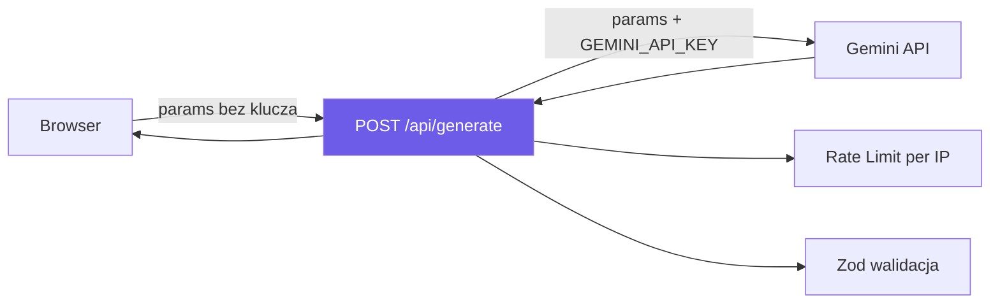
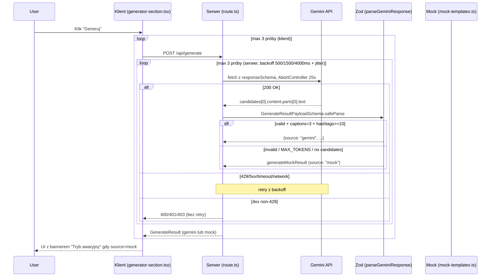

# 📖 CaptionForge – Dokumentacja Techniczna

> **Wersja:** 2.0
> **Data:** Kwiecień 2026
> **Status:** Aplikacja Next.js 14 (App Router) — po migracji z Vanilla HTML/JS

---

## Spis treści

1. [Wprowadzenie](#1-wprowadzenie)
2. [Architektura systemu](#2-architektura-systemu)
3. [Moduły aplikacji](#3-moduły-aplikacji)
4. [Integracja z Gemini API](#4-integracja-z-gemini-api)
5. [Stack technologiczny](#5-stack-technologiczny)
6. [Powiązana dokumentacja](#6-powiązana-dokumentacja)

---

## 1. Wprowadzenie

**CaptionForge** to aplikacja webowa do generowania angażujących opisów i hasztagów pod posty w mediach społecznościowych. Produkt łączy landing page (prezentacja wartości) z działającym generatorem opartym na AI (Google Gemini).

> **Propozycja wartości:** Wygeneruj spersonalizowany opis i hasztagi do posta w 10 sekund — dopasowane do niszy, tonu głosu i platformy.

Zakres funkcjonalny, persony użytkowników i szczegółowa strategia produktowa opisane są w dokumentach linkowanych w sekcji [Powiązana dokumentacja](#6-powiązana-dokumentacja).

> **Historia:** Pierwsza wersja MVP (Vanilla HTML/CSS/JS) znajduje się w folderze [`vanilla web/`](../../vanilla%20web) i jest zachowana jako referencja. Obecna implementacja produkcyjna to Next.js 14 — dokumentacja poniżej opisuje właśnie ją.

---

## 2. Architektura systemu

### 2.1 Struktura plików

```
code/
├── .env.local                  # GEMINI_API_KEY (NIE commitować)
├── next.config.mjs             # reactStrictMode: true
├── tailwind.config.ts          # darkMode: ["class", '[data-theme="dark"]']
├── tsconfig.json               # strict + noUncheckedIndexedAccess
├── postcss.config.mjs
├── package.json                # Next 14.2, React 18, Zod 3
└── src/
    ├── app/
    │   ├── layout.tsx          # Root layout + anti-FOUC script
    │   ├── page.tsx            # Server Component — landing
    │   ├── globals.css         # CSS vars (design tokens) + Tailwind
    │   └── api/generate/
    │       └── route.ts        # POST — proxy do Gemini + rate limit + Zod
    ├── components/
    │   ├── ui/                 # Button, ThemeToggle, ProgressBar, Toast
    │   └── features/
    │       ├── navbar.tsx, hero.tsx, features-grid.tsx,
    │       ├── how-it-works.tsx, faq.tsx, cta-bottom.tsx, footer.tsx
    │       ├── generator/      # GeneratorSection (CC) + Form + Results
    │       └── history/        # HistoryPanel + HistoryEntry
    ├── hooks/
    │   ├── useTheme.ts         # Dark/light mode hook
    │   └── useHistory.ts       # Historia generacji (localStorage)
    ├── lib/
    │   ├── cn.ts               # clsx + tailwind-merge
    │   ├── gemini-prompt.ts    # buildGeminiPrompt + parseGeminiResponse
    │   ├── mock-templates.ts   # Fallback szablony
    │   ├── history-storage.ts  # CRUD localStorage (max 50)
    │   └── export-txt.ts       # Eksport TXT (Blob API + UTF-8 BOM)
    ├── types/
    │   ├── generator.ts        # Platform, Tone, Language, GenerateResult
    │   └── history.ts          # HistoryEntry
    ├── constants/
    │   ├── platforms.ts        # 5 platform + limity znaków
    │   ├── tones.ts            # 5 tonów głosu
    │   └── design-tokens.ts    # Kolory (dokumentacja CSS vars)
    └── services/               # Zarezerwowane (puste) — przyszła warstwa serwisów
        └── .gitkeep            # np. analytics, A/B testing, zewnętrzne API wrappers
```

> **Notka architektoniczna:** W segmencie `app/` celowo brak plików `error.tsx` i `loading.tsx`. Cały data fetching odbywa się po stronie klienta w Client Component [`GeneratorSection`](../../code/src/components/features/generator/generator-section.tsx) z własnym state machine (`idle → loading → success | error`). Brak Server-Side data fetching = brak potrzeby segmentowych plików `error.tsx`/`loading.tsx` zgodnie z Next.js App Router semantiką.

> **Notka typograficzna:** Projekt używa systemowego stosu czcionek zamiast `next/font` — patrz [`adr_003_system-fonts.md`](../architecture/adr_003_system-fonts.md).

### 2.2 Diagram architektury



### 2.3 Podział Server / Client Components

Zgodnie z regułą [`dev-coding-rules.md`](../../kilocode/rules/dev-coding-rules.md) — preferuj **Server Components**, Client tylko tam gdzie konieczny (state, effects, event handlery).

| Komponent | Typ | Uzasadnienie |
|-----------|-----|--------------|
| [`app/page.tsx`](../../code/src/app/page.tsx) | **Server** | Statyczna kompozycja sekcji |
| [`features/navbar.tsx`](../../code/src/components/features/navbar.tsx) | Server (opakowuje `ThemeToggle` CC) | Markup statyczny + leaf CC |
| [`features/hero.tsx`](../../code/src/components/features/hero.tsx) | **Server** | Statyczna treść |
| [`features/features-grid.tsx`](../../code/src/components/features/features-grid.tsx) | **Server** | |
| [`features/how-it-works.tsx`](../../code/src/components/features/how-it-works.tsx) | **Server** | |
| [`features/faq.tsx`](../../code/src/components/features/faq.tsx) | Client | Accordion state |
| [`features/cta-bottom.tsx`](../../code/src/components/features/cta-bottom.tsx) | **Server** | |
| [`features/footer.tsx`](../../code/src/components/features/footer.tsx) | **Server** | |
| [`features/generator/generator-section.tsx`](../../code/src/components/features/generator/generator-section.tsx) | Client | Stan formularza, fetch, historia |
| [`features/generator/generator-form.tsx`](../../code/src/components/features/generator/generator-form.tsx) | Client | Inputy, walidacja |
| [`features/generator/generator-results.tsx`](../../code/src/components/features/generator/generator-results.tsx) | Client | Copy-to-clipboard, eksport |
| [`features/history/*`](../../code/src/components/features/history) | Client | Odczyt `localStorage`, usuwanie |
| [`ui/theme-toggle.tsx`](../../code/src/components/ui/theme-toggle.tsx) | Client | `useTheme` |
| [`ui/progress-bar.tsx`](../../code/src/components/ui/progress-bar.tsx) | Client | Animowane etapy |
| [`ui/toast.tsx`](../../code/src/components/ui/toast.tsx) | Client | Zarządzanie widocznością |

### 2.4 Przepływ danych — generowanie opisu



### 2.5 Stany interfejsu generatora

```mermaid
stateDiagram-v2
    [*] --> Idle: Strona załadowana
    Idle --> Loading: onSubmit (walidacja OK)
    Loading --> Success: API zwraca GenerateResult
    Loading --> Success: API zwraca mock fallback
    Loading --> Error: HTTP !ok / Failed to fetch
    Success --> Loading: Klik Regenerate
    Error --> Idle: reset
    Success --> Copied: Klik Copy
    Copied --> Success: Auto-reset po 2s

    note right of Loading: ProgressBar: 3 etapy tekstowe
    note right of Success: Kart z opisami + hasztagami + licznik znaków
    note right of Success: Automatyczny zapis do HistoryStorage
```

### 2.6 Struktura HTML — sekcje strony

Sekcje renderowane w [`page.tsx`](../../code/src/app/page.tsx):

| Sekcja | ID / Komponent | Typ |
|--------|----------------|-----|
| Navbar | [`Navbar`](../../code/src/components/features/navbar.tsx) | Server + leaf CC (`ThemeToggle`) |
| Hero | [`Hero`](../../code/src/components/features/hero.tsx) | Server |
| Features | [`FeaturesGrid`](../../code/src/components/features/features-grid.tsx) | Server |
| How It Works | [`HowItWorks`](../../code/src/components/features/how-it-works.tsx) | Server |
| Generator | [`GeneratorSection`](../../code/src/components/features/generator/generator-section.tsx) | Client |
| Historia | [`HistoryPanel`](../../code/src/components/features/history/history-panel.tsx) | Client (renderowana wewn. `GeneratorSection`) |
| FAQ | [`FAQ`](../../code/src/components/features/faq.tsx) | Client |
| CTA Bottom | [`CtaBottom`](../../code/src/components/features/cta-bottom.tsx) | Server |
| Footer | [`Footer`](../../code/src/components/features/footer.tsx) | Server |

---

## 3. Moduły aplikacji

### 3.1 Route Handler — `src/app/api/generate/route.ts`

Serwerowy **proxy** do Gemini API — rozwiązuje krytyczne ryzyko z Planu 1 audytu (klucz API w przeglądarce).

**Odpowiedzialności:**
- Odczyt `GEMINI_API_KEY` z `process.env` (nigdy nie trafia do klienta)
- Walidacja payloadu przez `Zod` (wspólna z typami klienta)
- Soft rate-limit in-memory per IP: **30 zapytań / godzinę**
- Wywołanie Gemini 2.0 Flash Lite z `temperature: 0.8`, `maxOutputTokens: 2048`
- Fallback na `generateMockResult()` przy: braku klucza / HTTP 429 / błędzie parsowania
- Błędy transportowe → HTTP 502 z komunikatem

**Odpowiedź:** `GenerateResult` z polem `source: "gemini" | "mock"` informującym UI o źródle.

### 3.2 Biblioteka — `src/lib/`

| Plik | Opis |
|------|------|
| [`gemini-prompt.ts`](../../code/src/lib/gemini-prompt.ts) | `buildGeminiPrompt()` — konstruuje prompt z PLATFORM_TIPS / TONE_DESCRIPTIONS. `parseGeminiResponse()` — czyści bloki markdown, parsuje JSON, dokleja `label` z `REACH_LABELS`, fallback na mock |
| [`mock-templates.ts`](../../code/src/lib/mock-templates.ts) | Szablony opisów + baza hasztagów pogrupowana wg platform × tonów × języków i 8 nisz × 3 zasięgów |
| [`history-storage.ts`](../../code/src/lib/history-storage.ts) | CRUD na `localStorage` klucz `captionforge-history`, max 50 wpisów (FIFO), auto-truncate przy przepełnieniu |
| [`export-txt.ts`](../../code/src/lib/export-txt.ts) | Generowanie Blob z UTF-8 BOM + `URL.createObjectURL` → download `.txt` |
| [`cn.ts`](../../code/src/lib/cn.ts) | `clsx + tailwind-merge` — helper do komponowania klas |

### 3.3 Hooks — `src/hooks/`

| Hook | Odpowiedzialność |
|------|------------------|
| [`useTheme`](../../code/src/hooks/useTheme.ts) | Dark/light mode z persystencją w `localStorage` (klucz `captionforge-theme`), anti-FOUC script w `layout.tsx`, listener na `prefers-color-scheme`, toggle klasy `.dark` + atrybutu `data-theme` na `<html>` |
| [`useHistory`](../../code/src/hooks/useHistory.ts) | Reaktywny wrapper nad `HistoryStorage` — `entries`, `addEntry`, `removeEntry`, `clearAll`, `mounted` (SSR-safe) |

### 3.4 Typy — `src/types/`

- [`generator.ts`](../../code/src/types/generator.ts) — `Platform`, `Tone`, `Language`, `HashtagReach`, `GenerateRequest`, `Caption`, `Hashtag`, `GenerateResult`, `GeneratorState`
- [`history.ts`](../../code/src/types/history.ts) — `HistoryEntry` (id, timestamp, params, result)

### 3.5 Stałe — `src/constants/`

- [`platforms.ts`](../../code/src/constants/platforms.ts) — metadata 5 platform + `charLimits` (Instagram 2200, TikTok 300, LinkedIn 3000, Twitter 280, Facebook 63206) + progi safe/warning/danger
- [`tones.ts`](../../code/src/constants/tones.ts) — 5 tonów z opisami PL
- [`design-tokens.ts`](../../code/src/constants/design-tokens.ts) — dokumentacja CSS vars

### 3.6 Dark Mode — Anti-FOUC

Inline script w [`layout.tsx`](../../code/src/app/layout.tsx:30) (przed hydratacją React):

```javascript
var stored = localStorage.getItem('captionforge-theme');
var preferred = window.matchMedia('(prefers-color-scheme: dark)').matches ? 'dark' : 'light';
var theme = stored || preferred || 'light';
document.documentElement.setAttribute('data-theme', theme);
document.documentElement.classList.toggle('dark', theme === 'dark');
```

Tailwind skonfigurowany na `darkMode: ["class", '[data-theme="dark"]']` → wspiera obie selekcje.

---

## 4. Integracja z Gemini API

### 4.1 Konfiguracja

Klucz API wyłącznie po stronie serwera, w zmiennej środowiskowej:

```env
# code/.env.local
GEMINI_API_KEY=AIza...
```

Model konfigurowalny w [`route.ts`](../../code/src/app/api/generate/route.ts:79):

```typescript
const geminiModel = "gemini-2.0-flash-lite";
const apiUrl = `https://generativelanguage.googleapis.com/v1beta/models/${geminiModel}:generateContent?key=${apiKey}`;
```

### 4.2 Format promptu

Budowany przez [`buildGeminiPrompt`](../../code/src/lib/gemini-prompt.ts:30):

```
Jesteś ekspertem od social media copywritingu.

Wygeneruj dokładnie 3 różne warianty opisu posta oraz 10-15 hasztagów.

PARAMETRY:
- Platforma: {PLATFORM_TIPS[platform]}     ← np. "TikTok — krótko i dynamicznie, max 300 znaków"
- Ton głosu: {TONE_DESCRIPTIONS[tone]}     ← np. "inspirujący i motywujący"
- Nisza/branża: {niche || "ogólna"}
- Temat posta: {topic}
- Język: {langName}

WYMAGANIA DLA OPISÓW:
1. Każdy wariant musi mieć inny styl/podejście
2. Dopasuj długość do specyfiki platformy
3. Używaj emoji odpowiednio do tonu
4. Zakończ call-to-action lub pytaniem angażującym

WYMAGANIA DLA HASZTAGÓW:
1. Mix popularnych i niszowych hasztagów
2. Dopasowane do branży
3. Oznacz każdy hasztag zasięgiem: large, medium lub small

ODPOWIEDZ W FORMACIE JSON — TYLKO JSON:
{
  "captions": [{"id": 1, "text": "...", "variant": "Wariant 1"}, ...],
  "hashtags": [{"tag": "#hashtag", "reach": "large|medium|small"}, ...]
}
```

### 4.3 Obsługa błędów (po wdrożeniu PLAN_generator-niezawodnosc-p0.md)

| Sytuacja | Zachowanie |
|----------|-----------|
| Brak `GEMINI_API_KEY` | Zwrot `generateMockResult()` (tryb dev) |
| Rate limit lokalny (30/h/IP) | HTTP 429 + PL komunikat |
| HTTP 400 (niepoprawny payload) | `Zod` zwraca szczegóły błędu |
| HTTP 429/500/502/503/504 z Gemini | Retry serwer (3×, backoff 500/1500/4000 ms + jitter); po wyczerpaniu → fallback mock z `source: "mock"` |
| Timeout >25 s na próbę | `AbortController` przerywa, traktowane jak błąd sieciowy → retry; po wyczerpaniu → fallback mock |
| Błąd parsowania JSON | Fallback na mock w [`parseGeminiResponse`](../../code/src/lib/gemini-prompt.ts) |
| Walidacja Zod odpowiedzi (`GenerateResultPayloadSchema`) fail | Fallback mock z `source: "mock"` (np. <3 captions, <10 hashtags) |
| `finishReason: MAX_TOKENS` | Fallback mock (retry nie pomoże — deterministyczne obcięcie) |
| Brak kandydatów / `parts[0].text` | Fallback mock |
| Niepoprawne `reach` (np. `"high"`) | Auto-fix do `"medium"` z `console.warn` |
| `Failed to fetch` po stronie klienta | Retry klient (2×, backoff 800/2000 ms); po wyczerpaniu toast: `❌ Brak połączenia z internetem.` |
| HTTP 4xx (non-429) | Bez retry — błąd zwracany do klienta od razu |
| Inny błąd HTTP po retry | HTTP 502 z opisem |

### 4.4 Bezpieczeństwo — rozwiązany problem

Pierwotna wersja Vanilla trzymała klucz w `CONFIG` w `generator.js` (widoczny w DevTools). Migracja do Next.js rozwiązała ten problem:



**TODO przed produkcją:**
- [ ] Distributed rate limit (Upstash Redis / Vercel KV) — obecny jest in-memory i resetuje się przy restarcie
- [ ] Metering per user (po dodaniu kont) dla modelu Free/Pro

### 4.5 Polityka resilience (PLAN_generator-niezawodnosc-p0.md)

Po wdrożeniu [`PLAN_generator-niezawodnosc-p0.md`](../plans/PLAN_generator-niezawodnosc-p0.md) generator gwarantuje **deterministyczny** rezultat: albo wynik AI, albo świadomy fallback do mocka oznaczony w UI. Pusty `GenerateResult` (`captions: [], hashtags: []`) jest **niemożliwy** do osiągnięcia.

#### Pełna ścieżka resilience



#### Konfiguracja Gemini (Structured Output)

```typescript
generationConfig: {
  temperature: 0.7,              // było 0.8 — mniejsza wariancja
  maxOutputTokens: 4096,         // było 2048 — PL ma drozsze tokeny
  responseMimeType: "application/json",
  responseSchema: GENERATE_RESPONSE_SCHEMA,  // wymusza {captions:[3], hashtags:[10..15]}
}
```

`GENERATE_RESPONSE_SCHEMA` eksportowany z [`gemini-prompt.ts`](../../code/src/lib/gemini-prompt.ts) zawiera dokładne minItems/maxItems oraz `enum: ["large","medium","small"]` dla `reach`.

#### Walidacja Zod odpowiedzi

`parseGeminiResponse` w trzech etapach:
1. **`JSON.parse(cleanJson)`** w try/catch — przy fail → mock.
2. **`GenerateResultPayloadSchema.safeParse`** (z [`generator.ts`](../../code/src/types/generator.ts)) — wymaga 3 captions z niepustym `text/variant`, 10–15 hashtags z niepustym `tag`. Fail → mock.
3. **Iteracja po hashtagach** — `HashtagReachSchema.safeParse(h.reach)`. Jeśli fail → ustaw `reach="medium"` i loguj `console.warn` (auto-fix).

#### Logging

Per-attempt: `{requestId, attempt, status, latencyMs}`.
Sumaryczny: `{requestId, totalLatencyMs, source, finishReason?}`.

`requestId` generowany przez `crypto.randomUUID()` server-side (zapobiega log injection / korelacji cross-user). Logi NIE zawierają: pełnego promptu, treści `topic`, IP, fragmentów odpowiedzi >200 znaków (zgodnie z 4.2 z planu).

#### Worst-case latency

3 próby × średnio ~5 s + backoff 6 s = **≤ 22 s** zanim klient zobaczy odpowiedź. Pojedyncza próba ma timeout 25 s (margines na wolne odpowiedzi PL z `maxOutputTokens: 4096`).

#### UI — banner trybu awaryjnego

W [`generator-results.tsx`](../../code/src/components/features/generator/generator-results.tsx) przy `result.source === "mock"` wyświetlany jest baner z tekstem „Tryb awaryjny — szablony" + krótkim wyjaśnieniem + przyciskiem „🔄 Spróbuj z AI" wywołującym `onRegenerate`. Użytkownik ma świadomość że dostał szablon i może świadomie ponowić.

#### Retry po stronie klienta

W [`generator-section.tsx`](../../code/src/components/features/generator/generator-section.tsx) `handleGenerate` ma własną pętlę 1+2 retry z backoffem 800/2000 ms + jitter dla błędów sieciowych (`Failed to fetch`, `NetworkError`) i statusów 5xx. Statusy 4xx (walidacja) — bez retry.

---

## 5. Stack technologiczny

### 5.1 Technologie

| Warstwa | Technologia | Wersja | Uzasadnienie |
|---------|-------------|--------|-------------|
| **Framework** | Next.js App Router | 14.2 | Server Components + Route Handlers |
| **Runtime UI** | React | 18.3 | Concurrent rendering |
| **Typy** | TypeScript | 5.x strict + `noUncheckedIndexedAccess` | Bezpieczeństwo typów |
| **Style** | Tailwind CSS | 3.4 | Utility-first + CSS vars na design tokens |
| **Dark mode** | `[data-theme="dark"]` + klasa `.dark` | — | Anti-FOUC przez inline script |
| **Walidacja** | Zod | 3 | Wspólna schema client + server |
| **Utilities** | clsx + tailwind-merge | — | Composable className |
| **AI Backend** | Google Gemini 2.0 Flash Lite | — | Tani i szybki tier |
| **Persystencja** | localStorage | — | Historia + motyw bez backendu |
| **Eksport** | Blob API | — | Pobieranie TXT po stronie klienta |
| **Fonty** | System font stack | — | Brak FOIT/FOUT |
| **Ikony** | Inline SVG | — | Kontrola koloru przez CSS |

### 5.2 Komendy

```bash
npm run dev       # Serwer dev (http://localhost:3000)
npm run build     # Produkcyjny build
npm run start     # Uruchomienie buildu
npm run lint      # ESLint (next/core-web-vitals)
npx tsc --noEmit  # Weryfikacja TypeScript strict
```

Zgodnie z [`dev-coding-rules.md`](../../kilocode/rules/dev-coding-rules.md) każda sesja deweloperska musi kończyć się zielonym `tsc + lint + build`.

### 5.3 Design tokens

Zdefiniowane w [`globals.css`](../../code/src/app/globals.css) jako CSS Custom Properties i mapowane do Tailwinda w [`tailwind.config.ts`](../../code/tailwind.config.ts):

| Token | Light | Dark |
|-------|-------|------|
| `--color-primary` | `#6C5CE7` | `#6C5CE7` |
| `--color-secondary` | `#00B894` | `#00B894` |
| `--color-accent` | `#FD79A8` | `#FD79A8` |
| `--color-surface` | `#FFFFFF` | `#1A1A2E` |
| `--color-text-primary` | `#2D3436` | `#E2E8F0` |

Breakpointy: `sm: 480px`, `md: 768px`, `lg: 1024px`, `xl: 1200px`.

---

## 6. Powiązana dokumentacja

| Dokument | Zawartość |
|----------|-----------|
| [`README.md`](../README.md) | Uruchomienie, zakres funkcji, roadmap, stack |
| [`plan.md`](../architecture/legacy-vanilla-plan.md) | Historyczny plan Vanilla + aktualny design system |
| [`Job_To_Be_Done.md`](../business/Job_To_Be_Done.md) | Persony (Kasia, Tomek), Job Snapshoty, ryzyka biznesowe |
| [`User_Journey_Map.md`](../business/User_Journey_Map.md) | User Journey MVP i docelowa, Gap Analysis, metryki |
| [`../plans/PLAN_szkielet-nextjs-captionforge.md`](../plans/PLAN_szkielet-nextjs-captionforge.md) | Master plan migracji do Next.js |
| [`../plans/PLAN_captionforge-audit-i-roadmap.md`](../plans/PLAN_captionforge-audit-i-roadmap.md) | Audit kodu Vanilla + 9 planów rozwoju |
| [`../plans/PLAN_gemini-api-integration.md`](../plans/PLAN_gemini-api-integration.md) | Spec integracji Gemini (oryg. dla Vanilla, zaadaptowana) |
| [`../../kilocode/rules/dev-coding-rules.md`](../../kilocode/rules/dev-coding-rules.md) | Standardy Next.js/React/TS/Tailwind |

---

*Dokumentacja opisuje aktualną architekturę CaptionForge w wersji Next.js 14 (kwiecień 2026). Pierwotna wersja Vanilla znajduje się w folderze [`vanilla web/`](../../vanilla%20web).*
