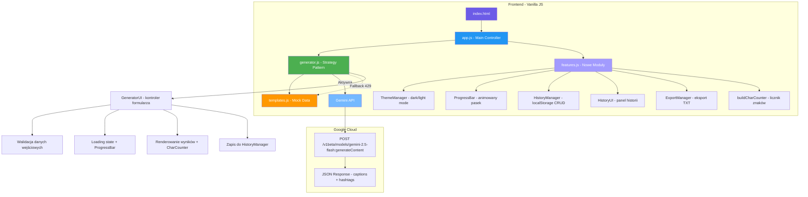
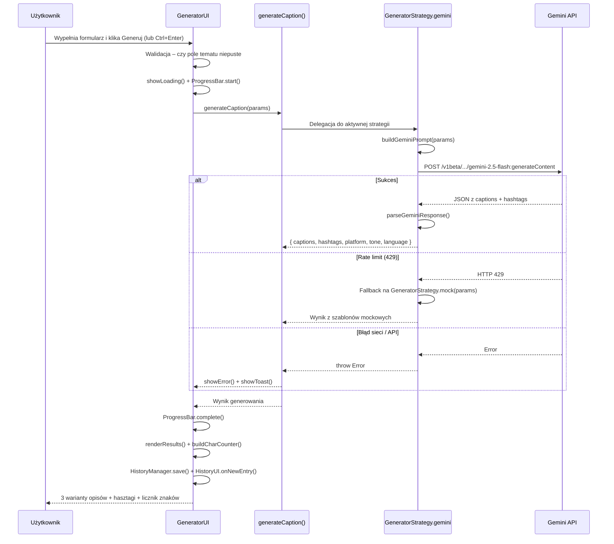
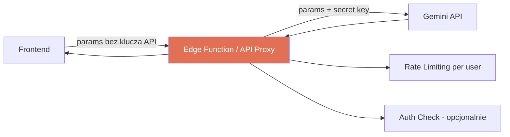

# 📖 CaptionForge – Dokumentacja Techniczna

> **Wersja:** 1.1
> **Data:** Marzec 2026
> **Status:** Faza projektowania – architektura do implementacji

---

## Spis treści

1. [Wprowadzenie](#1-wprowadzenie)
2. [Architektura systemu](#2-architektura-systemu)
3. [Plany implementacji](#3-plany-implementacji)
4. [Integracja z Gemini API](#4-integracja-z-gemini-api)
5. [Stack technologiczny](#5-stack-technologiczny)
6. [Powiązana dokumentacja](#6-powiązana-dokumentacja)

---

## 1. Wprowadzenie

**CaptionForge** to narzędzie webowe do generowania angażujących opisów i hasztagów pod posty w mediach społecznościowych. Produkt łączy landing page (prezentacja wartości) z działającym generatorem opartym na AI.

> **Propozycja wartości:** Wygeneruj spersonalizowany opis i hasztagi do posta w 10 sekund – dopasowane do niszy, tonu głosu i platformy.

Zakres funkcjonalny, persony użytkowników i szczegółowa strategia produktowa opisane są w dokumentach linkowanych w sekcji [Powiązana dokumentacja](#6-powiązana-dokumentacja).

---

## 2. Architektura systemu

### 2.1 Struktura plików

```
captionforge/
├── index.html              # Główna strona – landing + generator + historia
├── css/
│   └── styles.css          # Wszystkie style, responsywność, dark mode, animacje
├── js/
│   ├── app.js              # Nawigacja, animacje, FAQ, inicjalizacja modułów
│   ├── generator.js        # Logika generatora – Strategy Pattern + GeneratorUI
│   ├── templates.js        # Baza szablonów mockowych i hasztagów
│   └── features.js         # Nowe moduły: ThemeManager, HistoryManager, ExportManager, ProgressBar
└── docs/
    ├── technical-documentation.md  # Ten plik
    ├── README.md                   # Szybki start
    ├── plan.md                     # Oryginalny plan i design system
    ├── Job_To_Be_Done.md           # Analiza JTBD i persony
    └── User_Journey_Map.md         # Ścieżka użytkownika i gap analysis
```

### 2.2 Diagram architektury



### 2.3 Wzorzec Strategy Pattern

Kluczowym wzorcem w `generator.js` jest **Strategy Pattern**, który umożliwia przełączanie silnika generowania bez zmian w UI:

```
GeneratorStrategy
├── gemini    ← aktywna strategia (Google Gemini 2.5 Flash)
│              └── fallback na mock przy rate limit (HTTP 429)
└── mock      ← backup (szablony z templates.js, symulacja 1.5s)
```

**Zmiana strategii** sprowadza się do jednej linii w `generator.js`:
```javascript
let activeStrategy = 'gemini'; // zmień na 'mock' aby wrócić do szablonów
```
Zero zmian w UI, walidacji i renderowaniu.

### 2.4 Przepływ danych – generowanie opisu



### 2.5 Moduły JavaScript

#### `app.js` – Main Controller
Inicjalizuje i koordynuje pozostałe moduły. Odpowiada za:
- Scroll effect na navbar + scroll-based active nav link highlight
- Mobile hamburger menu (toggle + zamknięcie poza menu)
- Smooth scroll dla wszystkich anchor linków (z offsetem navbara)
- Intersection Observer – reveal animations z staggered delay dla grid-ów
- FAQ Accordion – ekskluzywne otwieranie paneli
- Inicjalizacja `ThemeManager`, `GeneratorUI`, `HistoryUI`
- Mockup copy button w sekcji hero

#### `generator.js` – Generator Logic + UI
- `CONFIG` – konfiguracja Gemini API (klucz, model, temperature)
- `GeneratorStrategy` – obiekt ze strategiami `gemini` i `mock`
- `generateCaption()` – główna funkcja delegująca do aktywnej strategii
- `buildGeminiPrompt()` – budowanie promptu z parametrów użytkownika
- `parseGeminiResponse()` – parsowanie JSON z Gemini, fallback na mock przy błędzie
- `getTemplates()` – pobieranie szablonów z fallbackiem tonu
- `fillTemplate()` – podmiana `{topic}` i `{niche}` w szablonach
- `generateHashtags()` – mix nisza + ogólne, Fisher-Yates shuffle, deduplication
- `findNicheKey()` – exact + partial matching do bazy nisz
- `GeneratorUI` – kontroler formularza: init, walidacja, loading, render, eksport, copy

#### `templates.js` – Mock Data
- `captionTemplates` – szablony opisów: 5 platform × 5 tonów × 2 języki
- `hashtagDatabase` – baza hasztagów pogrupowana wg 8 nisz i 3 zasięgów
- `platformHashtagLimits` – rekomendowane limity hasztagów per platforma
- `reachLabels` – etykiety zasięgów (🔥 duży, 📈 średni, 🎯 niszowy) w PL i EN

#### `features.js` – Nowe Moduły

| Moduł | Odpowiedzialność |
|-------|-----------------|
| `ThemeManager` | Dark / light mode z persystencją w `localStorage`, anti-FOUC w `<head>`, listener na systemową preferencję |
| `ProgressBar` | Animowany pasek z etapami tekstowymi (Analizuję → Generuję → Dobieram hasztagi → Gotowe!) |
| `HistoryManager` | CRUD na `localStorage` – klucz `captionforge-history`, max 50 wpisów, auto-truncate przy przepełnieniu storage |
| `HistoryUI` | Renderowanie panelu historii: lista wpisów z podglądem opisów, przywracanie ustawień do formularza, usuwanie wpisów |
| `ExportManager` | Generowanie i pobieranie pliku `.txt` z opisami i hasztagami (UTF-8 BOM, Blob API) |
| `buildCharCounter` | HTML z licznikiem znaków per platforma z progami safe / warning / danger |

### 2.6 Struktura HTML – sekcje strony

Planowana struktura stron `index.html`:

| Sekcja | ID | Opis |
|--------|----|------|
| Navbar | `#navbar` | Logo, nawigacja, przycisk CTA, przełącznik motywu (🌙/☀️), hamburger |
| Hero | `#hero` | Headline, CTA, mockup karty z przykładem, statystyki, floating badges |
| Features | `#features` | 6 kart funkcji z ikonami (Inline SVG) |
| How It Works | `#how-it-works` | 3 kroki z wizualizacjami |
| Generator | `#generator` | Formularz (5 pól) + panel wyników (placeholder / loading / results) |
| Historia | `#historySection` | Collapsible panel z historią generacji (localStorage) |
| FAQ | `#faq` | 3 pytania w accordion |
| CTA Bottom | – | Finalne CTA do generatora |
| Footer | – | Linki, brand |

### 2.7 Stany interfejsu generatora

```mermaid
stateDiagram-v2
    [*] --> Placeholder: Strona załadowana
    Placeholder --> Loading: Klik Generuj / Ctrl+Enter
    Loading --> Results: Gemini API zwraca wynik
    Loading --> Results: Fallback mock (rate limit)
    Loading --> Error: Błąd sieci / API
    Results --> Loading: Klik Generuj ponownie
    Error --> Placeholder: showError() - auto-reset
    Results --> Copied: Klik Kopiuj przy opisie
    Copied --> Results: Auto-reset po 2s

    note right of Loading: ProgressBar: 3 etapy tekstowe
    note right of Results: Opisy + hasztagi + licznik znaków
    note right of Results: Zapis do HistoryManager
```

---

## 3. Plany implementacji

### 3.1 Decyzje architektoniczne

| Decyzja | Uzasadnienie |
|---------|-------------|
| Vanilla JS (bez frameworka) | Zero zależności npm, deployment = upload pliku, bundle ~0 kB overhead |
| Strategy Pattern w generatorze | Przełączenie gemini ↔ mock = 1 linia kodu, zero zmian w UI |
| Google Gemini 2.5 Flash | Szybkość + wysoka jakość + darmowy tier; możliwość zamiany na Pro przy skali |
| Fallback mock przy rate limit 429 | Ciągłość działania bez degradacji UX przy przekroczeniu limitów |
| localStorage dla historii | Zero backendu, zero konta, natychmiastowa wartość dla powracających userów |
| System font stack | Brak FOIT/FOUT, zero zewnętrznych requestów, szybszy FCP |
| Inline SVG | Kontrola koloru i animacji ikon, brak zewnętrznych zapytań |
| CSS Custom Properties + `data-theme` | Dark mode bez przeładowania strony, spójny design system |
| Anti-FOUC script w `<head>` | Motyw czytany z localStorage PRZED renderowaniem DOM – brak mignięcia jasnego tła |
| Blob API dla eksportu TXT | Zero backendu – plik generowany w przeglądarce z UTF-8 BOM dla zgodności z Excelem/Notepadem |

### 3.2 Planowana kolejność budowy

Projekt należy budować iteracyjnie w poniższej kolejności:

```mermaid
graph LR
    A[1. HTML + sekcje] --> B[2. CSS + dark mode]
    B --> C[3. app.js – nawigacja + animacje]
    C --> D[4. templates.js – baza mockowych danych]
    D --> E[5. generator.js – UI + mock strategy]
    E --> F[6. Gemini API – strategia gemini + prompt ]
    F --> G[7. features.js – History + Export + ProgressBar]
    G --> H[8. ThemeManager + anti-FOUC]
    H --> I[9. CharCounter per platforma]
    I --> J[10. Testowanie + polish]
```



**Etap 1 – Struktura HTML:**
- Semantyczny HTML5 z pełną listą sekcji (navbar → footer)
- Formularz generatora z 5 polami: platforma, ton, nisza, język, temat
- Placeholdery dla panelu historii i sekcji wyników

**Etap 2 – CSS i Dark Mode:**
- Mobile-first, breakpointy 768px / 1024px / 1200px
- CSS Custom Properties dla design systemu i motywów (`[data-theme="dark"]`)
- Flexbox / Grid do layoutu, CSS keyframes dla animacji

**Etap 3 – app.js:**
- Navbar scroll effect, hamburger menu, smooth scroll
- Intersection Observer – reveal animations z staggered delay
- FAQ accordion, active nav link tracking

**Etap 4 – templates.js:**
- Baza szablonów: 5 platform × 5 tonów × 2 języki
- Baza hasztagów podzielona wg 8 nisz i 3 zasięgów
- Dla każdej platformy: limit rekomendowanych hasztagów

**Etap 5 – generator.js (mock strategy + UI):**
- GeneratorUI: walidacja, loading state, render wyników, copy
- Strategy Pattern: mock jako domyślna strategia
- Utility functions: escapeHtml, copyToClipboard, showToast

**Etap 6 – Gemini API:**
- Strategia `gemini` w `GeneratorStrategy`
- `buildGeminiPrompt()` z instrukcją JSON response format
- `parseGeminiResponse()` z fallback na mock przy błędzie parsowania
- Obsługa błędów: 429 → fallback mock, sieć/API → showError + toast
- Zmiana `activeStrategy` na `'gemini'`

**Etap 7 – features.js (HistoryManager + HistoryUI + ExportManager + ProgressBar):**
- `HistoryManager.save()` wywoływany po każdym pomyślnym generowaniu
- `HistoryUI` – collapsible panel z podglądem opisów, restore do formularza, usuwanie
- `ExportManager.export()` – plik TXT z BOM, download przez Blob API
- `ProgressBar` – 3 etapy tekstowe podczas ładowania Gemini API

**Etap 8 – ThemeManager + Anti-FOUC:**
- Inline script w `<head>` czytający `localStorage['captionforge-theme']` przed renderem
- `ThemeManager.init()` w app.js, listener na zmianę systemowej preferencji
- Przełącznik w navbarze z ikonami 🌙/☀️

**Etap 9 – CharCounter per platforma:**
- `platformCharLimits` per platforma (np. TikTok 300 znaków, Twitter 280)
- `buildCharCounter()` z klasami CSS: `.safe` / `.warning` / `.danger`
- Wywoływane przy renderowaniu każdej karty opisu

**Etap 10 – Testowanie:**
- Weryfikacja generowania dla wszystkich kombinacji platforma × ton × nisza × język
- Test dark mode (toggle + systemowe preferencje + brak FOUC)
- Test historii: zapis, podgląd, restore do formularza, usunięcie, wyczyszczenie
- Test eksportu TXT: poprawna nazwa pliku, kodowanie UTF-8, format treści
- Test fallback: symulacja 429 → czy mock się odpala
- Test responsywności: mobile (< 768px), tablet, desktop

---

## 4. Integracja z Gemini API

### 4.1 Konfiguracja

```javascript
const CONFIG = {
    geminiApiKey: 'AIza...',        // klucz z Google AI Studio
    geminiModel:  'gemini-2.5-flash',
    temperature:  0.8               // kreatywność generacji (0–1)
};
```

Endpoint: `https://generativelanguage.googleapis.com/v1beta/models/{model}:generateContent?key={apiKey}`

### 4.2 Format promptu

```
Wygeneruj dokładnie 3 różne warianty opisu posta oraz 10-15 hasztagów.

PARAMETRY:
- Platforma: {platformTip}        ← np. "TikTok – krótko i dynamicznie, max 300 znaków"
- Ton głosu: {toneDescription}   ← np. "inspirujący i motywujący"
- Nisza/branża: {niche}
- Temat posta: {topic}
- Język: {langName}

ODPOWIEDZ W FORMACIE JSON – TYLKO JSON, bez dodatkowego tekstu:
{
  "captions": [
    {"id": 1, "text": "...", "variant": "Wariant 1"},
    ...
  ],
  "hashtags": [
    {"tag": "#hashtag", "reach": "large|medium|small"},
    ...
  ]
}
```

### 4.3 Obsługa błędów

| Sytuacja | Zachowanie |
|----------|-----------|
| HTTP 429 (rate limit) | Automatyczny fallback na strategię `mock` |
| Błąd parsowania JSON z Gemini | Fallback na strategię `mock` |
| Błąd sieci (`Failed to fetch`) | Toast: "❌ Brak połączenia z internetem." |
| Inny błąd Gemini API | Toast: "❌ Błąd API Gemini. Sprawdź klucz API lub spróbuj ponownie." |

### 4.4 Uwaga bezpieczeństwa

> ⚠️ **WAŻNE:** Klucz API przechowywany bezpośrednio w `CONFIG` jest widoczny w kodzie front-endu. Akceptowalne wyłącznie w fazie prototypu/MVP.
>
> Przed produkcją należy wdrożyć **backend proxy** lub **Edge Function** (np. Vercel Serverless, Supabase Edge Function), który:
> - Przyjmuje parametry generowania od frontendu bez klucza
> - Sam wywołuje Gemini API z kluczem przechowywanym jako zmienna środowiskowa
> - Implementuje rate limiting i auth per user



---

## 5. Stack technologiczny

### 5.1 Technologie

| Warstwa | Technologia | Uzasadnienie |
|---------|-------------|-------------|
| **Markup** | HTML5 semantyczny | Dostępność, SEO, zero budowania |
| **Style** | CSS3 – Custom Properties, Flexbox, Grid | Brak preprocesora = prostota; dark mode przez `data-theme` |
| **Logika** | Vanilla JavaScript ES6+ | Zero zależności, mały bundle |
| **AI Backend** | Google Gemini 2.5 Flash | Wysokiej jakości generacja tekstu, szybki, darmowy tier |
| **Animacje** | CSS Transitions + Keyframes + Intersection Observer | Natywne, wydajne, zero JS bibliotek |
| **Ikony** | Inline SVG | Kontrola koloru przez CSS (fill/stroke), brak external requests |
| **Fonty** | System font stack | Brak FOIT/FOUT, natychmiastowy rendering |
| **Persystencja** | localStorage | Zero backendu – historia generacji dostępna między sesjami |
| **Eksport** | Blob API + URL.createObjectURL | Pobieranie pliku TXT bez backendu, UTF-8 BOM |

---

## 6. Powiązana dokumentacja

| Dokument | Zawartość |
|----------|-----------|
| [`README.md`](README.md) | Uruchomienie projektu, zakres funkcji, instrukcja podpięcia Gemini API |
| [`plan.md`](plan.md) | Oryginalny plan techniczny: szczegółowy design system, kolory, breakpointy |
| [`Job_To_Be_Done.md`](Job_To_Be_Done.md) | Persony (Kasia, Tomek), Job Snapshoty, analiza bólu, ryzyka biznesowe, MVP Scope |
| [`User_Journey_Map.md`](User_Journey_Map.md) | User Journey MVP i docelowa, Gap Analysis (co zbudować dalej), metryki konwersji |

---

*Dokumentacja opisuje planowaną architekturę CaptionForge na podstawie analizy projektu.*
