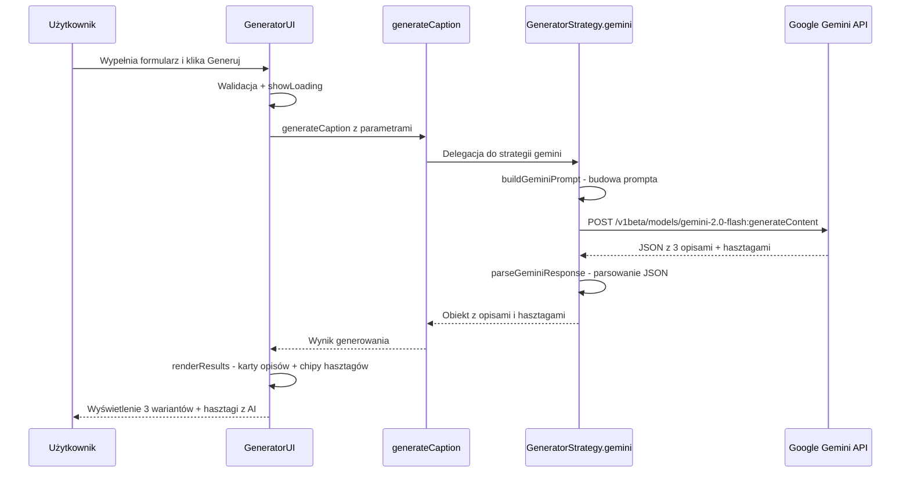

# 🔌 Plan Integracji Gemini API z CaptionForge

> **Cel:** Podłączenie Google Gemini API do generatora opisów, zastępując mock-owe szablony prawdziwym AI.
> **Podejście:** Prototyp edukacyjny – klucz API bezpośrednio w kodzie JS (frontend).
> **Klucz API:** 

---

## 📋 Podsumowanie zmian

Integracja wymaga modyfikacji **jednego pliku**: [`generator.js`](../captionforge/js/generator.js). Dzięki zastosowanemu **Strategy Pattern** nie trzeba zmieniać UI, walidacji ani renderowania wyników – wystarczy dodać nową strategię `gemini` i przełączyć `activeStrategy`.

---

## 🔧 Kroki implementacji

### Krok 1: Dodaj obiekt konfiguracyjny CONFIG

**Plik:** [`generator.js`](../captionforge/js/generator.js:1) – na samej górze pliku, przed `GeneratorStrategy`

Dodaj stałą `CONFIG` z kluczem API i parametrami modelu:

```javascript
const CONFIG = {
    geminiApiKey: 
    geminiModel: 'gemini-2.0-flash',
    temperature: 0.8
};
```

**Dlaczego `gemini-2.0-flash`?** Jest szybki, tani i wystarczająco dobry do generowania krótkich opisów social media. Alternatywnie można użyć `gemini-2.0-flash-lite` dla jeszcze niższych kosztów lub `gemini-2.5-pro-preview-03-25` dla najwyższej jakości.

---

### Krok 2: Dodaj strategię `gemini` w obiekcie GeneratorStrategy

**Plik:** [`generator.js`](../captionforge/js/generator.js:17) – wewnątrz obiektu `GeneratorStrategy`, po strategii `mock`

Dodaj nową strategię `gemini` która:
1. Buduje prompt na podstawie parametrów użytkownika
2. Wysyła request do Gemini API
3. Parsuje odpowiedź do formatu zgodnego z UI

```javascript
gemini: async function(params) {
    const { platform, tone, niche, language, topic } = params;
    
    const prompt = buildGeminiPrompt(params);
    
    const apiUrl = `https://generativelanguage.googleapis.com/v1beta/models/${CONFIG.geminiModel}:generateContent?key=${CONFIG.geminiApiKey}`;
    
    const response = await fetch(apiUrl, {
        method: 'POST',
        headers: {
            'Content-Type': 'application/json'
        },
        body: JSON.stringify({
            contents: [{
                parts: [{ text: prompt }]
            }],
            generationConfig: {
                temperature: CONFIG.temperature,
                maxOutputTokens: 2048
            }
        })
    });
    
    if (!response.ok) {
        const errorData = await response.json();
        throw new Error(`Gemini API error: ${errorData.error?.message || response.statusText}`);
    }
    
    const data = await response.json();
    return parseGeminiResponse(data, params);
}
```

**Kluczowe elementy:**
- **URL API:** `https://generativelanguage.googleapis.com/v1beta/models/{model}:generateContent?key={apiKey}`
- **Klucz API** przekazywany jako query parameter `key=` (standard Google API)
- **Format body:** obiekt `contents` z tablicą `parts` – to format Gemini API
- **generationConfig:** `temperature: 0.8` dla kreatywnych odpowiedzi, `maxOutputTokens: 2048` wystarczy na 3 opisy + hasztagi

---

### Krok 3: Dodaj funkcję buildGeminiPrompt

**Plik:** [`generator.js`](../captionforge/js/generator.js:100) – w sekcji HELPER FUNCTIONS

Funkcja buduje szczegółowy prompt, który instruuje Gemini jak wygenerować opisy:

```javascript
function buildGeminiPrompt(params) {
    const { platform, tone, niche, language, topic } = params;
    
    const langName = language === 'pl' ? 'polski' : 'angielski';
    
    const toneDescriptions = {
        inspirational: 'inspirujący i motywujący',
        professional: 'profesjonalny i ekspercki',
        casual: 'luźny i przyjacielski',
        humorous: 'humorystyczny i zabawny',
        educational: 'edukacyjny i informacyjny'
    };
    
    const platformTips = {
        instagram: 'Instagram - używaj emoji, zachęcaj do interakcji, max 2200 znaków',
        tiktok: 'TikTok - krótko i dynamicznie, nawiązuj do trendów, max 300 znaków',
        linkedin: 'LinkedIn - profesjonalnie, z wartością merytoryczną, storytelling',
        twitter: 'X/Twitter - zwięźle, max 280 znaków, angażująco',
        facebook: 'Facebook - konwersacyjnie, zachęcaj do dyskusji'
    };
    
    return `Jesteś ekspertem od social media copywritingu.

Wygeneruj dokładnie 3 różne warianty opisu posta oraz 10-15 hasztagów.

PARAMETRY:
- Platforma: ${platformTips[platform] || platform}
- Ton głosu: ${toneDescriptions[tone] || tone}
- Nisza/branża: ${niche || 'ogólna'}
- Temat posta: ${topic}
- Język: ${langName}

WYMAGANIA DLA OPISÓW:
1. Każdy wariant musi mieć inny styl/podejście
2. Dopasuj długość do specyfiki platformy
3. Używaj emoji odpowiednio do tonu
4. Zakończ call-to-action lub pytaniem angażującym

WYMAGANIA DLA HASZTAGÓW:
1. Mix popularnych i niszowych hasztagów
2. Dopasowane do branży: ${niche || 'ogólna'}
3. Oznacz każdy hasztag zasięgiem: duzy, sredni lub niszowy

ODPOWIEDZ W FORMACIE JSON - TYLKO JSON, bez dodatkowego tekstu:
{
  "captions": [
    {"id": 1, "text": "treść opisu 1", "variant": "Wariant 1"},
    {"id": 2, "text": "treść opisu 2", "variant": "Wariant 2"},
    {"id": 3, "text": "treść opisu 3", "variant": "Wariant 3"}
  ],
  "hashtags": [
    {"tag": "#hashtag1", "reach": "large"},
    {"tag": "#hashtag2", "reach": "medium"},
    {"tag": "#hashtag3", "reach": "small"}
  ]
}

Wartości reach: "large" = popularny/duży zasięg, "medium" = średni zasięg, "small" = niszowy.
Pisz w języku: ${langName}.`;
}
```

**Dlaczego JSON w prompcie?** Gemini dobrze radzi sobie z generowaniem strukturyzowanego JSON. Dzięki temu parsowanie odpowiedzi jest proste i deterministyczne.

---

### Krok 4: Dodaj funkcję parseGeminiResponse

**Plik:** [`generator.js`](../captionforge/js/generator.js:100) – w sekcji HELPER FUNCTIONS, po `buildGeminiPrompt`

Funkcja parsuje odpowiedź Gemini i mapuje ją na format oczekiwany przez UI:

```javascript
function parseGeminiResponse(data, params) {
    const { language, platform, tone } = params;
    const lang = language || 'pl';
    
    try {
        // Wyciągnij tekst z odpowiedzi Gemini
        const rawText = data.candidates?.[0]?.content?.parts?.[0]?.text;
        
        if (!rawText) {
            throw new Error('Brak treści w odpowiedzi Gemini');
        }
        
        // Wyczyść tekst z ewentualnych markdown code blocks
        const cleanJson = rawText
            .replace(/```json\n?/g, '')
            .replace(/```\n?/g, '')
            .trim();
        
        const parsed = JSON.parse(cleanJson);
        
        // Mapuj hasztagi na format z etykietami zasięgu
        const hashtags = (parsed.hashtags || []).map(h => ({
            tag: h.tag,
            reach: h.reach || 'medium',
            label: reachLabels[h.reach]?.[lang] || h.reach
        }));
        
        return {
            captions: parsed.captions || [],
            hashtags,
            platform,
            tone,
            language
        };
    } catch (parseError) {
        console.error('Błąd parsowania odpowiedzi Gemini:', parseError);
        console.log('Raw response:', data);
        
        // Fallback na mock jeśli parsowanie się nie uda
        return GeneratorStrategy.mock(params);
    }
}
```

**Kluczowe elementy:**
- **Ścieżka do tekstu:** `data.candidates[0].content.parts[0].text` – to standardowa struktura odpowiedzi Gemini API
- **Czyszczenie JSON:** Gemini czasem opakowuje JSON w bloki markdown, więc usuwamy je
- **Fallback na mock:** Jeśli parsowanie się nie uda, wracamy do szablonów – użytkownik i tak dostanie wynik

---

### Krok 5: Zmień activeStrategy na gemini

**Plik:** [`generator.js`](../captionforge/js/generator.js:84)

Zmień linię:
```javascript
// BYŁO:
let activeStrategy = 'mock';

// JEST:
let activeStrategy = 'gemini';
```

To jedyna zmiana potrzebna do przełączenia całego generatora z mocka na AI.

---

### Krok 6: Opcjonalnie – dodaj obsługę błędów sieciowych

**Plik:** [`generator.js`](../captionforge/js/generator.js:315) – w metodzie `handleGenerate` klasy `GeneratorUI`

Obecna obsługa błędów w `handleGenerate` już łapie wyjątki i wywołuje `showError()`. Warto jednak rozszerzyć komunikat o bardziej szczegółowe informacje:

```javascript
async handleGenerate() {
    const params = this.getParams();
    if (!this.validate(params)) return;
    this.showLoading();

    try {
        const result = await generateCaption(params);
        this.renderResults(result);
    } catch (error) {
        console.error('Błąd generowania:', error);
        if (error.message.includes('Gemini API error')) {
            showToast('❌ Błąd API Gemini. Sprawdź klucz API lub spróbuj ponownie.');
        } else if (error.message.includes('Failed to fetch')) {
            showToast('❌ Brak połączenia z internetem.');
        } else {
            showToast('❌ Wystąpił błąd. Spróbuj ponownie.');
        }
        this.showError();
    }
}
```

---

## 📊 Diagram przepływu po integracji



---

## 📁 Podsumowanie zmian w plikach

| Plik | Zmiana | Opis |
|------|--------|------|
| [`generator.js`](../captionforge/js/generator.js) | Dodanie `CONFIG` | Obiekt z kluczem API i parametrami modelu |
| [`generator.js`](../captionforge/js/generator.js) | Dodanie strategii `gemini` | Nowa strategia w `GeneratorStrategy` |
| [`generator.js`](../captionforge/js/generator.js) | Dodanie `buildGeminiPrompt` | Funkcja budująca prompt dla Gemini |
| [`generator.js`](../captionforge/js/generator.js) | Dodanie `parseGeminiResponse` | Funkcja parsująca odpowiedź API |
| [`generator.js`](../captionforge/js/generator.js) | Zmiana `activeStrategy` | Z `mock` na `gemini` |
| [`generator.js`](../captionforge/js/generator.js) | Rozszerzenie `handleGenerate` | Lepsza obsługa błędów sieciowych |

**Żadne inne pliki nie wymagają zmian** – HTML, CSS, `app.js` i `templates.js` pozostają bez zmian.

---

## ⚠️ Uwagi

1. **Klucz API w kodzie frontendowym** – akceptowalne dla prototypu edukacyjnego, ale NIE dla produkcji. Każdy może go zobaczyć w DevTools.
2. **CORS** – Gemini API obsługuje requesty z przeglądarki, więc nie powinno być problemów z CORS.
3. **Rate limiting** – darmowy tier Gemini API ma limity: 15 RPM dla flash, 2 RPM dla pro. Dla prototypu wystarczy.
4. **Fallback na mock** – jeśli API zwróci błąd lub parsowanie się nie uda, generator automatycznie wróci do szablonów z `templates.js`.
5. **Strategia mock pozostaje** – można łatwo przełączyć z powrotem zmieniając `activeStrategy = 'mock'`.

---

## 🧪 Testowanie po integracji

1. Otwórz `index.html` w przeglądarce
2. Przejdź do sekcji Generator
3. Wypełnij formularz: platforma, ton, nisza, temat, język
4. Kliknij Generuj opisy
5. Sprawdź czy:
   - Opisy są generowane przez AI, a nie z szablonów
   - Hasztagi mają oznaczenia zasięgu
   - Kopiowanie do schowka działa
   - Przy braku internetu wyświetla się komunikat błędu
6. Otwórz DevTools > Network i sprawdź czy request do Gemini API przechodzi poprawnie
