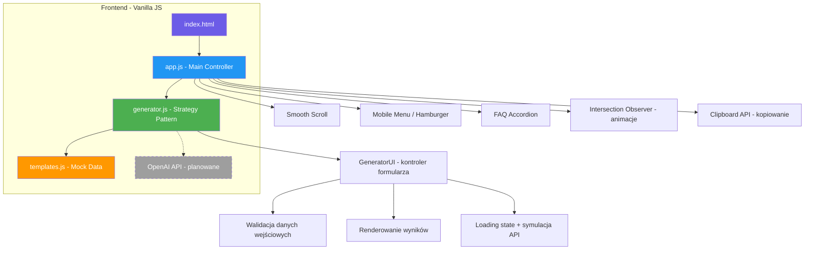
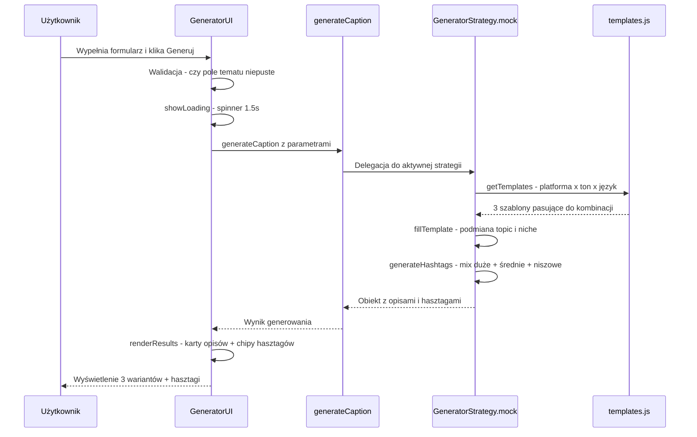
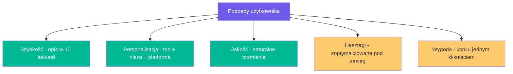
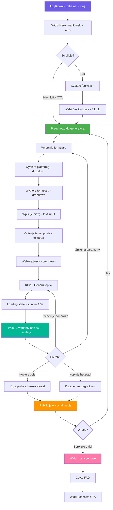
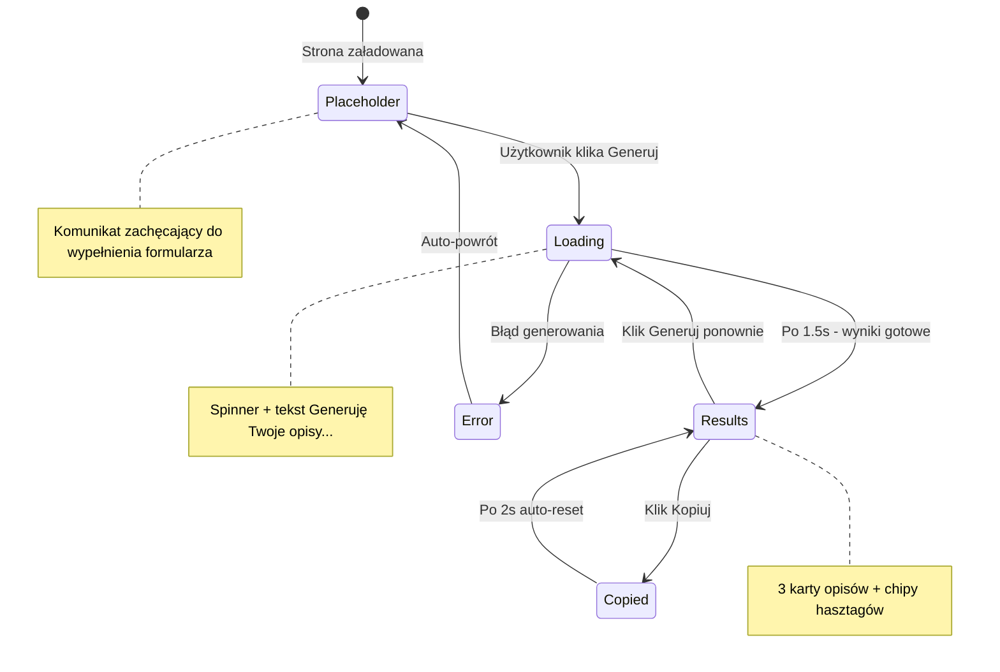
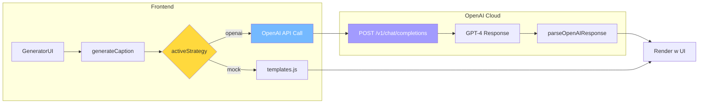
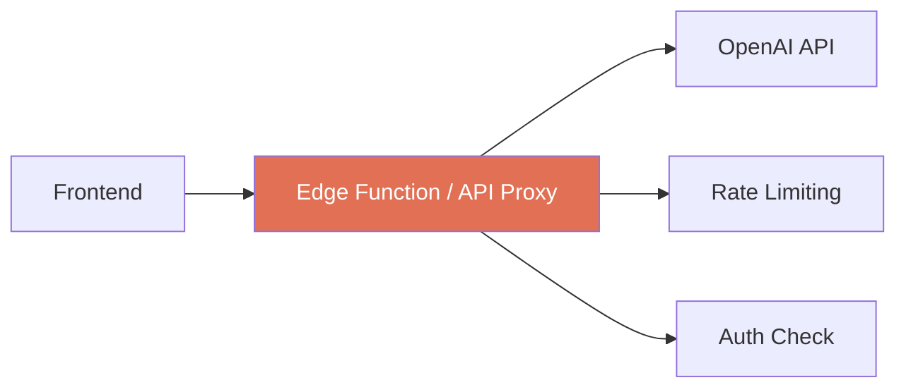

# 📖 CaptionForge – Dokumentacja Techniczna

> **Wersja:** 1.0 (MVP / Prototyp)
> **Data:** Marzec 2026
> **Status:** Prototyp z mock-generatorem, architektura przygotowana pod integrację z AI

---

## Spis treści

1. [Plan projektu](#1-plan-projektu)
2. [Architektura systemu](#2-architektura-systemu)
3. [Proces budowy](#3-proces-budowy)
4. [Użytkownik docelowy](#4-użytkownik-docelowy-icp)
5. [User Journey](#5-user-journey)
6. [Integracje i API](#6-integracje-i-api)
7. [Monetyzacja](#7-monetyzacja)
8. [Stack technologiczny](#8-stack-technologiczny)
9. [Roadmap](#9-roadmap)
10. [Ryzyka i ograniczenia](#10-ryzyka-i-ograniczenia)

---

## 1. Plan projektu

### 1.1 Wizja produktu

**CaptionForge** to narzędzie webowe do generowania angażujących opisów i hasztagów pod posty w mediach społecznościowych. Produkt łączy w sobie:

- **Landing page** – prezentacja wartości produktu i konwersja użytkowników
- **Działający prototyp generatora** – mock z architekturą przygotowaną pod przyszłe API OpenAI

### 1.2 Problem do rozwiązania

Twórcy treści w social media spędzają średnio 15–30 minut na napisanie jednego opisu do posta. Główne bariery to:

| Problem | Nasilenie |
|---------|-----------|
| Brak inspiracji / blokada twórcza | 🔴 Wysoki |
| Dobór odpowiednich hasztagów | 🟡 Średni |
| Dopasowanie tonu do platformy | 🟡 Średni |
| Oszczędność czasu przy codziennym postowaniu | 🔴 Wysoki |

### 1.3 Propozycja wartości

> Wygeneruj spersonalizowany opis i hasztagi do posta w 10 sekund – dopasowane do Twojej niszy, tonu głosu i platformy.

### 1.4 Zakres MVP

MVP obejmuje wyłącznie:

- ✅ Landing page z sekcjami: Hero, Features, How It Works, Generator, Pricing, FAQ, Footer
- ✅ Prototyp generatora z szablonami mockowymi
- ✅ Obsługa 5 platform: Instagram, TikTok, LinkedIn, X/Twitter, Facebook
- ✅ 5 tonów głosu: inspirujący, profesjonalny, casualowy, humorystyczny, edukacyjny
- ✅ 2 języki: polski, angielski
- ✅ Kopiowanie wyników do schowka
- ✅ Responsywny design mobile-first

Co **nie** wchodzi w MVP:

- ❌ System kont użytkowników
- ❌ Prawdziwe generowanie AI przez OpenAI
- ❌ Historia wygenerowanych opisów
- ❌ Analityka i tracking
- ❌ Backend / baza danych

### 1.5 Struktura plików

```
plans/captionforge/
├── index.html              # Główna strona – landing + generator
├── css/
│   └── styles.css          # Wszystkie style, responsywność, animacje
├── js/
│   ├── app.js              # Nawigacja, animacje, FAQ, inicjalizacja
│   ├── generator.js        # Logika generatora – Strategy Pattern
│   └── templates.js        # Baza szablonów mockowych i hasztagów
├── docs/
│   └── technical-documentation.md  # Ten plik
├── plan.md                 # Oryginalny plan techniczny
└── README.md               # Dokumentacja szybkiego startu
```

---

## 2. Architektura systemu

### 2.1 Diagram architektury



### 2.2 Wzorzec Strategy Pattern

Kluczowym elementem architektury jest **Strategy Pattern** w pliku `generator.js`:

```
GeneratorStrategy
├── mock      ← aktywna strategia (szablony z templates.js)
└── openai    ← zakomentowana, gotowa do podpięcia
```

Ten wzorzec pozwala na **bezbolesne przejście** z mocka na prawdziwe API:

1. Dodaj nową strategię w obiekcie `GeneratorStrategy`
2. Zmień zmienną `activeStrategy` na nową strategię
3. Zero zmian w reszcie kodu – UI, walidacja, renderowanie pozostaje identyczne

### 2.3 Przepływ danych



### 2.4 Moduły JavaScript

#### `app.js` – Main Controller
- Obsługa nawigacji z efektem scroll
- Mobile hamburger menu z zamykaniem poza menu
- Smooth scroll dla anchor linków
- Intersection Observer – reveal animations z staggered delay
- FAQ Accordion – otwieranie/zamykanie paneli
- Active nav link highlight przy scrollowaniu
- Mockup copy button w sekcji hero
- Dynamiczne dodawanie stylów CSS dla stanów interaktywnych

#### `generator.js` – Generator Logic
- `GeneratorStrategy` – obiekt z dostępnymi strategiami generowania
- `generateCaption()` – główna funkcja delegująca do aktywnej strategii
- `getTemplates()` – pobieranie szablonów z fallbackiem
- `fillTemplate()` – podmiana placeholderów na dane użytkownika
- `generateHashtags()` – budowanie zestawu hasztagów z miksu zasięgów
- `findNicheKey()` – dopasowanie niszy użytkownika do bazy danych
- `GeneratorUI` – kontroler UI: init, walidacja, loading, render, copy

#### `templates.js` – Mock Data
- `captionTemplates` – szablony opisów: 5 platform x 5 tonów x 2 języki
- `hashtagDatabase` – baza hasztagów pogrupowana wg nisz i zasięgów
- `platformHashtagLimits` – rekomendowane limity hasztagów per platforma
- `reachLabels` – etykiety zasięgów w dwóch językach

---

## 3. Proces budowy

### 3.1 Kolejność implementacji

Projekt był budowany iteracyjnie w następującej kolejności:

```mermaid
graph LR
    A[1. Planowanie] --> B[2. HTML Structure]
    B --> C[3. CSS + Responsywność]
    C --> D[4. JS - app.js]
    D --> E[5. JS - templates.js]
    E --> F[6. JS - generator.js]
    F --> G[7. Polish i Animacje]
    G --> H[8. Testowanie]

    style A fill:#E8E8E8,color:#333
    style B fill:#FF6B6B,color:white
    style C fill:#4ECDC4,color:white
    style D fill:#45B7D1,color:white
    style E fill:#96CEB4,color:white
    style F fill:#FFEAA7,color:#333
    style G fill:#DDA0DD,color:white
    style H fill:#98D8C8,color:white
```



**Etap 1 – Planowanie:**
- Zdefiniowanie zakresu MVP
- Wybór stacku technologicznego: zero frameworków
- Zaprojektowanie design systemu: kolory, typografia, breakpointy
- Utworzenie planu technicznego w `plan.md`

**Etap 2 – Struktura HTML:**
- Semantyczny HTML5 z sekcjami: navbar, hero, features, how-it-works, generator, pricing, FAQ, footer
- Inline SVG dla ikon – brak zależności od zewnętrznych bibliotek
- Formularz generatora z polami: platforma, ton, nisza, język, temat

**Etap 3 – CSS i Responsywność:**
- Mobile-first approach z breakpointami: 768px, 1024px, 1200px
- CSS Custom Properties dla spójnego design systemu
- Flexbox i Grid do layoutu
- Animacje CSS: transitions, keyframes, transforms

**Etap 4 – app.js:**
- Nawigacja: scroll effect, hamburger menu, smooth scroll
- Intersection Observer do reveal animations z efektem stagger
- FAQ accordion z ekskluzywnym otwieraniem
- Active nav link tracking

**Etap 5 – templates.js:**
- Budowa bazy szablonów: 5 platform x 5 tonów x 2 języki = 150 szablonów
- Baza hasztagów pogrupowana wg 8 nisz
- Logika kategoryzacji zasięgu hasztagów

**Etap 6 – generator.js:**
- Implementacja Strategy Pattern
- Mock strategy z symulacją 1.5s opóźnienia API
- Logika dopasowywania nisz – exact + partial matching
- GeneratorUI: formularz, walidacja, loading, render, copy
- Placeholder dla strategii OpenAI

**Etap 7 – Polish:**
- Loading state z spinnerem
- Toast notifications
- Copy to clipboard z wizualnym potwierdzeniem
- Animacje wejścia sekcji
- Staggered delay dla elementów w gridzie

**Etap 8 – Testowanie:**
- Weryfikacja w przeglądarce: desktop i mobile
- Test generowania dla różnych kombinacji parametrów
- Test kopiowania do schowka
- Test nawigacji i responsywności

### 3.2 Decyzje architektoniczne

| Decyzja | Uzasadnienie |
|---------|-------------|
| Vanilla JS zamiast React/Vue | Zero zależności, szybki ładunek, łatwość deploymentu |
| Strategy Pattern | Łatwe przełączenie mock → API bez zmian w UI |
| System fonts | Brak zewnętrznych zapytań o fonty, szybszy FCP |
| Inline SVG | Kontrola nad kolorami i animacjami ikon |
| CSS Custom Properties | Spójny design system, łatwa zmiana motywu |
| Mobile-first CSS | Optymalizacja pod dominujące urządzenia użytkowników |

---

## 4. Użytkownik docelowy (ICP)

### 4.1 Persona główna: Twórca treści w social media

| Atrybut | Opis |
|---------|------|
| **Nazwa** | Kasia / Twórczyni treści |
| **Wiek** | 22–35 lat |
| **Rola** | Content creator, influencer, social media manager |
| **Platformy** | Instagram, TikTok, LinkedIn |
| **Problem** | Codzienne tworzenie opisów jest czasochłonne i wyczerpujące twórczo |
| **Cel** | Szybko generować angażujące opisy dopasowane do niszy i tonu |
| **Budżet** | 0–100 zł/mies. na narzędzia do social media |
| **Tech-savviness** | Średni – używa narzędzi online, nie jest programistką |

### 4.2 Persona dodatkowa: Freelancer / Agencja

| Atrybut | Opis |
|---------|------|
| **Nazwa** | Tomek / Social Media Freelancer |
| **Wiek** | 25–40 lat |
| **Rola** | Zarządza kontami klientów, tworzy contentzbiorczo |
| **Platformy** | Wszystkie 5 |
| **Problem** | Zarządzanie wieloma profilami w różnych niszach z różnymi tonami |
| **Cel** | Szybko przełączać się między klientami i generować treść |
| **Budżet** | 50–200 zł/mies. – wydaje na narzędzia, rozlicza je klientom |

### 4.3 Persona negatywna: kogo NIE targetujemy

- Duże agencje marketingowe z własnymi narzędziami AI
- Osoby, które nie prowadzą social media
- Firmy potrzebujące zaawansowanej analityki i raportowania

### 4.4 Kluczowe potrzeby użytkowników



---

## 5. User Journey

### 5.1 Ścieżka nowego użytkownika



### 5.2 Szczegółowe kroki interakcji z generatorem

| Krok | Akcja użytkownika | Reakcja systemu |
|------|-------------------|-----------------|
| 1 | Otwiera stronę | Widzi hero z nagłówkiem i CTA |
| 2 | Klika "Generuj za darmo" lub "Generator" w nav | Smooth scroll do sekcji generatora |
| 3 | Wybiera platformę z dropdown | – |
| 4 | Wybiera ton głosu z dropdown | – |
| 5 | Wpisuje niszę w pole tekstowe | – |
| 6 | Wpisuje temat posta w textarea | Licznik znaków aktualizuje się w czasie rzeczywistym |
| 7 | Wybiera język z dropdown | – |
| 8 | Klika "Generuj opisy" | Przycisk zmienia się w spinner, pojawia się loading state |
| 9 | Czeka 1.5s | System dopasowuje szablony i generuje hasztagi |
| 10 | Widzi 3 warianty opisów | Karty z opisami + przycisk "Kopiuj" przy każdej |
| 11 | Widzi rekomendowane hasztagi | Chipy z ikonami zasięgu: 🔥 duży, 📈 średni, 🎯 niszowy |
| 12 | Klika "Kopiuj" przy wybranym opisie | Toast: "Skopiowano!", przycisk zmienia tekst na 2s |
| 13 | Klika "Kopiuj wszystkie hasztagi" | Wszystkie hasztagi kopiowane jednym kliknięciem |
| 14 | Opcjonalnie klika "Generuj ponownie" | Nowe losowe warianty z tymi samymi parametrami |

### 5.3 Stany interfejsu generatora



---

## 6. Integracje i API

### 6.1 Obecne integracje (MVP)

W obecnej wersji MVP projekt **nie integruje się z żadnym zewnętrznym API**. Wszystkie dane pochodzą z lokalnych szablonów w pliku `templates.js`.

Wykorzystywane API przeglądarki:

| API | Zastosowanie |
|-----|-------------|
| **Clipboard API** | `navigator.clipboard.writeText()` – kopiowanie opisów i hasztagów |
| **Intersection Observer API** | Animacje reveal przy scrollowaniu |
| **DOM API** | Manipulacja UI, eventy, formularze |

### 6.2 Planowana integracja: OpenAI GPT-4

Architektura jest w pełni przygotowana na integrację z OpenAI API. Kod strategii `openai` jest już zakomentowany w `generator.js` na liniach 60–80.

#### Kroki podpięcia OpenAI:

1. Odkomentuj strategię `openai` w obiekcie `GeneratorStrategy`
2. Zmień `activeStrategy = 'openai'`
3. Dodaj konfigurację z kluczem API:

```javascript
const CONFIG = {
    openaiApiKey: 'sk-...',
    model: 'gpt-4',
    temperature: 0.8
};
```

#### Diagram integracji:



#### Budowa prompta:

Planowana funkcja `buildOpenAIPrompt()` buduje prompt zawierający:
- Platformę docelową i jej specyfikę
- Ton głosu z przykładami
- Niszę/branżę użytkownika
- Temat posta
- Język wyjściowy
- Instrukcję generowania 3 wariantów + hasztagów

### 6.3 Przyszłe integracje (roadmap)

| Integracja | Cel | Priorytet |
|-----------|-----|-----------|
| **Supabase Auth** | System kont użytkowników, historia opisów | 🔴 Wysoki |
| **Supabase Database** | Przechowywanie wygenerowanych opisów | 🔴 Wysoki |
| **Buffer / Later API** | Harmonogram publikacji postów | 🟡 Średni |
| **Hashtag Analytics API** | Dane o trendach hasztagów w czasie rzeczywistym | 🟡 Średni |
| **Stripe** | Obsługa płatności za plan Pro | 🔴 Wysoki |
| **Google Analytics** | Tracking konwersji i zachowań użytkowników | 🟢 Niski |

### 6.4 Uwagi dotyczące bezpieczeństwa integracji

> ⚠️ **WAŻNE:** Klucz API OpenAI **nie powinien** być przechowywany w kodzie front-endowym. Docelowo potrzebny jest backend-proxy lub edge function, np. Supabase Edge Function, Vercel Serverless Function, aby klucz API nie był widoczny w przeglądarce.

Rekomendowana architektura produkcyjna:



---

## 7. Monetyzacja

### 7.1 Model cenowy

| Feature | Free | Pro - 49 zł/mies. |
|---------|------|-------------------|
| Opisy miesięcznie | 10 | ♾️ Nielimitowane |
| Platformy | 3 - IG, TikTok, FB | Wszystkie 5 |
| Tony głosu | 3 | Wszystkie 5 |
| Hasztagi | Podstawowe | Z oceną zasięgu |
| Historia opisów | ❌ | ✅ 500 ostatnich |
| Eksport CSV | ❌ | ✅ |
| **Trial** | – | 7 dni gratis |

### 7.2 Analiza biznesowa (ICE)

- **Impact:** 8/10 – duże zapotrzebowanie wśród twórców treści
- **Confidence:** 6/10 – zatłoczony rynek, ale specjalizacja w social media daje przewagę
- **Ease:** 7/10 – technicznie prosty, wymaga dobrej bazy szablonów i AI

### 7.3 Konkurencja

Główni konkurenci: Jasper, Copy.ai, Later, Hootsuite AI.
**Przewaga CaptionForge:** specjalizacja wyłącznie w opisach social media + personalizacja tonu głosu na konkretną niszę.

---

## 8. Stack technologiczny

### 8.1 Obecny stack (MVP)

| Warstwa | Technologia | Uzasadnienie |
|---------|-------------|-------------|
| **Markup** | HTML5 semantyczny | Dostępność, SEO, zero budowania |
| **Style** | CSS3 – Custom Properties, Flexbox, Grid | Brak preprocesora = prostota |
| **Logika** | Vanilla JavaScript ES6+ | Zero zależności, mały bundle |
| **Animacje** | CSS Transitions + Intersection Observer | Natywne, wydajne |
| **Ikony** | Inline SVG | Kontrola, brak zewnętrznych requestów |
| **Fonty** | System font stack | Brak FOIT/FOUT, natychmiastowy rendering |

### 8.2 Design System

| Token | Wartość | Zastosowanie |
|-------|---------|-------------|
| `--primary` | `#6C5CE7` | Fiolet – główny kolor marki, nagłówki, CTA |
| `--secondary` | `#00B894` | Zielony – sukces, potwierdzenia |
| `--dark` | `#2D3436` | Ciemny – tekst, tła |
| `--light` | `#F8F9FA` | Jasny – tła sekcji |
| `--accent` | `#FD79A8` | Różowy – wyróżnienia, CTA hover |

**Breakpointy responsywności:**
- `< 768px` – Mobile
- `768px – 1024px` – Tablet
- `1024px – 1200px` – Desktop mały
- `> 1200px` – Desktop duży

---

## 9. Roadmap

### Faza 1: MVP (obecna) ✅
- Landing page z generatorem
- Mock-owy generator z szablonami
- Responsywny design
- Kopiowanie do schowka

### Faza 2: AI Integration
- Integracja z OpenAI GPT-4
- Backend proxy dla bezpieczeństwa klucza API
- Poprawa jakości generowanych opisów

### Faza 3: User Accounts
- System kont użytkowników przez Supabase Auth
- Historia wygenerowanych opisów
- Zapisane konfiguracje per profil/klient

### Faza 4: Monetyzacja
- Integracja Stripe dla planu Pro
- Rate limiting dla planu Free
- Dashboard użytkownika z statystykami użycia

### Faza 5: Rozszerzenia
- Analiza trendów hasztagów w czasie rzeczywistym
- Eksport do CSV
- Harmonogram publikacji przez integrację z Buffer/Later
- A/B testing opisów

---

## 10. Ryzyka i ograniczenia

### Ryzyka

| Ryzyko | Prawdopodobieństwo | Impact | Mitygacja |
|--------|-------------------|--------|-----------|
| Zatłoczony rynek AI content tools | 🔴 Wysoki | 🔴 Wysoki | Specjalizacja w social media captions |
| Koszty API OpenAI przy skali | 🟡 Średni | 🟡 Średni | Rate limiting, caching, hybrydowy model |
| Jakość mock-ów niewystarczająca do konwersji | 🟡 Średni | 🔴 Wysoki | Szybka integracja z AI w Fazie 2 |
| Bezpieczeństwo klucza API na frontendzie | 🔴 Wysoki | 🔴 Wysoki | Backend proxy wymagany przed produkcją |

### Ograniczenia obecnej wersji

- **Brak persistencji** – wyniki znikają po odświeżeniu strony
- **Mock-owe dane** – opisy oparte na szablonach, nie na prawdziwym AI
- **Brak analityki** – nie zbieramy danych o użyciu
- **Statyczne hasztagi** – baza nie aktualizuje się automatycznie
- **Brak backendu** – cała logika po stronie klienta

---

*Dokumentacja wygenerowana na podstawie analizy kodu źródłowego projektu CaptionForge.*
